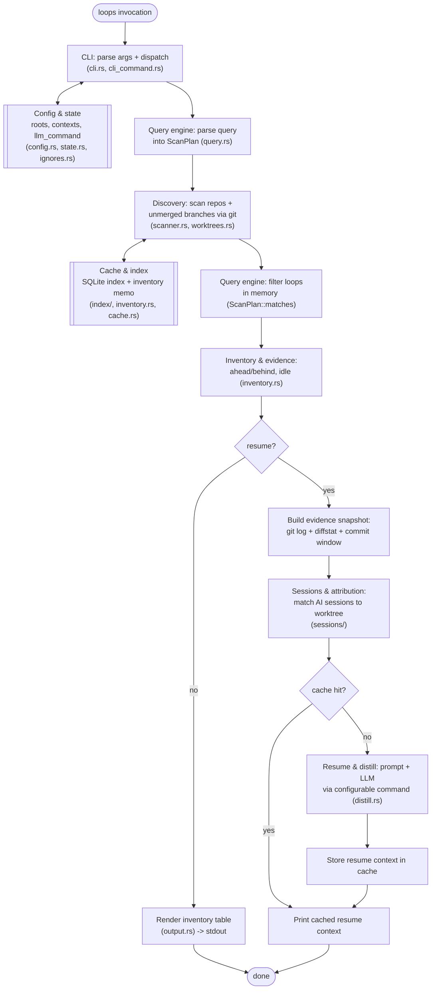

# 00 — Overview

> Architecture layer index: [`README.md`](README.md). This is the anchor doc;
> the eight runtime-domain docs and the build/CI/release doc slot into the
> end-to-end flow described here.

## Purpose

`open-loops` is a single-binary Rust CLI (`loops`) that answers three questions
about paused work without asking you to document anything: *what did I start and
not finish, where did I leave off, and what is the next step?* It lists every
unmerged branch across the git repositories under your configured roots, and on
demand it reconstructs a resume context for one of them by distilling git
history and your past AI sessions through an LLM.

The dominant cost when returning to a paused branch is not understanding the
code — it is recovering the *context*: why the branch exists, what is done, what
remains, and what to do next. That context already exists, scattered across git
and AI-session logs; the friction is the manual archaeology of finding it. This
project removes that friction. This document establishes the shared vocabulary
and the end-to-end flow that the nine sibling domain docs build on; read it
first.

## Domain map

The runtime is split into eight bounded contexts, each documented in its own
file, plus a build/CI/release doc. The crate root that wires them together is
[`src/lib.rs`](../../src/lib.rs:1) (module list) and the dispatch entrypoint is
[`src/main.rs`](../../src/main.rs:5).

| # | Domain | Code | Doc |
|---|---|---|---|
| 1 | Discovery | `scanner.rs`, `worktrees.rs` | [01-discovery.md](01-discovery.md) |
| 2 | Sessions & attribution | `sessions/` | [02-sessions-attribution.md](02-sessions-attribution.md) |
| 3 | Query engine | `query.rs` | [03-query-engine.md](03-query-engine.md) |
| 4 | Inventory & evidence | `inventory.rs` | [04-inventory-evidence.md](04-inventory-evidence.md) |
| 5 | Resume & distill | `distill.rs` | [05-resume-distill.md](05-resume-distill.md) |
| 6 | Cache & index | `cache.rs`, `index/` | [06-cache-index.md](06-cache-index.md) |
| 7 | Config & state | `config.rs`, `state.rs`, `ignores.rs` | [07-config-state.md](07-config-state.md) |
| 8 | CLI & output | `cli.rs`, `cli_command.rs`, `main.rs`, `output.rs` | [08-cli-output.md](08-cli-output.md) |
| — | Build / CI / release | workflows, `release-plz`, `cargo-dist` | [09-build-ci-release.md](09-build-ci-release.md) |

The public entrypoint of the crate is the `cli` module: `main.rs` parses
arguments and dispatches to one `run_*` function per subcommand
([`src/main.rs:8`](../../src/main.rs:8)). Everything below the CLI is a library
(`open_loops`) so the same orchestration is reachable from tests.

## Concepts & vocabulary

These terms are canonical across the whole architecture layer; later docs use
these exact spellings.

- **open loop** — the unit of work the tool tracks: an unmerged branch (other
  than the default branch) that still carries commits of its own, in some
  repository under a configured root. The branch is an indexing proxy for the
  conceptual "started-but-unfinished task", not the task itself. Its canonical
  key is `repo/branch`, used by `resume` and `ignore`
  (`OpenLoop::key`, [`src/scanner.rs:109`](../../src/scanner.rs:109)).
- **evidence snapshot** — the bundle of objective facts gathered for a loop
  before any LLM call: the git commit log and diffstat against the default
  branch, the loop's commit time window, and the matched AI-session excerpts,
  together with a derived *confidence* score. `loops resume --dry-run` prints
  the evidence snapshot without invoking the LLM, so you can audit what would
  feed it.
- **resume context** — the distilled, human-facing document the LLM produces
  from the evidence snapshot: the `## Why`, `## Done`, `## Remaining`, and
  `## Next step` sections, always followed by a `## Sources` section and a
  confidence score for auditing.
- **pull-only** — the operating model: the tool captures nothing ahead of time
  and writes nothing inside your repositories. It scans git and sessions *on
  demand*, at the moment you ask to resume. This is what lets it work
  retroactively on branches that already exist (see *Decisions*, ex-ADR-0001).

Two stores sit beside the main flow. The **inventory** is a per-repository memo
of ahead/behind counts keyed by `(branch, head_sha, default_sha)`; the **index**
is a disposable SQLite cache of scan results keyed effectively by
`branch@head-sha`. Both are throwaway: git is always the source of truth, and
either store can be deleted and rebuilt on the next run. The distillation
**cache** stores finished resume contexts keyed by the loop's `head_sha`, so a
new commit invalidates it automatically.

## Main flow

A `loops` invocation traverses the runtime domains as follows. `loops [query]`
walks the path down to inventory rendering; `loops resume <query>` continues
through resume/distill. Cache/index and config/state are side stores read and
written along the way.

In code: `main.rs` dispatches to `run_list` or `run_resume`
([`src/cli.rs:224`](../../src/cli.rs:224),
[`src/cli.rs:292`](../../src/cli.rs:292)). Both first load config and resolve the
query into a `ScanPlan` via `resolve_plan_persisting`
([`src/cli.rs:63`](../../src/cli.rs:63)) — the runtime wrapper that persists any
active-context switch and delegates to `query::resolve_plan`
([`src/query.rs:225`](../../src/query.rs:225)) — then scan
(`scanner::scan_indexed`, [`src/scanner.rs:733`](../../src/scanner.rs:733)),
filter in memory (`ScanPlan::matches`,
[`src/query.rs:346`](../../src/query.rs:346)), and either render the table
(`output::render_table`, [`src/output.rs:31`](../../src/output.rs:31)) or, for
resume, gather the evidence snapshot and distill it (`build_prompt`/`run_llm`,
[`src/distill.rs:64`](../../src/distill.rs:64),
[`src/distill.rs:106`](../../src/distill.rs:106)).

## Interfaces & contracts

The CLI surface is the public contract; each subcommand maps to one `run_*`
function. See [`docs/features.md`](../features.md) for user-facing details — this
section only states the boundaries.

| Subcommand | Entry | Side stores touched |
|---|---|---|
| `loops [query]` | `run_list` ([`src/cli.rs:224`](../../src/cli.rs:224)) | reads config/state, reads+writes index & inventory |
| `loops resume <query> [--dry-run] [--fresh]` | `run_resume` ([`src/cli.rs:292`](../../src/cli.rs:292)) | also reads+writes the distillation cache |
| `loops refresh [query]` | `run_refresh` ([`src/cli.rs:336`](../../src/cli.rs:336)) | recomputes & prunes index + inventory |
| `loops init <dir>...` | `run_init` ([`src/cli.rs:264`](../../src/cli.rs:264)) | writes config roots |
| `loops ignore <repo/branch>` | `run_ignore` ([`src/cli.rs:278`](../../src/cli.rs:278)) | writes the ignore list |
| `loops worktrees` (alias `wt`) | `run_worktrees` ([`src/cli.rs:418`](../../src/cli.rs:418)) | reads config |
| `loops completions <shell>` | `run_completions` ([`src/cli.rs:411`](../../src/cli.rs:411)) | none |

The command surface itself (`Cli`, `Command`) is declared once in
[`src/cli_command.rs`](../../src/cli_command.rs:5) and shared between the runtime
and `build.rs`. Output streams follow one rule: progress lines go to **stderr**,
the inventory table and resume context go to **stdout**, so stdout can be piped
without losing data. On any error the process prints `error: …` and exits with
status 1 ([`src/main.rs:21`](../../src/main.rs:21)).

The cross-domain data types each have a home doc: `OpenLoop`
([`src/scanner.rs:109`](../../src/scanner.rs:109)) in discovery, `ScanPlan`
([`src/query.rs:40`](../../src/query.rs:40)) in the query engine,
`SessionExcerpt` ([`src/sessions/mod.rs:11`](../../src/sessions/mod.rs:11)) in
sessions, and `Confidence` ([`src/distill.rs:13`](../../src/distill.rs:13)) in
resume/distill.

## Invariants & edge cases

These hold system-wide; each domain doc restates the ones it owns.

- **Nothing is written inside your repositories.** All state lives under
  `~/.open-loops/` (override with `OPEN_LOOPS_HOME`,
  [`src/main.rs:28`](../../src/main.rs:28)). This is success criterion #5 of the
  MVP and a hard guarantee.
- **Git is the source of truth; the index and inventory are throwaway caches.**
  A corrupt or unopenable index self-heals — it is rebuilt from git, or falls
  back to in-memory, with a one-line warning, and never aborts a command
  (`Index::open`, [`src/index/mod.rs:50`](../../src/index/mod.rs:50)).
- **Partial failure never aborts the whole operation.** A repository that fails
  to scan becomes a stderr warning while the rest continue; a configured root
  that no longer exists is skipped with a warning.
- **Session parsing is tolerant.** The Claude Code `.jsonl` format is internal,
  not a public API, so a malformed line is skipped with a warning rather than
  aborting (see [02-sessions-attribution.md](02-sessions-attribution.md)).
- **No loops configured is a guided error, not a crash.** Every scanning command
  shares a preamble that requires at least one root and otherwise tells you to
  run `loops init` (`load_cfg_with_roots`,
  [`src/cli.rs:38`](../../src/cli.rs:38)).
- **The cache invalidates itself on new work.** A resume context is keyed by the
  loop's HEAD sha, so a new commit produces a cache miss automatically
  (`Cache::get`/`Cache::put`, [`src/cache.rs:30`](../../src/cache.rs:30),
  [`src/cache.rs:39`](../../src/cache.rs:39)).
- **A resume is never silently trusted.** Every resume context ships a
  confidence score and a `## Sources` section — the audit trail you use to
  decide whether to trust the distillation, not debugging metadata.

## Decisions

The architecture rests on two cross-cutting decisions absorbed from the original
ADRs. Domain-specific decisions live in their respective docs.

**Pull-only MVP (on-demand scan)** *(ex-ADR-0001)*. Resume context exists in AI
sessions plus git. It could be captured eagerly via a session-end hook (push),
which reads back faster, but push only works from the moment it is installed and
needs per-machine infrastructure. The MVP instead distills *on demand* (pull):
zero capture, and it works retroactively on branches that already exist. The
trade-off is that a cold resume pays for an LLM call (~30–60s), mitigated by
caching keyed by `branch@head-sha`; and the session-to-branch mapping is
heuristic (time window plus branch mention), mitigated by the auditable
`## Sources` section. Push and hybrid models are deferred to a later phase, after
validating the central hypothesis (resume in under 60s with nothing written down
in advance).

**Git and the LLM via shell-out** *(ex-ADR-0002, the cross-cutting principle)*.
The tool shells out to the `git` binary (not the `git2`/`gix` libraries) and
calls the LLM through a configurable command (`llm_command`, default
`claude -p`) that receives the prompt on stdin. The rationale is simplicity and
debuggability: the performance bottleneck is the LLM, not git, so a library
binding buys nothing the subprocess does not. Making the LLM command injectable
lets the test suite substitute a stdin→stdout program such as `cat` and lets
users switch LLM providers without code changes. The consequence is that both
`git` and an LLM CLI must be on `PATH`; error messages point at installation and
configuration when they are missing.

## Extension & limitations

- **Other session harnesses (planned).** The `sessions/` module is deliberately
  an adapter layer behind the `SessionSource` trait
  ([`src/sessions/mod.rs:23`](../../src/sessions/mod.rs:23)). A future phase adds
  adapters for harnesses beyond Claude Code (e.g. Codex CLI, OpenCode) without
  touching the rest of the code. See
  [02-sessions-attribution.md](02-sessions-attribution.md).
- **Push / hybrid capture (planned).** A later phase may add a session-end hook
  that snapshots context eagerly, with `resume` preferring the snapshot when one
  exists and falling back to the pull path otherwise.
- **Heuristic attribution.** Session-to-branch matching is intentionally
  approximate; the confidence score and `## Sources` section exist precisely
  because the heuristic can be wrong, and refining it is a known candidate for
  experimentation.
- **Typed errors (implemented).** The library API returns domain-specific
  `thiserror` enums (`QueryError`, `GitError`, `ConfigError`, …) aggregated as
  `OpenLoopsError` at the CLI boundary ([`src/error.rs`](../../src/error.rs)).
  `main` prints failures with `error_chain()` so nested causes (e.g. TOML parse
  errors) remain visible. Breaking change for lib consumers — see CHANGELOG
  *unreleased*.
- **Roadmap — library maturity & OSS health (partially implemented).** Typed
  errors (spec §4.1) are done. Still upcoming: observability (`tracing`,
  `--verbose`, spec §4.3), proptest/coverage gates (§4.2), and community files
  (§4.4). Design:
  [`docs/superpowers/specs/2026-06-26-library-maturity-oss-health-design.md`](../superpowers/specs/2026-06-26-library-maturity-oss-health-design.md).

## References

Code (verified against the current tree):

- [`src/lib.rs:1`](../../src/lib.rs:1) — crate module list (the eight domains).
- [`src/main.rs:5`](../../src/main.rs:5) — `main`: parse and dispatch;
  [`src/main.rs:28`](../../src/main.rs:28) — `OPEN_LOOPS_HOME` base-dir resolution.
- [`src/cli.rs:224`](../../src/cli.rs:224) — `run_list`;
  [`src/cli.rs:292`](../../src/cli.rs:292) — `run_resume`;
  [`src/cli.rs:63`](../../src/cli.rs:63) — `resolve_plan_persisting` (runtime wrapper
  that delegates to `query::resolve_plan`);
  [`src/cli.rs:38`](../../src/cli.rs:38) — `load_cfg_with_roots` (shared preamble).
- [`src/cli_command.rs:5`](../../src/cli_command.rs:5) — `Cli`/`Command` surface.
- [`src/scanner.rs:109`](../../src/scanner.rs:109) — `OpenLoop` (the open-loop type);
  [`src/scanner.rs:733`](../../src/scanner.rs:733) — `scan_indexed`.
- [`src/query.rs:40`](../../src/query.rs:40) — `ScanPlan`;
  [`src/query.rs:346`](../../src/query.rs:346) — `ScanPlan::matches`.
- [`src/sessions/mod.rs:11`](../../src/sessions/mod.rs:11) — `SessionExcerpt`;
  [`src/sessions/mod.rs:23`](../../src/sessions/mod.rs:23) — `SessionSource` trait.
- [`src/distill.rs:13`](../../src/distill.rs:13) — `Confidence`;
  [`src/distill.rs:64`](../../src/distill.rs:64) — `build_prompt`.
- [`src/output.rs:31`](../../src/output.rs:31) — `render_table` (inventory render).
- [`src/index/mod.rs:50`](../../src/index/mod.rs:50) — `Index::open` (self-healing).
- [`src/cache.rs:30`](../../src/cache.rs:30) — `Cache::get`;
  [`src/cache.rs:39`](../../src/cache.rs:39) — `Cache::put` (distillation cache keyed by head-sha).

Sibling architecture docs: [01-discovery](01-discovery.md) ·
[02-sessions-attribution](02-sessions-attribution.md) ·
[03-query-engine](03-query-engine.md) ·
[04-inventory-evidence](04-inventory-evidence.md) ·
[05-resume-distill](05-resume-distill.md) · [06-cache-index](06-cache-index.md) ·
[07-config-state](07-config-state.md) · [08-cli-output](08-cli-output.md) ·
[09-build-ci-release](09-build-ci-release.md).

User-facing docs (linked, not duplicated): [setup](../setup.md) ·
[features](../features.md) · [configuration](../configuration.md) ·
[distribution](../distribution.md).
