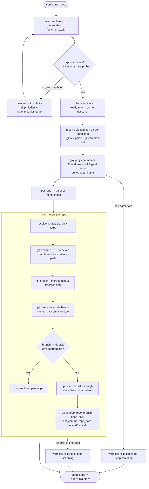

# 01 — Discovery

> Architecture layer index: [`README.md`](README.md). Anchor doc with the shared
> vocabulary and end-to-end flow: [`00-overview.md`](00-overview.md). Read the
> overview first; this doc owns the first runtime domain in that flow.

## Purpose

Discovery answers the foundational question of the whole tool: *which
repositories exist under your configured roots, and which of their branches are
open loops?* It is the first runtime domain — everything downstream (query,
inventory, evidence, resume) operates on the loops this domain produces.

Concretely, discovery walks the configured roots looking for git repositories,
enumerates each repo's local branches, and keeps only the **open loops** — the
unmerged branches (other than the default) that still carry commits of their
own. It does all of this by shelling out to the `git` binary rather than reading
`.git` internals directly, which keeps it agnostic to physical layout: a normal
checkout, a linked worktree, and a bare store are all just arrangements of the
same logical *branch store*, and git is asked to tell them apart. The sibling
worktree inventory (`loops worktrees`) reuses the same discovery pass to report
disk-level clutter (merged worktrees still checked out on disk).

## Domain map

| File | Responsibility |
|---|---|
| [`src/scanner.rs`](../../src/scanner.rs:1) | Repo discovery (FS walk + git dedup), branch enumeration, the open-loop model, and the git shell-out helper. |
| [`src/worktrees.rs`](../../src/worktrees.rs:1) | Worktree inventory: enumerate a repo's worktrees and classify each with a cleanup *verdict*. |

Discovery depends on two neighbouring domains: the FS walk skips directories per
rules co-owned with [07-config-state](07-config-state.md) (`scan_depth`, and the
`ignores.rs` ignore list applied later by the query engine), and the indexed
scan path reads and writes the throwaway caches owned by
[06-cache-index](06-cache-index.md). The `repo_path` each open loop carries
(the branch's worktree) is the join key the next domain,
[02-sessions-attribution](02-sessions-attribution.md), uses to match AI sessions
to a loop.

Public entry points:

- `scanner::scan` / `scanner::scan_indexed` ([`src/scanner.rs:682`](../../src/scanner.rs:682),
  [`src/scanner.rs:733`](../../src/scanner.rs:733)) — scan all repos under the
  roots and return the open loops. `scan_indexed` is the variant the CLI calls;
  `scan` is the index-free shorthand.
- `scanner::find_repos` / `find_repos_cached` ([`src/scanner.rs:314`](../../src/scanner.rs:314),
  [`src/scanner.rs:320`](../../src/scanner.rs:320)) — repo discovery only (walk +
  dedup), without branch enumeration.
- `scanner::open_loops` / `open_loops_indexed` ([`src/scanner.rs:424`](../../src/scanner.rs:424),
  [`src/scanner.rs:451`](../../src/scanner.rs:451)) — enumerate the open loops of
  one repo.
- `worktrees::worktrees` / `scan_worktrees` ([`src/worktrees.rs:84`](../../src/worktrees.rs:84),
  [`src/worktrees.rs:150`](../../src/worktrees.rs:150)) — worktree inventory for
  one repo / all repos under the roots.

## Concepts & vocabulary

These build on the canonical terms in [00-overview](00-overview.md#concepts--vocabulary);
discovery owns the *open loop* type and adds the discovery-local vocabulary.

- **open loop** — an unmerged branch (other than the default) that still carries
  commits of its own. Discovery materialises it as `OpenLoop`
  ([`src/scanner.rs:109`](../../src/scanner.rs:109)), whose canonical key is
  `root-label/repo/branch` (`OpenLoop::key`,
  [`src/scanner.rs:122`](../../src/scanner.rs:122)).
- **repo candidate** — a directory on disk that *looks like* a git repository
  during the FS walk, before git confirms it. A directory is a candidate when it
  contains a `.git` file or directory, or when a cheap bare probe matches
  (`HEAD` file + `objects/` + `refs/` directories). Modelled as `RepoCandidate`
  ([`src/scanner.rs:101`](../../src/scanner.rs:101)); the probe lives in
  `is_repo_candidate` / `looks_like_bare` ([`src/scanner.rs:133`](../../src/scanner.rs:133),
  [`src/scanner.rs:129`](../../src/scanner.rs:129)).
- **common-dir** — the absolute path of the git *common directory*
  (`git rev-parse --path-format=absolute --git-common-dir`), the canonical
  identity of a branch store. N worktrees of one repo all resolve to the same
  common-dir, so it is the deduplication key and the source of the canonical
  `repo_name` (`git_common_dir`, `repo_name_from_common_dir`,
  [`src/scanner.rs:158`](../../src/scanner.rs:158),
  [`src/scanner.rs:138`](../../src/scanner.rs:138)).
- **default branch** — the branch open loops are measured against. Resolved as
  `origin/HEAD`'s target when it exists locally, else `main`, else `master`
  (`default_branch`, [`src/scanner.rs:57`](../../src/scanner.rs:57)).
- **scan depth** — the maximum directory depth, from each root, the walk
  descends before giving up. Configurable, default 4; owned by config (see
  [07-config-state](07-config-state.md)).
- **worktree** — a checkout of one branch on disk. A linked worktree marks its
  directory with a `.git` *file* (not directory) pointing back into the common
  store. `WorktreeEntry` ([`src/scanner.rs:248`](../../src/scanner.rs:248)) is
  the parsed `git worktree list --porcelain` row; `Worktree`
  ([`src/worktrees.rs:37`](../../src/worktrees.rs:37)) is the richer inventory
  model carrying a `Verdict`.
- **verdict** — the cleanup classification of a worktree (`home`, `prunable`,
  `active`, `deletable`, `cold`), produced by a pure first-match rule
  (`Worktree::verdict`, [`src/worktrees.rs:51`](../../src/worktrees.rs:51)).

## Main flow

A scan proceeds in three stages: **walk** the roots into repo candidates,
**dedup** candidates into one logical repo per common-dir, then **enumerate**
each repo's open loops via git. The walk early-returns at the first repo
boundary it finds, so it never descends into a repo's innards or double-counts
its worktrees. Branch enumeration runs the same way against normal, bare, and
worktree layouts because git is asked the questions, not the filesystem.

In code, `scan_indexed` ([`src/scanner.rs:733`](../../src/scanner.rs:733)) drives
the flow: it calls `find_repos_cached` (walk + dedup), filters by `repo:` name
when the query pushed one down (the `repo:` predicate is defined in
[03-query-engine](03-query-engine.md)), then fans `open_loops` out across the
discovered repos on a thread per repo (`std::thread::scope`). Inside `open_loops_indexed`
([`src/scanner.rs:451`](../../src/scanner.rs:451)) the *light phase* always runs
(default branch, worktree map, merged set, `for-each-ref`); the *heavy phase*
(`rev-list` for ahead/behind) runs only when the caller asks for ahead/behind,
and is memoised. The walk itself is `walk`
([`src/scanner.rs:378`](../../src/scanner.rs:378)), and dedup-by-common-dir is
`dedup_candidates_cached` ([`src/scanner.rs:334`](../../src/scanner.rs:334)).

The worktree inventory (`loops worktrees`) reuses `find_repos` for discovery and
then, per repo, parses `git worktree list --porcelain` and classifies each entry
(`worktrees::worktrees`, [`src/worktrees.rs:84`](../../src/worktrees.rs:84)).

## Interfaces & contracts

The cross-domain output is the `OpenLoop` ([`src/scanner.rs:109`](../../src/scanner.rs:109)):

| Field | Meaning |
|---|---|
| `root_label`, `repo_name`, `branch` | The three segments of the canonical key. `repo_name` always comes from the common-dir, never the folder name. |
| `repo_path` | The branch's worktree path when it is checked out, else the repo container — the join key for session attribution. |
| `head_sha` | Branch HEAD; keys the distillation cache (see [06-cache-index](06-cache-index.md)). |
| `last_commit` | Branch HEAD commit time (drives idle sorting). |
| `ahead`, `behind` | `Option<u32>` vs the default branch; `None` when the heavy phase was skipped. |

The scan functions return `(loops, warnings, inventory_updates)` — warnings are
accumulated, never fatal (see *Invariants*). `ScanOptions`
([`src/scanner.rs:17`](../../src/scanner.rs:17)) controls the heavy phase
(`need_ahead_behind`), cache bypass (`fresh`), and inventory memoisation
(`inventory_dir`, `inventory_ttl_secs`).

All git access goes through one private helper, `git`
([`src/scanner.rs:33`](../../src/scanner.rs:33)): it runs `git -C <repo> <args>`,
returns trimmed stdout on success, and on a non-zero exit returns an `Err`
carrying the repo path and git's stderr. A missing `git` binary surfaces as
`git not found in PATH — install git`. The discovery-relevant subcommands it
wraps are `rev-parse --git-common-dir`, `symbolic-ref`/`rev-parse` (default
branch), `for-each-ref` (branch enumeration), `branch --merged`, `rev-list`
(ahead/behind), and `worktree list --porcelain`. The branch-evidence helpers
`git_log`, `diffstat`, and `commit_window`
([`src/scanner.rs:964`](../../src/scanner.rs:964),
[`src/scanner.rs:973`](../../src/scanner.rs:973),
[`src/scanner.rs:984`](../../src/scanner.rs:984)) also live here but feed the
evidence snapshot consumed by [05-resume-distill](05-resume-distill.md).

Worktree inventory contracts: `parse_worktree_porcelain`
([`src/scanner.rs:261`](../../src/scanner.rs:261)) is a pure parser over git's
porcelain output (a new entry per `worktree ` line; tolerant of unknown/blank
lines), and `Worktree::verdict` ([`src/worktrees.rs:51`](../../src/worktrees.rs:51))
is a pure first-match classifier. User-facing details of `loops worktrees` live
in [docs/features.md](../features.md) — not duplicated here.

## Invariants & edge cases

- **Tolerant shell-out — one failed repo never aborts the scan.** This is the
  core robustness rule, confirmed at three points in `scanner.rs`:
  - A candidate whose `git rev-parse --git-common-dir` fails is pushed onto the
    warnings vec and skipped during dedup; the loop continues
    (`dedup_candidates_cached`, [`src/scanner.rs:368`](../../src/scanner.rs:368)).
  - A repo whose parallel `open_loops` returns `Err` (or panics) becomes a
    warning while the other repos' results are still collected
    (`recompute_misses`, [`src/scanner.rs:877`](../../src/scanner.rs:877); the
    index-free path behaves identically). The same holds for the worktree
    inventory (`scan_worktrees`, [`src/worktrees.rs:170`](../../src/worktrees.rs:170)).
  - Inside `open_loops`, a failing `git worktree list` does not abort the repo:
    it warns and falls back to an empty branch→worktree map, so loops still list
    with `repo_path` defaulting to the container
    ([`src/scanner.rs:497`](../../src/scanner.rs:497)).

  Warnings go to stderr by the caller; the open loops still go to stdout. (A
  *hard* git error — e.g. an unresolvable default branch in the only repo —
  still propagates from `open_loops`, but per repo it is caught and demoted to a
  warning by the parallel driver.)
- **A malformed `for-each-ref` line is skipped, not fatal.** A row that does not
  split into name/sha/date triggers a warning and `continue`, mirroring the
  tolerant-parsing rule used for session logs
  ([`src/scanner.rs:556`](../../src/scanner.rs:556)).
- **The walk early-returns at a repo boundary.** Once a directory is a repo
  candidate it is collected and not descended into, so a repo's own worktrees
  and `.git` internals are never re-counted; dedup-by-common-dir then collapses
  any candidates that *were* reached separately
  ([`src/scanner.rs:378`](../../src/scanner.rs:378)).
- **Hidden and heavy directories are pruned during descent.** Dot-prefixed
  directories and `node_modules` / `target` (`SKIP_DIRS`,
  [`src/scanner.rs:127`](../../src/scanner.rs:127)) are not descended into
  (`name.starts_with('.')`, [`src/scanner.rs:393`](../../src/scanner.rs:393)). A
  bare repo named `.bare` hidden under a dot-prefixed parent is therefore not
  discovered unless a root points directly at it or the container carries the
  `.git` pointer — a known, documented edge case. The same rule applies to any
  linked worktree whose checkout directory sits under a dot-prefixed parent
  (e.g. a worktree at `~/repos/.wip/feature`) — the `.bare` case is called out
  separately because it is the more common surprise.
- **Default-branch resolution is defensive.** A stale or single-branch
  `origin/HEAD` that names a branch with no local ref is *not* honoured; the code
  falls through to `main`/`master` so the repo does not silently disappear
  (`default_branch_and_sha`, [`src/scanner.rs:72`](../../src/scanner.rs:72)).
- **`repo_name` is layout-agnostic.** It is derived from the common-dir
  basename, never from the worktree folder name (`.bare`/`.git` → parent
  directory name; `foo.git` → `foo`), so the same repo gets the same name
  regardless of which worktree was scanned
  ([`src/scanner.rs:138`](../../src/scanner.rs:138)).
- **git forbids one branch being checked out in two worktrees at once**, so the
  branch→worktree map is 1:1 and bare/detached entries (no branch to key on) are
  dropped (`worktree_map`, [`src/scanner.rs:303`](../../src/scanner.rs:303)).

## Decisions

**Repository discovery via git interrogation** *(ex-ADR-0005)*. Discovery
originally recognised a repo only when `dir/.git` was a *directory*. In the
bare-plus-worktree layout (`.git` is always a *file* pointing at a `.bare/`
store, and worktrees are sibling directories) no `.git` directory exists
anywhere, so discovery returned zero repos — and naming from the folder would
have yielded `.bare`, `main`, or `dev` instead of the real repo name. The
alternative considered, layout-specific path heuristics (match `.bare`, guess
from worktree folder names), would have hard-coded one author's tree. The
decision is to ask git instead: mark a candidate when `.git` *exists* (file or
directory) or a cheap structural bare probe matches, resolve each candidate to
its absolute `--git-common-dir`, and **deduplicate by that common-dir** so any
combination of worktrees collapses to one logical repo scanned once. The
canonical `repo_name` is derived from the common-dir, and the fixed walk depth
became the configurable `scan_depth` (default 4). The trade-off is one extra
`git rev-parse` per candidate and the documented blind spot for an isolated
hidden `.bare`; the canonical three-segment key `root_label/repo/branch` is
unchanged — only the *source* of `repo_name` moved.

**Git via shell-out** *(ex-ADR-0002, the git half)*. Discovery shells out to the
`git` binary rather than linking a library (`git2`/`gix`). The rationale is
simplicity and debuggability: the product's performance bottleneck is the LLM,
not git, so a library binding buys nothing the subprocess does not, while a
subprocess is trivial to reason about and to reproduce by hand. The consequence
is that `git` must be on `PATH`; its absence is reported with an actionable
message pointing at installation. (The LLM half of this decision is covered in
[05-resume-distill](05-resume-distill.md); the cross-cutting principle is in
[00-overview](00-overview.md#decisions).)

**Worktree inventory as an open-loop axis** *(absorbed from the worktree-inventory
design)*. A merged worktree left checked out on disk is itself an open loop with
a physical cost, so `loops worktrees` lists every worktree under the roots with
a deterministic cleanup verdict and, for the safe-to-remove ones, prints the
exact cleanup command. The locked decisions: the tool is an *advisor* — it
classifies and suggests but never deletes anything; output is ASCII-only with a
word verdict (no emoji); and the verdict is a pure first-match rule with **no
time threshold** (idle age is a display/sort column, not part of the rule),
which avoids a magic-number cutoff. The safety bias is explicit: detached or
unclear states resolve to `active` rather than `deletable`, so live work is never
suggested for deletion.

## Extension & limitations

- **Other layouts via git, not heuristics.** Because discovery interrogates git,
  new physical arrangements (submodules, future worktree styles) are handled by
  git's own answers; submodules currently dedup under their owner repo's
  common-dir, which is acceptable rather than a goal.
- **Isolated hidden bare stores.** A `.bare` directory hidden under a
  dot-prefixed parent, with no container `.git` pointer and not pointed at
  directly by a root, is skipped during descent. Documented in
  [docs/configuration.md](../configuration.md); the workaround is to register a
  root that points at the container or the bare path.
- **`loops worktrees` is advisor-only and never executes cleanup.** A
  deliberate `loops clean` that runs the suggested commands (with guards) is
  out of scope and deferred to a future, explicit feature.
- **PERF: common-dir resolved twice per repo.** `git_common_dir` runs once in
  dedup and again in `open_loops`
  ([`src/scanner.rs:460`](../../src/scanner.rs:460)); the cost is one extra git
  call per repo per scan, an accepted trade-off for keeping the public signatures
  stable (the `PERF-1` note at [`src/scanner.rs:237`](../../src/scanner.rs:237)).
  The SQLite index mitigates it on warm scans (see
  [06-cache-index](06-cache-index.md)).

## References

Code (verified against the current tree):

- [`src/scanner.rs:33`](../../src/scanner.rs:33) — `git` (the single shell-out
  helper).
- [`src/scanner.rs:57`](../../src/scanner.rs:57) — `default_branch`;
  [`src/scanner.rs:72`](../../src/scanner.rs:72) — `default_branch_and_sha`
  (origin/HEAD → main → master fallback).
- [`src/scanner.rs:101`](../../src/scanner.rs:101) — `RepoCandidate`;
  [`src/scanner.rs:109`](../../src/scanner.rs:109) — `OpenLoop`;
  [`src/scanner.rs:122`](../../src/scanner.rs:122) — `OpenLoop::key`.
- [`src/scanner.rs:127`](../../src/scanner.rs:127) — `SKIP_DIRS`;
  [`src/scanner.rs:129`](../../src/scanner.rs:129) — `looks_like_bare`;
  [`src/scanner.rs:133`](../../src/scanner.rs:133) — `is_repo_candidate`.
- [`src/scanner.rs:138`](../../src/scanner.rs:138) — `repo_name_from_common_dir`;
  [`src/scanner.rs:158`](../../src/scanner.rs:158) — `git_common_dir`.
- [`src/scanner.rs:248`](../../src/scanner.rs:248) — `WorktreeEntry`;
  [`src/scanner.rs:261`](../../src/scanner.rs:261) — `parse_worktree_porcelain`;
  [`src/scanner.rs:303`](../../src/scanner.rs:303) — `worktree_map`.
- [`src/scanner.rs:314`](../../src/scanner.rs:314) — `find_repos`;
  [`src/scanner.rs:334`](../../src/scanner.rs:334) — `dedup_candidates_cached`
  (warning on rev-parse failure at [`:368`](../../src/scanner.rs:368));
  [`src/scanner.rs:378`](../../src/scanner.rs:378) — `walk` (early-return + skips).
- [`src/scanner.rs:424`](../../src/scanner.rs:424) — `open_loops`;
  [`src/scanner.rs:451`](../../src/scanner.rs:451) — `open_loops_indexed`
  (worktree-list fallback warning at [`:497`](../../src/scanner.rs:497);
  malformed-line skip at [`:556`](../../src/scanner.rs:556)).
- [`src/scanner.rs:682`](../../src/scanner.rs:682) — `scan`;
  [`src/scanner.rs:733`](../../src/scanner.rs:733) — `scan_indexed`;
  [`src/scanner.rs:877`](../../src/scanner.rs:877) — per-repo error → warning.
- [`src/scanner.rs:964`](../../src/scanner.rs:964) — `git_log`;
  [`src/scanner.rs:973`](../../src/scanner.rs:973) — `diffstat`;
  [`src/scanner.rs:984`](../../src/scanner.rs:984) — `commit_window`.
- [`src/worktrees.rs:37`](../../src/worktrees.rs:37) — `Worktree`;
  [`src/worktrees.rs:51`](../../src/worktrees.rs:51) — `Worktree::verdict`;
  [`src/worktrees.rs:84`](../../src/worktrees.rs:84) — `worktrees`;
  [`src/worktrees.rs:150`](../../src/worktrees.rs:150) — `scan_worktrees`
  (per-repo error → warning at [`:170`](../../src/worktrees.rs:170)).

Tests worth reading: `find_repos_dedups_container_and_worktrees`,
`find_repos_respects_scan_depth_and_skips_hidden`,
`find_repos_finds_pure_bare_repo`,
`open_loops_finds_unmerged_ignores_merged_and_default`,
`open_loops_sets_repo_path_to_worktree_when_branch_checked_out`
(all in [`src/scanner.rs`](../../src/scanner.rs:1108)), and
`verdict_covers_all_combinations` / `scan_worktrees_aggregates_and_does_not_abort`
(in [`src/worktrees.rs`](../../src/worktrees.rs:203)).

Sibling architecture docs: [00-overview](00-overview.md) ·
[02-sessions-attribution](02-sessions-attribution.md) (consumes `repo_path`) ·
[06-cache-index](06-cache-index.md) (the refs-fingerprint gate + inventory memo) ·
[07-config-state](07-config-state.md) (`scan_depth`, `ignores.rs`).

User-facing docs (linked, not duplicated): [features](../features.md)
(`loops`, `loops worktrees`) · [configuration](../configuration.md)
(`scan_depth`, the hidden-`.bare` edge case).
