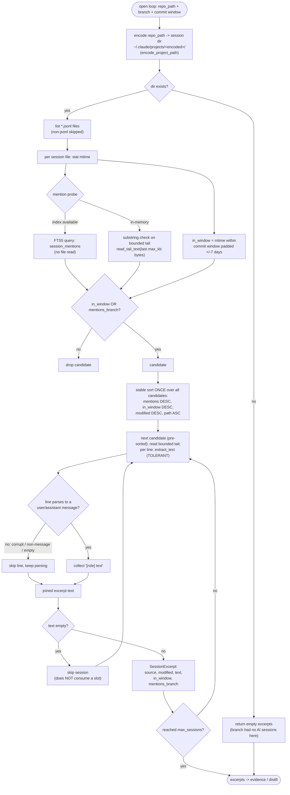

# 02 — Sessions & attribution

> Architecture layer index: [`README.md`](README.md). Anchor doc with the shared
> vocabulary and end-to-end flow: [`00-overview.md`](00-overview.md). Read the
> overview first; this doc owns the second runtime domain in that flow, the one
> that turns AI-session logs into the **session excerpts** that feed resume.

## Purpose

This domain answers a single question for a given open loop: *which past AI
sessions belong to this branch, and what did they say?* Discovery
([01-discovery](01-discovery.md)) has already produced the open loop with a
`repo_path` — the worktree where the branch is checked out. Sessions &
attribution takes that path, finds the AI-session logs recorded for it, parses
their message text tolerantly, and yields a ranked list of `SessionExcerpt`s
attributed to the branch.

These excerpts carry the part of the resume context that git alone cannot
recover: *what the AI and the author were actually working on* when the branch
was last touched — the "where I left off" signal. The excerpts flow into the
evidence snapshot consumed by [04-inventory-evidence](04-inventory-evidence.md)
and the distillation in [05-resume-distill](05-resume-distill.md), and they are
also what the `## Sources` section and the confidence score are computed from,
so a resume is always auditable.

The whole domain is an **adapter layer**. The Claude Code `.jsonl` format and
its on-disk location are an internal detail isolated behind one trait; nothing
outside `src/sessions/` knows what a session file looks like. This is a hard
project rule (see *Extension & limitations*).

## Domain map

| File | Responsibility |
|---|---|
| [`src/sessions/mod.rs`](../../src/sessions/mod.rs:1) | The `SessionSource` trait (the harness-agnostic contract) and the `SessionExcerpt` type (the cross-domain output). |
| [`src/sessions/claude_code.rs`](../../src/sessions/claude_code.rs:1) | The one concrete adapter: locate Claude Code sessions for a `repo_path`, parse them tolerantly, rank them, and yield excerpts. |

This domain sits between three neighbours:

- **Upstream — discovery.** It consumes `OpenLoop.repo_path`
  ([`src/scanner.rs:109`](../../src/scanner.rs:109)), the join key. Crucially,
  discovery resolves `repo_path` to the *branch's worktree* when the branch is
  checked out, not the repo container — this is the attribution mechanism (see
  *Main flow* and *Decisions*). The worktree map that does this lives in
  discovery (`worktree_map`, [`src/scanner.rs:303`](../../src/scanner.rs:303)).
- **Sideways — cache & index.** The adapter can optionally use the disposable
  SQLite FTS index ([06-cache-index](06-cache-index.md)) to accelerate the
  branch-mention probe (`Index::session_mentions`,
  [`src/index/mod.rs:431`](../../src/index/mod.rs:431);
  `Index::upsert_session`, [`src/index/mod.rs:347`](../../src/index/mod.rs:347)).
  This is an optimisation only — the in-memory path produces the same result.
- **Downstream — evidence & distill.** The `SessionExcerpt`s become part of the
  evidence snapshot and drive `compute_confidence`
  ([`src/distill.rs:23`](../../src/distill.rs:23), consumed in
  [05-resume-distill](05-resume-distill.md)).

Public entry points:

- `ClaudeCode::excerpts` ([`src/sessions/claude_code.rs:225`](../../src/sessions/claude_code.rs:225))
  — the `SessionSource` trait method; the in-memory path.
- `ClaudeCode::excerpts_indexed` ([`src/sessions/claude_code.rs:75`](../../src/sessions/claude_code.rs:75))
  — the same logic, optionally accelerated by an FTS index; what the CLI calls
  (`run_resume` evidence step, [`src/cli.rs:204`](../../src/cli.rs:204)).
- `encode_project_path` ([`src/sessions/claude_code.rs:16`](../../src/sessions/claude_code.rs:16))
  — the path-encoding rule that locates a repo's session directory.
- `extract_text` ([`src/sessions/claude_code.rs:25`](../../src/sessions/claude_code.rs:25))
  — the tolerant per-line message parser.

## Concepts & vocabulary

These build on the canonical terms in [00-overview](00-overview.md#concepts--vocabulary);
this domain owns the *session excerpt* type and the attribution vocabulary.

- **session source** — a harness adapter behind the `SessionSource` trait
  ([`src/sessions/mod.rs:23`](../../src/sessions/mod.rs:23)). One impl per AI
  harness; Claude Code is the only one today.
- **session excerpt** — the cross-domain output: a bounded slice of one session's
  message text plus the two attribution signals, modelled as `SessionExcerpt`
  ([`src/sessions/mod.rs:11`](../../src/sessions/mod.rs:11)).
- **encoded project path** — Claude Code stores a project's sessions under
  `~/.claude/projects/<encoded>/`, where `<encoded>` is the project's absolute
  path with `/`, `\`, `.`, and `:` replaced by `-`
  (`encode_project_path`, [`src/sessions/claude_code.rs:16`](../../src/sessions/claude_code.rs:16)).
  Attribution works by encoding the loop's `repo_path` and reading that exact
  directory.
- **commit window** — the branch's commit time range, computed in discovery
  (`commit_window`, [`src/scanner.rs:984`](../../src/scanner.rs:984)) and passed
  in as `window`. A session is *in window* when its file mtime falls inside that
  range padded by ±7 days ([`src/sessions/claude_code.rs:88`](../../src/sessions/claude_code.rs:88)).
- **mention probe** — the test for whether a session's text contains the branch
  name. In the in-memory path it is a substring check on the bounded tail
  ([`src/sessions/claude_code.rs:160`](../../src/sessions/claude_code.rs:160));
  in the indexed path it is an FTS5 query
  (`session_mentions`, [`src/index/mod.rs:431`](../../src/index/mod.rs:431)).
- **bounded tail** — only the last `max_kb` bytes of each session file are read,
  because the end of a conversation concentrates the "where I left off" signal
  (`read_tail_text`, [`src/sessions/claude_code.rs:51`](../../src/sessions/claude_code.rs:51)).
- **tolerant parse** — the rule that a malformed or non-message line is skipped,
  never fatal (see *Invariants & edge cases*).

## Main flow

`excerpts_indexed` ([`src/sessions/claude_code.rs:75`](../../src/sessions/claude_code.rs:75))
is the heart of the domain. It encodes the loop's `repo_path` into the session
directory, then for every `.jsonl` file it derives the two attribution signals
(in-window from the file mtime, mention from the text), keeps the candidates that
match either signal, sorts them by a deterministic relevance order, reads the
bounded tail of each survivor, and emits a `SessionExcerpt` — skipping any whose
extracted text is empty. The session-format parsing (`extract_text`) is tolerant:
a corrupt line yields `None` and is dropped, never aborting the file.



In code, the CLI's evidence step opens the disposable index and calls
`excerpts_indexed` with `Some(&index)`
([`src/cli.rs:203`](../../src/cli.rs:203),
[`src/cli.rs:204`](../../src/cli.rs:204)); the trait method `excerpts`
([`src/sessions/claude_code.rs:225`](../../src/sessions/claude_code.rs:225))
delegates to the same function with `None`, so tests and any non-indexed caller
share the identical attribution logic. The relevance sort is a total order with a
deterministic tie-break (`path ASC`) so output is stable across runs
([`src/sessions/claude_code.rs:175`](../../src/sessions/claude_code.rs:175));
empty-text sessions are filtered *before* the `max_sessions` cap so a junk
session never displaces a real one
([`src/sessions/claude_code.rs:195`](../../src/sessions/claude_code.rs:195)).

## Interfaces & contracts

The contract is one trait and one struct, both in
[`src/sessions/mod.rs`](../../src/sessions/mod.rs:1). The trait is the seam every
future harness implements; the struct is what the rest of the system consumes.

The `SessionSource` trait, copied from
[`src/sessions/mod.rs:23`](../../src/sessions/mod.rs:23):

```rust
pub trait SessionSource {
    /// Excerpts of the sessions most relevant to the branch.
    /// `window`: commit time range of the branch (sessions outside it that do
    /// not mention the branch are discarded).
    ///
    /// # Errors
    ///
    /// Returns an error if the projects directory cannot be read.
    fn excerpts(
        &self,
        repo_path: &Path,
        branch: &str,
        window: (DateTime<Utc>, DateTime<Utc>),
        max_sessions: usize,
        max_kb: u64,
    ) -> Result<Vec<SessionExcerpt>>;
}
```

The `SessionExcerpt` struct, all fields copied from
[`src/sessions/mod.rs:11`](../../src/sessions/mod.rs:11):

```rust
#[derive(Debug, Clone)]
pub struct SessionExcerpt {
    /// Session file name (shown in the Sources section).
    pub source: String,
    pub modified: DateTime<Utc>,
    /// Extracted text (user/assistant messages), already truncated.
    pub text: String,
    /// Session mtime falls within the branch commit window (±7 days).
    pub in_window: bool,
    /// Session content mentions the branch name.
    pub mentions_branch: bool,
}
```

Field contract and downstream use:

| Field | Meaning | Consumed by |
|---|---|---|
| `source` | Session file name (not full path). | The `## Sources` audit section. |
| `modified` | Session file mtime, as UTC. | Ranking; informational in evidence. |
| `text` | Extracted, already-truncated `[role] message` text. | The distillation prompt. |
| `in_window` | mtime inside the ±7-day-padded commit window. | `compute_confidence` ([`src/distill.rs:27`](../../src/distill.rs:27)). |
| `mentions_branch` | Text contains the branch name. | `compute_confidence` ([`src/distill.rs:27`](../../src/distill.rs:27)). |

The two boolean signals are the entire basis of the confidence score:
`in_window && mentions_branch` on any excerpt → `High`; any excerpts at all →
`Medium`; none → `Low` ([`src/distill.rs:23`](../../src/distill.rs:23)). That
mapping and its user-facing meaning live in
[docs/features.md](../features.md) — not duplicated here.

Method parameters (shared by `excerpts` and `excerpts_indexed`):

| Parameter | Source |
|---|---|
| `repo_path` | `OpenLoop.repo_path` (worktree when checked out, else container). |
| `branch` | `OpenLoop.branch`. |
| `window` | `scanner::commit_window` ([`src/scanner.rs:984`](../../src/scanner.rs:984)). |
| `max_sessions`, `max_kb` | Config `max_sessions` / `max_session_kb` ([`src/config.rs:30`](../../src/config.rs:30)). |

`excerpts_indexed` takes one extra parameter, `index: Option<&Index>`: `None`
selects the in-memory mention probe; `Some` uses the FTS index but still reads
the bounded tail for the finally-selected sessions
([`src/sessions/claude_code.rs:75`](../../src/sessions/claude_code.rs:75)).

## Invariants & edge cases

- **Tolerant parse — a bad line is skipped with the rest of the file kept, never
  an abort.** This is the core robustness rule for this domain, and it holds at
  the *line* level, not just the file level. `extract_text`
  ([`src/sessions/claude_code.rs:25`](../../src/sessions/claude_code.rs:25))
  returns `None` for a line that is not valid JSON, is not a `user`/`assistant`
  message, or has no text — using `serde_json::from_str(line).ok()?`, so a
  corrupt line cannot panic or propagate an error. `read_tail_text` then
  `filter_map`s those `None`s away
  ([`src/sessions/claude_code.rs:60`](../../src/sessions/claude_code.rs:60)), so
  the surrounding good lines still contribute. The rationale is stated at the top
  of the adapter: the Claude Code `.jsonl` format is internal and may change, so
  parsing must degrade rather than fail
  ([`src/sessions/claude_code.rs:2`](../../src/sessions/claude_code.rs:2)).
  Verified by `extract_text_captures_user_assistant_and_ignores_rest` and
  `excerpts_selects_by_window_tolerates_garbage_and_limits_count`
  ([`src/sessions/claude_code.rs:267`](../../src/sessions/claude_code.rs:267),
  [`src/sessions/claude_code.rs:284`](../../src/sessions/claude_code.rs:284)).
- **A missing project directory is empty, not an error.** If the encoded session
  directory does not exist, the adapter returns an empty vec
  ([`src/sessions/claude_code.rs:85`](../../src/sessions/claude_code.rs:85)) — a
  branch whose worktree the AI never ran in correctly has no excerpts. Verified
  by `excerpts_empty_when_project_dir_does_not_exist`
  ([`src/sessions/claude_code.rs:315`](../../src/sessions/claude_code.rs:315)).
- **Only the bounded tail is read.** At most `max_kb` bytes from the end of each
  file are read, and when the file was truncated mid-line the first (cut) line of
  the tail is dropped ([`src/sessions/claude_code.rs:56`](../../src/sessions/claude_code.rs:56)).
  This bounds memory regardless of session size. Verified by
  `excerpts_truncates_large_file_and_skips_cut_line`
  ([`src/sessions/claude_code.rs:356`](../../src/sessions/claude_code.rs:356)).
- **A mention outside the window still attributes.** A session whose mtime is
  outside the commit window is kept if its text mentions the branch
  (`in_window || mentions_branch`,
  [`src/sessions/claude_code.rs:161`](../../src/sessions/claude_code.rs:161)),
  so a long pause before resuming does not lose the relevant session. Verified by
  `excerpts_includes_session_outside_window_if_it_mentions_branch`
  ([`src/sessions/claude_code.rs:328`](../../src/sessions/claude_code.rs:328)).
- **Empty-text sessions never consume a slot.** A session whose extracted text is
  empty is skipped *before* the `max_sessions` cap is applied, so a real session
  is never displaced by a content-free peer
  ([`src/sessions/claude_code.rs:195`](../../src/sessions/claude_code.rs:195)).
  Verified by `excerpts_skips_session_with_only_messages_without_text` and
  `excerpts_empty_session_excluded_before_max_sessions_truncate`
  ([`src/sessions/claude_code.rs:384`](../../src/sessions/claude_code.rs:384),
  [`src/sessions/claude_code.rs:463`](../../src/sessions/claude_code.rs:463)).
- **Ordering is deterministic.** The candidate sort is a stable total order —
  `mentions_branch` desc, `in_window` desc, `modified` desc, then `path` asc as
  the tie-break — so two runs over the same files always select and order the
  same excerpts ([`src/sessions/claude_code.rs:175`](../../src/sessions/claude_code.rs:175)).
  Verified by `excerpts_same_mtime_deterministic_order_by_path`
  ([`src/sessions/claude_code.rs:419`](../../src/sessions/claude_code.rs:419)).
- **The index is an accelerator, not a source of truth.** When an index is
  passed, the adapter upserts each candidate's bounded tail (idempotent on an
  unchanged `(path, mtime, size)`) and uses FTS for the mention probe; on any
  index error it falls back to the in-memory probe — the result set is the same
  ([`src/sessions/claude_code.rs:93`](../../src/sessions/claude_code.rs:93)).
  Verified by `excerpts_indexed_uses_fts_for_mention_probe`
  ([`src/sessions/claude_code.rs:504`](../../src/sessions/claude_code.rs:504)).

## Decisions

This domain has no dedicated ADR. The decisions below are absorbed from the
worktree-session-attribution design — its spec and plan (originally
`2026-06-25-worktree-session-attribution.md` under `docs/superpowers/`, now
consolidated into this layer; the originals are preserved in git history).
They build on the cross-cutting *pull-only* and *shell-out* decisions in
[00-overview](00-overview.md#decisions).

**Attribute sessions via the branch's worktree path, not the container.** *Context:*
Claude Code stores sessions under the encoded *cwd* where it ran. In the
author's bare-plus-worktree layout each branch is checked out in its own
directory (`.../app/dev`), so the AI's cwd was the worktree — but discovery
originally set `OpenLoop.repo_path` to the repo *container* (`.../app`, a bare
store). Encoding the container produced a directory no session ever wrote to, so
`loops resume` for a worktree branch distilled with **zero session excerpts** —
losing exactly the "what the AI was doing" signal the tool exists to recover.
*Decision:* resolve each loop's `repo_path` to the branch's worktree when it is
checked out, sourced only from `git worktree list --porcelain` (no folder-name
heuristics), with a fallback to the container/common-dir when the branch has no
worktree. The session adapter is then *unchanged* — it already encodes whatever
`repo_path` it is handed, so the correct cwd simply flows through
([`src/sessions/claude_code.rs:84`](../../src/sessions/claude_code.rs:84)).
*Trade-off:* one extra `git worktree list` per repo, and a branch with no
worktree still yields empty excerpts (correct — the AI never ran there). The
mapping lives entirely in discovery (`worktree_map`,
[`src/scanner.rs:303`](../../src/scanner.rs:303)); this domain only consumes the
resolved path.

**One `repo_path` field, not a separate `session_path`.** *Context:* the same
path serves two consumers — git evidence commands (`git_log`, `diffstat`,
`commit_window`) and session lookup. *Decision:* keep a single `repo_path`
(worktree-when-checked-out, container-otherwise) rather than adding a dedicated
session field. Git evidence commands are correct from either the worktree or the
bare store, so there is no value in splitting them. *Trade-off / consequence:* a
single field avoids divergent state and, critically, keeps `OpenLoop::key()` and
the distillation cache untouched — `repo_path` never enters the canonical key
(the common-dir remains the dedup/identity anchor; see ADR 0003 for the cache
key and [06-cache-index](06-cache-index.md)).

**Read only the bounded tail of each session.** *Context:* session files grow
without bound, but the resume signal — "where I left off" — concentrates at the
end of the conversation. *Decision:* read only the last `max_kb` bytes and drop
the first (possibly cut) line ([`src/sessions/claude_code.rs:51`](../../src/sessions/claude_code.rs:51)).
*Trade-off:* a relevant note buried early in a very long session can be missed,
accepted in exchange for bounded memory and a strong recency bias toward the
latest state.

## Extension & limitations

- **Phase 3 — additional harnesses behind the trait.** Adapters for harnesses
  beyond Claude Code (e.g. Codex CLI, OpenCode) are a planned phase. Each is a
  new `SessionSource` impl ([`src/sessions/mod.rs:23`](../../src/sessions/mod.rs:23))
  living inside `src/sessions/`; nothing outside that module changes, because
  the rest of the system only ever sees `SessionExcerpt`. This is the **hard
  rule** from [`CLAUDE.md`](../../CLAUDE.md): *never couple the session format
  outside `src/sessions/`*. The module doc states the same intent
  ([`src/sessions/mod.rs:1`](../../src/sessions/mod.rs:1)).
- **Format is internal, parsing is defensive.** The Claude Code `.jsonl` schema
  is not a public API and may change without notice; the adapter therefore never
  trusts a line and degrades on anything unexpected
  ([`src/sessions/claude_code.rs:2`](../../src/sessions/claude_code.rs:2)). A
  format change would be felt as fewer extracted excerpts, not a crash.
- **Heuristic attribution.** The two signals (time window and branch mention) are
  intentionally approximate; a session can be matched to the wrong branch or a
  relevant one missed. The confidence score and `## Sources` section exist
  precisely so the result is auditable rather than blindly trusted (see
  [00-overview](00-overview.md#extension--limitations) and
  [05-resume-distill](05-resume-distill.md)).
- **Path-encoding coupling.** `encode_project_path`
  ([`src/sessions/claude_code.rs:16`](../../src/sessions/claude_code.rs:16))
  mirrors Claude Code's own `/`,`\`,`.`,`:` → `-` rule; if Claude Code changes
  how it encodes project paths, this adapter must follow, and a mismatch would
  surface as silently empty excerpts. The session directory itself is
  configurable (`sessions_dir`, default `~/.claude/projects`,
  [`src/config.rs:50`](../../src/config.rs:50)); see
  [docs/configuration.md](../configuration.md).

## References

Code (verified against the current tree):

- [`src/sessions/mod.rs:11`](../../src/sessions/mod.rs:11) — `SessionExcerpt`
  (all five fields);
  [`src/sessions/mod.rs:23`](../../src/sessions/mod.rs:23) — `SessionSource`
  trait (the full `excerpts` signature).
- [`src/sessions/claude_code.rs:2`](../../src/sessions/claude_code.rs:2) — the
  "format internal → tolerant parse" rationale;
  [`src/sessions/claude_code.rs:16`](../../src/sessions/claude_code.rs:16) —
  `encode_project_path` (the cwd-encoding rule);
  [`src/sessions/claude_code.rs:25`](../../src/sessions/claude_code.rs:25) —
  `extract_text` (tolerant per-line parse);
  [`src/sessions/claude_code.rs:51`](../../src/sessions/claude_code.rs:51) —
  `read_tail_text` (bounded tail + cut-line drop);
  [`src/sessions/claude_code.rs:75`](../../src/sessions/claude_code.rs:75) —
  `excerpts_indexed` (the core attribution logic);
  [`src/sessions/claude_code.rs:175`](../../src/sessions/claude_code.rs:175) —
  the deterministic relevance sort;
  [`src/sessions/claude_code.rs:195`](../../src/sessions/claude_code.rs:195) —
  empty-text skip before the `max_sessions` cap;
  [`src/sessions/claude_code.rs:217`](../../src/sessions/claude_code.rs:217) —
  `impl SessionSource for ClaudeCode` (delegates to `excerpts_indexed` with no
  index).
- [`src/scanner.rs:109`](../../src/scanner.rs:109) — `OpenLoop` (carries
  `repo_path`, the join key);
  [`src/scanner.rs:303`](../../src/scanner.rs:303) — `worktree_map`
  (branch → worktree path; the attribution mechanism, owned by discovery);
  [`src/scanner.rs:984`](../../src/scanner.rs:984) — `commit_window` (the window
  passed in).
- [`src/index/mod.rs:347`](../../src/index/mod.rs:347) — `Index::upsert_session`
  (idempotent FTS upsert);
  [`src/index/mod.rs:431`](../../src/index/mod.rs:431) — `Index::session_mentions`
  (FTS mention probe).
- [`src/distill.rs:23`](../../src/distill.rs:23) — `compute_confidence` (consumes
  `in_window`/`mentions_branch`).
- [`src/cli.rs:204`](../../src/cli.rs:204) — `excerpts_indexed` call in the
  resume evidence step.
- [`src/config.rs:50`](../../src/config.rs:50) — `default_sessions_dir`;
  [`src/config.rs:30`](../../src/config.rs:30) — `max_sessions` (`max_session_kb`
  at [`src/config.rs:33`](../../src/config.rs:33)).

Tests worth reading (all in [`src/sessions/claude_code.rs`](../../src/sessions/claude_code.rs:237)):
`extract_text_captures_user_assistant_and_ignores_rest`,
`excerpts_selects_by_window_tolerates_garbage_and_limits_count`,
`excerpts_includes_session_outside_window_if_it_mentions_branch`,
`excerpts_truncates_large_file_and_skips_cut_line`,
`excerpts_skips_session_with_only_messages_without_text`,
`excerpts_same_mtime_deterministic_order_by_path`,
`excerpts_indexed_uses_fts_for_mention_probe`. The end-to-end attribution test
(`resume_includes_session_excerpt_for_branch_in_worktree`) lives in
[`tests/cli.rs`](../../tests/cli.rs:1).

Sibling architecture docs: [00-overview](00-overview.md) ·
[01-discovery](01-discovery.md) (produces `repo_path`, resolves the worktree map) ·
[04-inventory-evidence](04-inventory-evidence.md) (the evidence snapshot consuming
these excerpts) · [05-resume-distill](05-resume-distill.md) (distill + confidence
+ `## Sources`) · [06-cache-index](06-cache-index.md) (the FTS index accelerator).

User-facing docs (linked, not duplicated): [features](../features.md)
(per-worktree session matching, the confidence table) ·
[configuration](../configuration.md) (`sessions_dir`, `max_sessions`,
`max_session_kb`).
