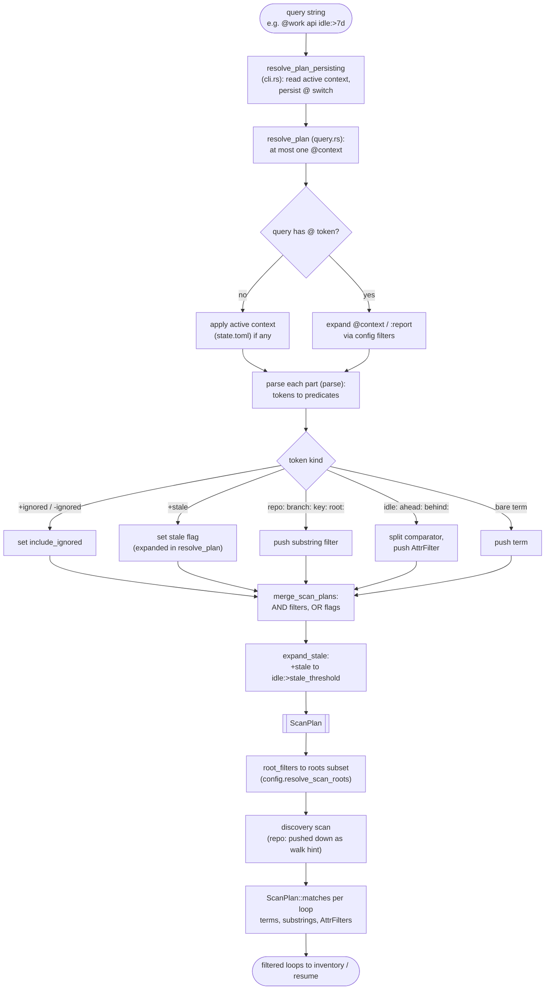

# 03 — Query engine

> Architecture layer index: [`README.md`](README.md). Anchor doc with the shared
> vocabulary and end-to-end flow: [`00-overview.md`](00-overview.md). Read the
> overview first; this doc owns the third runtime domain in that flow.

## Purpose

The query engine answers a narrowing question: *given everything discovered, which
loops do I want to see right now?* It turns a small query language — bare terms,
`attr:value` predicates, `@context` scopes, and the `+ignored` tag — into a
declarative plan, then evaluates that plan against the open loops produced by
[01-discovery](01-discovery.md). The result is the filtered inventory the rest of
the pipeline operates on, and (for `loops resume`) the single loop a resume targets.

The domain exists because the inventory is otherwise all-or-nothing: with several
roots, dozens of repos, and many branches per repo, listing everything is noise.
The design borrows [Taskwarrior](https://taskwarrior.org/)'s idea of a *declarative
filter over data that already exists* — git is the source of truth, so the engine
never maintains per-loop state; it only describes what to keep. Two properties make
the rest of the system simpler: the parser is **pure** (no git, no I/O), and the
same parse-plus-filter layer feeds `loops`, `loops resume`, `loops refresh`, and
`loops worktrees` so they cannot disagree about what a query means.

## Domain map

| File | Responsibility |
|---|---|
| [`src/query.rs`](../../src/query.rs:1) | The whole query language: parser (`parse`), the parsed plan (`ScanPlan`), `@context` resolution (`resolve_plan`), and the in-memory evaluator (`ScanPlan::matches`). Pure — no git, no filesystem. |

The engine sits between two neighbouring domains. Upstream, the **active context**
it reads and the configured **contexts** it expands are owned by
[07-config-state](07-config-state.md): the `[contexts.X]` table and the
`context_filter` lookup live in `config.rs`
([`src/config.rs:86`](../../src/config.rs:86)), and the persisted active context
lives in `state.rs` ([`src/state.rs:47`](../../src/state.rs:47)). Downstream, the
plan is matched against the `OpenLoop` values produced by
[01-discovery](01-discovery.md); the discovery scan also honours a single
**pushed-down** `repo:` filter as a directory-walk hint, while every other
predicate is applied here in memory. Resolved `root:` filters are turned into a
roots subset by `Config::resolve_scan_roots`
([`src/config.rs:127`](../../src/config.rs:127)), so `root:` is the one predicate
the query engine *defines* but does not *evaluate* (see *Invariants*).

The runtime entry point is `query::resolve_plan`
([`src/query.rs:225`](../../src/query.rs:225)). The CLI never calls it directly: it
goes through the thin wrapper `resolve_plan_persisting`
([`src/cli.rs:63`](../../src/cli.rs:63)), which resolves the plan *and* persists any
`@context` switch the query requested. That boundary is described under *Main flow*.

## Concepts & vocabulary

These build on the canonical terms in [00-overview](00-overview.md#concepts--vocabulary).
The query engine owns the `ScanPlan` type and the query-language vocabulary.

- **query** — the whitespace-tokenised string a user types after `loops` (e.g.
  `@work api idle:>7d`). Tokens split on whitespace **only**, so a `/` is literal
  inside a token (`feat/login` is one term, not two). All tokens are ANDed; there
  is no `OR` and no parentheses.
- **`ScanPlan`** — the parsed query, derived before any heavy I/O
  ([`src/query.rs:40`](../../src/query.rs:40)). It is the contract between parsing
  and evaluation: the parser only produces a `ScanPlan`, and the evaluator only
  reads one. Its shape is given under *Interfaces & contracts*.
- **term** — a bare token with no recognised `attr:` prefix. Each term must
  case-insensitively substring-match the loop's `repo_name`, `branch`, **or**
  canonical `key`; terms AND with each other.
- **attribute predicate** — an `attr:value` token whose name is one of the closed
  set `repo`, `branch`, `key`, `root`, `idle`, `ahead`, `behind` (`Attr`,
  [`src/query.rs:269`](../../src/query.rs:269)). A token whose name is *not* in that
  set is not an error — it falls through and becomes a bare term (so `foo:bar` is a
  term, not a failed predicate).
- **comparator** — the numeric/temporal operator on `idle`/`ahead`/`behind`: `>`,
  `<`, `>=`, `<=`, or bare equality (`Cmp`, [`src/query.rs:10`](../../src/query.rs:10)).
  `idle` *requires* a comparator (exact-equality on a duration is meaningless);
  `ahead`/`behind` allow a bare value meaning `== N`.
- **`AttrFilter`** — the evaluated form of a numeric/temporal predicate:
  `Idle(Cmp, Duration)`, `Ahead(Cmp, u32)`, or `Behind(Cmp, u32)`
  ([`src/query.rs:32`](../../src/query.rs:32)). Substring predicates
  (`repo`/`branch`/`key`) are *not* `AttrFilter`s — they are stored as their own
  string vectors on the plan.
- **context** — a named, persistent query scope defined in config as
  `[contexts.<name>] filter = "<query>"` and selected with `@<name>` (e.g.
  `@work`). A context filter is itself a sub-query, parsed by the same `parse`. The
  `@` prefix is what distinguishes the context `@work` from a repo literally named
  `work`. `@none` and `@all` are reserved names that *clear* the active context for
  one invocation rather than selecting one (`CONTEXT_RESET_NAMES`,
  [`src/query.rs:140`](../../src/query.rs:140)).
- **active context** — the context applied implicitly when a query has no `@`
  token, persisted in `state.toml` between invocations
  ([`src/state.rs:47`](../../src/state.rs:47)). An explicit `@name` replaces it for
  that run *and* updates the persisted value; `@none`/`@all` clears it.
- **`Candidate`** — the borrowed view of one open loop the evaluator sees
  ([`src/query.rs:57`](../../src/query.rs:57)): `repo_name`, `branch`, `key`,
  `last_commit`, `ahead`/`behind` (`Option<u32>`), and `ignored`. Borrowing keeps
  `matches` allocation-free.

## Main flow

A query travels four stages: the CLI wrapper resolves the active context and
persists any switch; `resolve_plan` expands `@context` tokens and AND-merges them
with the ad-hoc tokens into one `ScanPlan`; discovery scans (honouring the
pushed-down `repo:` hint); and `ScanPlan::matches` filters the discovered loops in
memory. `resolve_plan` also expands `:report` tokens to their saved filters (like
`@context`) and `+stale` to `idle:>{stale_threshold}`. `parse` itself still
rejects a raw leading-`:` token as a grammar guard, but top-level `:report` tokens
are intercepted by `resolve_plan` before they reach `parse`.

In code, the CLI resolves the plan once per scanning command via
`resolve_plan_persisting` ([`src/cli.rs:63`](../../src/cli.rs:63)): it loads the
runtime `State`, calls `query::resolve_plan`
([`src/query.rs:225`](../../src/query.rs:225)) with the current active context as
`ResolveOptions::current_context`, then consults
`context_persistence_from_query` ([`src/query.rs:159`](../../src/query.rs:159)) to
decide whether the query's `@` token should `Set`, `Clear`, or leave
(`Unchanged`) the persisted context. `resolve_plan` itself parses each part with
`parse` ([`src/query.rs:69`](../../src/query.rs:69)) and folds the parts together
with `merge_scan_plans` ([`src/query.rs:175`](../../src/query.rs:175)). The
resulting `ScanPlan` then drives the scan and is evaluated by `ScanPlan::matches`
([`src/query.rs:346`](../../src/query.rs:346)) against each discovered loop.

## Interfaces & contracts

**`ScanPlan` shape** ([`src/query.rs:40`](../../src/query.rs:40)). The parsed query;
every field is ANDed at evaluation time except the two flags:

| Field | Type | Meaning |
|---|---|---|
| `terms` | `Vec<String>` | Bare terms; each must substring-match repo, branch, **or** key (AND across terms). |
| `repo_filters` | `Vec<String>` | `repo:` substrings; all must match `repo_name`. |
| `branch_filters` | `Vec<String>` | `branch:` substrings; all must match `branch`. |
| `key_filters` | `Vec<String>` | `key:` substrings; all must match the canonical key. |
| `root_filters` | `Vec<String>` | Raw `root:` values. **Not** evaluated by `matches`; resolved to a roots subset by `Config::resolve_scan_roots` ([`src/config.rs:127`](../../src/config.rs:127)). |
| `attr_filters` | `Vec<AttrFilter>` | `idle:`/`ahead:`/`behind:` predicates. |
| `include_ignored` | `bool` | `+ignored` includes dismissed loops; default hides them. |
| `need_ahead_behind` | `bool` | True when an `ahead`/`behind` predicate is present, or when the caller renders those columns — signals discovery to run its heavy `rev-list` phase. |

Substring and root filters are **vectors, not single options**, so that merging a
context filter with ad-hoc tokens keeps *both* constraints (`@work api` keeps the
context's `root:` filter and adds the term `api`); `matches` requires every entry
to hold (`merge_scan_plans`, [`src/query.rs:175`](../../src/query.rs:175)).

**Grammar accepted by `parse`** ([`src/query.rs:69`](../../src/query.rs:69)). Tokens
split on whitespace only; `Attr::parse` ([`src/query.rs:269`](../../src/query.rs:269))
is the single source of truth for recognised names:

| Token form | Effect |
|---|---|
| `repo:<substr>` | substring filter on `repo_name` |
| `branch:<substr>` | substring filter on `branch` |
| `key:<substr>` | substring filter on the canonical `root-label/repo/branch` key |
| `root:<path-or-label>` | roots-subset filter, resolved against configured roots ([`src/config.rs:127`](../../src/config.rs:127)) |
| `idle:<op><N><unit>` | `op` ∈ `> < >= <=` (**required**); `unit` ∈ `m`/`h`/`d`/`w` (`parse_duration`, [`src/query.rs:329`](../../src/query.rs:329)) |
| `ahead:<op?><N>` / `behind:<op?><N>` | `op` optional; bare `N` means `== N`; sets `need_ahead_behind` |
| `+ignored` | include dismissed loops (sets `include_ignored = true`) |
| `-ignored` | hide dismissed loops (sets `include_ignored = false`); this is the default state, so it is only meaningful as an explicit override of a `+ignored` contributed by a merged context filter ([`src/query.rs:77`](../../src/query.rs:77)) |
| `@<name>` | select context `<name>`; `@none`/`@all` clear the active context |
| `<anything else>` | bare term (including unknown `name:value`, e.g. `foo:bar`) |
| `:<report>` | expand saved report `<name>` (`[reports.<name>]`); composes AND, resolved in `resolve_plan` |
| `+stale` | shortcut for `idle:>{stale_threshold}` (config, default `14d`); expanded in `resolve_plan` |

`@`- and `:`-token handling is not in `parse` (which rejects only a raw leading-`:`
token as a guard): `@context` and `:report` tokens are extracted by `resolve_plan`
([`src/query.rs:225`](../../src/query.rs:225)) before `parse` is called, so `parse`
never receives them. Persistence of the
selected context is decided by `context_persistence_from_query`
([`src/query.rs:159`](../../src/query.rs:159)). At most one `@context` is allowed
per query (`single_context_token`, [`src/query.rs:149`](../../src/query.rs:149)),
and a context's own `filter` string may not contain `@` or start with `:`
(`validate_context_filter`, [`src/query.rs:212`](../../src/query.rs:212)) — contexts
cannot nest.

**Evaluation contract** — `ScanPlan::matches(&Candidate, now) -> bool`
([`src/query.rs:346`](../../src/query.rs:346)). A loop matches when it satisfies
*every* term, substring filter, and `AttrFilter`. Ignored loops are dropped first
unless `include_ignored`. `idle` is computed as `now - last_commit`;
`ahead`/`behind` predicates fail closed when the value is `None` (heavy phase not
run), via `Option::is_some_and`.

**Error handling — `QueryError`.** `parse`, `resolve_plan`, and their helpers
return `Result<_, QueryError>` ([`src/error.rs:28`](../../src/error.rs:28)).
Variants cover parse/resolve failures (`IdleMissingComparator`,
`InvalidDuration`, `InvalidDurationUnit`, `InvalidNumber`, `MultipleContexts`,
`ContextFilterHasAt`, `ContextFilterHasColon`, `ReservedToken`) and wrap
`ConfigError` when a context name is unknown (`QueryError::Config`). Messages stay
actionable and in English; `main` prints the full `source()` chain via
`error_chain()` ([08-cli-output](08-cli-output.md)).

User-facing query examples and the full attribute table live in
[docs/features.md](../features.md) and [docs/configuration.md](../configuration.md)
(contexts, `default_context`/`LOOPS_CONTEXT`) — not duplicated here.

## Invariants & edge cases

- **The parser is pure.** `query.rs` performs no git and no I/O; it only maps a
  string to a `ScanPlan` and a `ScanPlan` plus a `Candidate` to a bool. All
  filesystem/config access (context lookup, root resolution) happens in the CLI
  wrapper and `config.rs`. This is what lets the same engine serve list, resume,
  refresh, and worktrees identically.
- **Unknown `attr:` names are terms, not errors.** Only the closed set in
  `Attr::parse` is treated as a predicate; anything else (`foo:bar`) becomes a bare
  term (`split_attr`, [`src/query.rs:298`](../../src/query.rs:298)). This keeps the
  grammar forgiving and forward-compatible.
- **`idle` requires a comparator; `ahead`/`behind` do not.** `idle:7d` is a clear
  error (`split_cmp(_, true)` returns `None`); `ahead:0` is valid and means `== 0`
  (`split_cmp(_, false)` defaults to `Cmp::Eq`, [`src/query.rs:305`](../../src/query.rs:305)).
- **`root:` is push-down, never evaluated in `matches`.** `matches` intentionally
  ignores `root_filters`; roots are narrowed *before* the scan by
  `resolve_scan_roots` ([`src/config.rs:127`](../../src/config.rs:127)). Multiple
  `root:` filters intersect (AND); if the intersection is empty the result is an
  empty inventory, **not** an error.
- **Only the first `repo:` filter is pushed into the scan.** Discovery accepts a
  single `repo:` directory-walk hint; any further `repo:` filters (and all other
  predicates) are applied afterwards by `matches`, so correctness never depends on
  the scan honouring more than one (`scan_with_inventory`,
  [`src/cli.rs:131`](../../src/cli.rs:131)).
- **At most one `@context` per query**, enforced before resolution
  (`single_context_token`, [`src/query.rs:149`](../../src/query.rs:149)); a second
  `@` token is a clear error.
- **Contexts cannot nest.** A context `filter` whose token contains `@` or starts
  with `:` is rejected (`validate_context_filter`,
  [`src/query.rs:212`](../../src/query.rs:212): `contains('@')` /
  `starts_with(':')`), so resolution is single-pass and predictable. Note that a
  leading `:` (report syntax) is what is caught — an attribute value like
  `repo:billing` inside a context filter is valid.
- **Explicit `@` replaces the active context; `@none`/`@all` clears it.** With no
  `@` token the active context (from `state.toml`) applies; an explicit `@name`
  both scopes that run and persists the switch; `@none`/`@all` ignores and clears
  the active context (Taskwarrior semantics, `resolve_plan` +
  `context_persistence_from_query`).
- **`ahead`/`behind` predicates fail closed on missing data.** When the heavy phase
  was skipped, `ahead`/`behind` are `None` and the predicate does not match, rather
  than matching a fabricated zero.
- **`need_ahead_behind` is a caller-OR flag.** The parser sets it true when the
  query has an `ahead`/`behind` predicate, but a caller may *also* set it true
  after parsing to force the heavy phase when it renders the AHEAD/BEHIND columns
  (the list path always does); the two needs are ORed (struct doc-comment,
  [`src/query.rs:51`](../../src/query.rs:51)).

## Decisions

**Parse → plan → evaluate in memory** *(ex-ADR-0003)*. The engine parses a query
into a declarative `ScanPlan` *before* any heavy work, then evaluates that plan in
memory against the loops git already produced — it does **not** push queries down
to a database or maintain a queryable index of loops. The rationale is that the
inventory is derived from git on demand (the pull-only model,
[00-overview](00-overview.md#decisions)); there is no durable store to query, and
introducing one would mean keeping per-loop state in sync with git, the very
bookkeeping the tool exists to avoid. Taskwarrior is the model: a declarative
filter over data that already exists, with no manual CRUD per item. The real
performance lever is **push-down before git** — restricting which roots and repos
get scanned (`root:` → roots subset, the first `repo:` → walk hint) so subprocesses
are never spawned for repos the query already excludes — not filtering an
in-memory `Vec`, which is cheap by comparison. The accepted trade-off is that the
language is AND-only (no `OR`, no parentheses), which is sufficient for the known
use cases and keeps both the parser and `merge_scan_plans` simple; richer
expressions are explicitly out of scope for v1. The SQLite index that accelerates
*scanning* is a separate concern owned by [06-cache-index](06-cache-index.md); it
is not a query index — `matches` never reads it.

**Contexts as persistent scopes** *(ex-ADR-0003, phase 4)*. Users with separate
work and personal roots needed a stable vocabulary instead of retyping `root:` on
every command. The decision is `[contexts.<name>]` config entries selected by
`@<name>`, where a context filter is *itself* a parseable sub-query AND-merged with
the ad-hoc tokens (`resolve_plan` + `merge_scan_plans`). An explicit `@` replaces
the active context (Taskwarrior-style), the active context applies only when the
query has no `@`, and `@none`/`@all` clears it for one run. Three constraints keep
resolution predictable: at most one `@` per query, no `@`/`:` inside a context
filter (no nesting), and the active context is persisted in the runtime
`state.toml` rather than in declarative `config.toml`, so a CLI-driven switch never
rewrites the user's config. The `@` prefix is deliberate — it disambiguates the
context `@work` from a repo named `work`. `+stale` (a shortcut for
`idle:>{stale_threshold}`) and reports (`:name`, saved queries in `[reports.X]`)
are both implemented (phases 5a/5b): `resolve_plan` expands them from config.

## Extension & limitations

- **`+stale` (implemented, phase 5a).** `+stale` expands to
  `idle:>{stale_threshold}` (config `stale_threshold`, default `14d`). `parse`
  sets the `ScanPlan::stale` flag; `resolve_plan::expand_stale` injects the
  concrete `Idle` filter and clears the flag, so `+stale` resolves identically to
  the explicit predicate and composes (AND) with any other tokens. A malformed
  `stale_threshold` surfaces as `QueryError::InvalidStaleThreshold`.
- **Reports `:name` (implemented MVP, phase 5b).** Saved queries defined in
  `[reports.<name>]` and invoked with `:name`. `resolve_plan` looks up the filter,
  validates it (`validate_report_filter`), parses it, and AND-merges it with the
  rest of the query — the same expansion shape as `@context`, but reports are not
  persisted to `state.toml`. MVP report filters cannot embed a `@context` or another
  `:report` (rejected via `QueryError::ReportFilterHasAt`/`ReportFilterHasColon`);
  depth-1 `@context` embedding remains planned. `parse` still rejects a raw
  leading-`:` token as a guard (`QueryError::ReservedReport`), reached only when
  `parse` is called directly rather than through `resolve_plan`.
- **No `OR`/parentheses (v1 limit).** The language is AND-only by design. Adding
  boolean composition would touch the parser, `ScanPlan`, and `merge_scan_plans`;
  it is deferred until a concrete need appears.
- **Typed errors (implemented).** Query failures are `QueryError` variants;
  library consumers can `match` on them. Tests assert variants with `matches!`,
  not substrings of git stderr (which varies by OS/locale).
- **`worktrees` shares only the filter layer.** `loops worktrees` reuses
  parse → `ScanPlan` → `matches` (roots, `repo`/`branch`, `idle`, ignored) but has
  no ahead/behind axis, so `need_ahead_behind` is ignored in that domain; its
  collection differs (see [01-discovery](01-discovery.md)).

## References

Code (verified against the current tree):

- [`src/query.rs:10`](../../src/query.rs:10) — `Cmp` (comparator);
  [`src/query.rs:32`](../../src/query.rs:32) — `AttrFilter`;
  [`src/query.rs:40`](../../src/query.rs:40) — `ScanPlan`;
  [`src/query.rs:57`](../../src/query.rs:57) — `Candidate`.
- [`src/query.rs:69`](../../src/query.rs:69) — `parse` (the tokeniser/parser);
  [`src/query.rs:298`](../../src/query.rs:298) — `split_attr`;
  [`src/query.rs:269`](../../src/query.rs:269) — `Attr` / `Attr::parse` (closed
  attribute set);
  [`src/query.rs:305`](../../src/query.rs:305) — `split_cmp`;
  [`src/query.rs:323`](../../src/query.rs:323) — `parse_count`;
  [`src/query.rs:329`](../../src/query.rs:329) — `parse_duration`.
- [`src/query.rs:122`](../../src/query.rs:122) — `ResolveOptions`;
  [`src/query.rs:129`](../../src/query.rs:129) — `ContextPersistence`;
  [`src/query.rs:140`](../../src/query.rs:140) — `CONTEXT_RESET_NAMES`
  (`none`/`all`);
  [`src/query.rs:149`](../../src/query.rs:149) — `single_context_token`
  (one-`@` rule);
  [`src/query.rs:159`](../../src/query.rs:159) — `context_persistence_from_query`;
  [`src/query.rs:175`](../../src/query.rs:175) — `merge_scan_plans` (AND/OR merge);
  [`src/query.rs:212`](../../src/query.rs:212) — `validate_context_filter`
  (no nesting);
  [`src/query.rs:225`](../../src/query.rs:225) — `resolve_plan` (runtime entry).
- [`src/query.rs:346`](../../src/query.rs:346) — `ScanPlan::matches` (the evaluator).
- [`src/cli.rs:63`](../../src/cli.rs:63) — `resolve_plan_persisting` (CLI wrapper
  that persists the active-context switch);
  [`src/cli.rs:131`](../../src/cli.rs:131) — `scan_with_inventory` (pushes the
  first `repo:` filter down to the scan).
- [`src/config.rs:10`](../../src/config.rs:10) — `ContextDef`;
  [`src/config.rs:43`](../../src/config.rs:43) — `Config.contexts`;
  [`src/config.rs:86`](../../src/config.rs:86) — `Config::context_filter`;
  [`src/config.rs:127`](../../src/config.rs:127) — `Config::resolve_scan_roots`
  (`root:` push-down).
- [`src/state.rs:47`](../../src/state.rs:47) — `State::current_context`;
  [`src/state.rs:51`](../../src/state.rs:51) — `State::set_current_context`.

Tests worth reading (all in [`src/query.rs`](../../src/query.rs:392)):
`parse_bare_terms_and_substring_attrs`, `unknown_attr_prefix_is_a_bare_term`,
`parse_numeric_and_duration_attrs`, `idle_without_operator_is_an_error`,
`resolve_plan_applies_current_context`, `resolve_plan_explicit_context_replaces_current`,
`resolve_plan_none_clears_current`, `resolve_plan_rejects_nested_context_in_filter`,
`resolve_plan_rejects_two_context_tokens`, and the `matches_*` evaluator tests.
The `tests::props` submodule adds `proptest` coverage (spec §4.2): `parse` never
panics on arbitrary input, unknown `name:value` tokens stay bare terms,
`parse_duration` accepts only the `m|h|d|w` suffixes, and `idle:>N` is monotonic
in its threshold. Inputs are bounded and string-only so the property tests run
identically across the CI matrix.

Sibling architecture docs: [00-overview](00-overview.md) ·
[01-discovery](01-discovery.md) (produces the open loops this engine filters; honours
the pushed-down `repo:` hint) ·
[04-inventory-evidence](04-inventory-evidence.md) (renders the filtered loops) ·
[06-cache-index](06-cache-index.md) (the SQLite scan accelerator — not a query
index) · [07-config-state](07-config-state.md) (the `[contexts.X]` table, `root:`
resolution, and the persisted active context).

User-facing docs (linked, not duplicated): [features](../features.md)
(query examples, the attribute table, contexts) ·
[configuration](../configuration.md) (`[contexts.X]`, `default_context`,
`LOOPS_CONTEXT`, `inventory_ttl_secs`).
