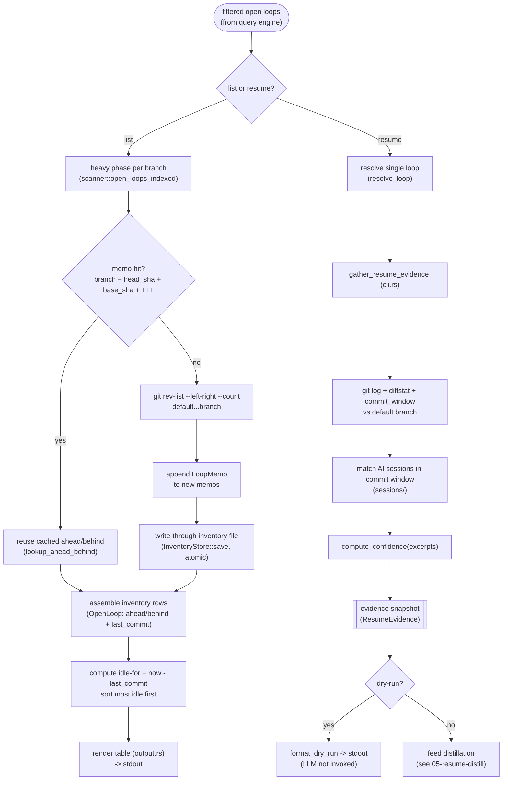

# 04 — Inventory & evidence

> Architecture layer index: [`README.md`](README.md). Anchor doc with the shared
> vocabulary and end-to-end flow: [`00-overview.md`](00-overview.md). Read the
> overview first; this doc owns the fourth runtime domain in that flow and is the
> detailed home of the canonical term *evidence snapshot*.

## Purpose

This domain turns the open loops produced by [01-discovery](01-discovery.md) and
narrowed by [03-query-engine](03-query-engine.md) into the two things a user
actually consumes: the **inventory** — the sorted table of loops with their
*ahead/behind* counts and *idle-for* age — and, when a single loop is targeted
for resume, the **evidence snapshot** that feeds distillation.

It answers two questions. For `loops [query]`: *of the loops that survived the
filter, how far has each diverged from its base, and how long has it sat idle?*
For `loops resume <query>`: *what objective, auditable facts exist about this one
loop before any LLM is asked to summarise it?* The inventory is cheap and listed
on every run; the evidence snapshot is gathered only for the loop a resume
targets. Both are derived from git on demand (the pull-only model,
[00-overview](00-overview.md#decisions)) — nothing is captured ahead of time and
nothing is written inside your repositories.

The expensive part of the inventory is the *ahead/behind* count: one
`git rev-list` per branch. That cost is memoised by a small SHA-validated store
([`src/inventory.rs`](../../src/inventory.rs:1)) so an unchanged branch is never
recounted; the store is throwaway and self-heals, because git is always the
source of truth.

## Domain map

| File | Responsibility |
|---|---|
| [`src/inventory.rs`](../../src/inventory.rs:1) | The ahead/behind memo store: the `LoopMemo`/`InventoryFile` types, the per-repo JSON file (one per git common-dir), SHA+TTL-validated lookup, atomic write, and orphan pruning. |
| [`src/scanner.rs`](../../src/scanner.rs:451) (heavy phase) | Where ahead/behind is actually computed (`rev-list`) and the memo is consulted/updated, inside `open_loops_indexed`. Owned by [01-discovery](01-discovery.md); this doc references the ahead/behind portion. |
| [`src/cli.rs`](../../src/cli.rs:189) (assembly) | `gather_resume_evidence` assembles the evidence snapshot (`ResumeEvidence`); `run_list` assembles the inventory rows and hands them to the renderer. |

The *rendering* of inventory rows — column widths, sort order, the `min`/`h`/`d`
age strings, the AHEAD/BEHIND dashes — lives in
[`src/output.rs`](../../src/output.rs:31) and is owned by
[08-cli-output](08-cli-output.md). This doc documents *what* each row holds and
*when* each field is computed, not how it is painted; see that doc for the render
layer. The SHA-validated SQLite scan accelerator that sits in front of the heavy
phase is a separate store owned by [06-cache-index](06-cache-index.md); the
inventory memo described here is the JSON ahead/behind layer, not the index.

Entry points:

- `gather_resume_evidence` ([`src/cli.rs:189`](../../src/cli.rs:189)) — builds the
  evidence snapshot for one resolved loop.
- `lookup_ahead_behind` ([`src/inventory.rs:175`](../../src/inventory.rs:175)) —
  the SHA+TTL-validated memo read.
- `InventoryStore::save` / `InventoryStore::load` / `InventoryStore::prune_orphans`
  ([`src/inventory.rs:69`](../../src/inventory.rs:69),
  [`src/inventory.rs:53`](../../src/inventory.rs:53),
  [`src/inventory.rs:92`](../../src/inventory.rs:92)) — the persistence surface.

## Concepts & vocabulary

These build on the canonical terms in [00-overview](00-overview.md#concepts--vocabulary).
This domain owns the precise definition of *evidence snapshot* and the
inventory-local vocabulary.

- **evidence snapshot** — the bundle of objective facts gathered for one loop
  *before any LLM call*. In code it is the `ResumeEvidence` struct
  ([`src/cli.rs:18`](../../src/cli.rs:18)), assembled by `gather_resume_evidence`
  ([`src/cli.rs:189`](../../src/cli.rs:189)). It holds the git commit log and the
  diffstat against the default branch, the matched AI-session excerpts, the
  resolved default-branch name, and a derived *confidence* score. The loop's
  commit time window is computed during assembly (to filter sessions) but is not
  stored on the struct. `loops resume --dry-run` prints the evidence snapshot
  without invoking the LLM, so you can audit exactly what would feed it
  (`format_dry_run`, [`src/distill.rs:198`](../../src/distill.rs:198)). The
  per-field "computed when" table is under *Interfaces & contracts*.
- **inventory** — the listing the tool renders for `loops [query]`: one row per
  visible open loop, each carrying its key, *idle-for* age, and *ahead/behind*
  counts. It is assembled fresh on every run from the filtered `OpenLoop` values
  and is never a persisted artifact in its own right.
- **inventory memo** — the per-repo, SHA-validated cache of *ahead/behind* counts
  that makes the inventory cheap on a warm run. One JSON file per git common-dir
  lives at `~/.open-loops/inventory/<fnv64hex>.json` (`InventoryFile`,
  [`src/inventory.rs:27`](../../src/inventory.rs:27)); each entry is a `LoopMemo`
  keyed by `(branch, head_sha, ab_base_sha)` ([`src/inventory.rs:16`](../../src/inventory.rs:16)).
  This is the store `src/inventory.rs` exists for; the name *evidence snapshot*
  does **not** refer to it.
- **ahead/behind** — how many commits a loop's HEAD is *ahead of* and *behind*
  the default branch, from `git rev-list --left-right --count default...branch`.
  Carried on `OpenLoop` as `Option<u32>` ([`src/scanner.rs:116`](../../src/scanner.rs:116));
  `None` when the heavy phase was skipped, rendered as `-`.
- **idle-for** — how long the loop has sat untouched: `now - last_commit`, where
  `last_commit` is the branch HEAD's commit time. It is the inventory's sort key
  (most idle first) and the `idle:` query predicate's input; it is computed at
  render time from the loop's `last_commit`, never stored.
- **confidence** — a `Low`/`Medium`/`High` score derived purely from the matched
  session excerpts (`compute_confidence`, [`src/distill.rs:23`](../../src/distill.rs:23)),
  carried in the evidence snapshot and surfaced in the resume output. Its full
  semantics belong to [05-resume-distill](05-resume-distill.md); this doc only
  records that it is part of the snapshot.

## Main flow

Two paths leave the filtered loops. The **list path** (always taken) computes
*ahead/behind* in the discovery heavy phase — consulting and updating the
inventory memo — then renders rows sorted by *idle-for*. The **resume path**
(taken only for `loops resume`) resolves a single loop and assembles its evidence
snapshot from fresh git output plus matched AI sessions.

In code, the list path runs through `run_list`
([`src/cli.rs:224`](../../src/cli.rs:224)): it forces `need_ahead_behind = true`
(the table always renders both columns), scans with write-through via
`scan_with_inventory` ([`src/cli.rs:110`](../../src/cli.rs:110)), filters the
loops with `ScanPlan::matches`, and prints `output::render_table`
([`src/output.rs:31`](../../src/output.rs:31)). The *ahead/behind* itself is
produced inside the discovery heavy phase: `open_loops_indexed`
([`src/scanner.rs:451`](../../src/scanner.rs:451)) consults the memo via
`lookup_ahead_behind` ([`src/inventory.rs:175`](../../src/inventory.rs:175)) and,
on a miss, runs `git rev-list --left-right --count` and appends a fresh
`LoopMemo`. The updated `InventoryFile` is returned to the CLI, which writes it
through with `InventoryStore::save` ([`src/inventory.rs:69`](../../src/inventory.rs:69)).

The resume path runs through `run_resume` ([`src/cli.rs:292`](../../src/cli.rs:292)):
`resolve_loop` ([`src/cli.rs:145`](../../src/cli.rs:145)) narrows to exactly one
loop, then `gather_resume_evidence` ([`src/cli.rs:189`](../../src/cli.rs:189))
builds the evidence snapshot — `git_log`, `diffstat`, and `commit_window`
([`src/scanner.rs:964`](../../src/scanner.rs:964),
[`src/scanner.rs:973`](../../src/scanner.rs:973),
[`src/scanner.rs:984`](../../src/scanner.rs:984)) against the default branch, the
session excerpts matched inside that window (see
[02-sessions-attribution](02-sessions-attribution.md)), and the confidence score.
With `--dry-run` the snapshot is printed by `format_dry_run`
([`src/distill.rs:198`](../../src/distill.rs:198)) and the LLM is never called;
otherwise it feeds distillation (see [05-resume-distill](05-resume-distill.md)).

## Interfaces & contracts

**The evidence snapshot — `ResumeEvidence`** ([`src/cli.rs:18`](../../src/cli.rs:18)).
Each field, and the precise moment it is computed:

| Field | Source | Computed when |
|---|---|---|
| `default_branch` | `scanner::default_branch` ([`src/scanner.rs:57`](../../src/scanner.rs:57)) | At resume time, inside `gather_resume_evidence`. |
| `commits` | `git log --oneline default..branch` (`git_log`, [`src/scanner.rs:964`](../../src/scanner.rs:964)) | At resume time. The branch-exclusive commit list. |
| `diffstat` | `git diff --stat default...branch` (`diffstat`, [`src/scanner.rs:973`](../../src/scanner.rs:973)) | At resume time. |
| `excerpts` | matched AI-session excerpts (`SessionSource::excerpts_indexed`, see [02-sessions-attribution](02-sessions-attribution.md)) | At resume time, filtered by the commit window. |
| `confidence` | `distill::compute_confidence(&excerpts)` ([`src/distill.rs:23`](../../src/distill.rs:23)) | At resume time, derived from the excerpts. |

The commit window — `commit_window` ([`src/scanner.rs:984`](../../src/scanner.rs:984)),
the time span of the branch-exclusive commits — is computed during assembly to
constrain which sessions are eligible, but is consumed immediately and **not**
stored on `ResumeEvidence`. The snapshot is computed entirely at *resume time*:
nothing in it is captured at scan time and nothing is captured at render time.
(`ahead`/`behind` and `idle-for`, by contrast, are inventory concerns computed at
scan/render time and are *not* part of the evidence snapshot, though
`format_dry_run` reprints the loop's already-known `ahead`/`behind` for context.)

**The inventory memo — `InventoryFile` / `LoopMemo`**
([`src/inventory.rs:27`](../../src/inventory.rs:27),
[`src/inventory.rs:16`](../../src/inventory.rs:16)):

| Field | Meaning |
|---|---|
| `InventoryFile.repo_path` | Absolute repo root, used for orphan detection (a missing path ⇒ orphan). |
| `InventoryFile.indexed_at` | Last-write timestamp, used for TTL validation. |
| `InventoryFile.loops` | One `LoopMemo` per unmerged branch. |
| `LoopMemo.branch` / `head_sha` / `ab_base_sha` | The three-part validation key: branch name, branch HEAD at compute time, default-branch HEAD at compute time. |
| `LoopMemo.ahead` / `behind` | The memoised counts (`u32`). |

`lookup_ahead_behind(file, branch, head_sha, ab_base_sha, ttl_secs, now)`
([`src/inventory.rs:175`](../../src/inventory.rs:175)) returns `Some((ahead, behind))`
only when a `LoopMemo` matches **all three** key parts *and* the file passes the
TTL check; otherwise `None` (a miss → recompute). `ttl_secs == 0` means
SHA-only validation (the default, `inventory_ttl_secs`; see
[docs/configuration.md](../configuration.md)). The store is keyed by
`common_dir_hash` — an FNV-1a 64-bit hash of the absolute common-dir, 16 hex chars
([`src/inventory.rs:143`](../../src/inventory.rs:143)) — so all worktrees of one
repo share a single file, while distinct branch HEADs keep distinct memos.

Writes are atomic: `save` writes a per-process tmp file (`.{hash}.{pid}.json.tmp`)
then renames it into place ([`src/inventory.rs:69`](../../src/inventory.rs:69),
[`src/inventory.rs:166`](../../src/inventory.rs:166)), so a reader never sees a
partial file. The user-facing surface — the `inventory/` state directory,
`inventory_ttl_secs`, the `--fresh` flag, and `loops refresh` — is documented in
[docs/configuration.md](../configuration.md) and [docs/features.md](../features.md),
not duplicated here.

## Invariants & edge cases

- **The memo is throwaway; git is the source of truth.** A missing, zero-byte,
  corrupt, or even directory-shaped inventory file is treated as "no memo": `load`
  returns `None` (warning only for the corrupt case) and the heavy phase
  recomputes from git ([`src/inventory.rs:53`](../../src/inventory.rs:53)). Unknown
  extra JSON fields are tolerated for forward compatibility
  (`store_load_tolerates_unknown_extra_fields`).
- **A memo hit must serve every key part.** `lookup_ahead_behind` matches branch,
  `head_sha`, **and** `ab_base_sha`; a new commit on the branch (head changes) or
  a move of the default branch (base changes) is automatically a miss
  ([`src/inventory.rs:189`](../../src/inventory.rs:189)). This is why a new commit
  recounts without any manual invalidation.
- **TTL treats clock skew as a miss.** When `ttl_secs > 0`, a negative age (an
  `indexed_at` in the future) returns `None` rather than a spurious hit
  (`age_secs < 0`, [`src/inventory.rs:185`](../../src/inventory.rs:185);
  `lookup_returns_none_for_future_indexed_at`).
- **Empty `default_sha` skips memoisation.** If the default-branch SHA cannot be
  resolved, the heavy phase does not write a memo, to avoid poisoning the cache
  with an unvalidatable base ([`src/scanner.rs:524`](../../src/scanner.rs:524)).
- **`--fresh` bypasses the memo read but still writes through.** A fresh scan
  recomputes every `rev-list` and re-saves the file, so the next unchanged scan
  hits again ([`src/scanner.rs:534`](../../src/scanner.rs:534);
  `loops refresh` always forces `fresh = true`, [`src/cli.rs:347`](../../src/cli.rs:347)).
- **Orphan pruning is global and honest, and runs only on `refresh`.**
  `prune_orphans` removes any inventory file whose `repo_path` no longer exists
  (`orphan`) or that cannot be parsed (`unreadable`, since it cannot prove its repo
  exists), each with a distinct warning; non-`.json` and tmp files are left alone,
  and a concurrent removal (ENOENT) is silent
  ([`src/inventory.rs:92`](../../src/inventory.rs:92)). It is a deliberate
  global GC, not scoped to the refresh query — a repo gone from disk is an orphan
  regardless of which query triggered the refresh.
- **`ahead`/`behind` are `None` when the heavy phase is skipped.** Callers that do
  not request them (or commands with no AHEAD/BEHIND columns) get `None`, rendered
  as `-`; the `ahead:`/`behind:` query predicates fail closed on `None` rather than
  matching a fabricated zero (see [03-query-engine](03-query-engine.md)).
- **The inventory is sorted most-idle-first.** Staleness is the attention
  criterion, so `render_table` sorts ascending by `last_commit`
  ([`src/output.rs:36`](../../src/output.rs:36)); an empty inventory renders a
  celebratory line, not a blank table.
- **The evidence snapshot is never silently trusted.** It always carries a
  confidence score, and the distilled output it feeds always ships a `## Sources`
  section — the audit trail (see [00-overview](00-overview.md#invariants--edge-cases)
  and [05-resume-distill](05-resume-distill.md)).

## Decisions

**Evidence snapshot — separate the raw facts from the distilled summary**
*(ex-ADR-0004)*. The decision that gives this domain its name is to draw a hard
line between **evidence** (the objective, cheap-to-gather facts: commits,
diffstat, commit window, session excerpts) and **distilled** output (the
LLM-produced `Why`/`Done`/`Remaining`/`Next step` summary). The driver in the
absorbed ADR was the Claude Code `SessionEnd` hook's tight timeout (default 1.5s,
configurable): an LLM call takes tens of seconds and cannot run synchronously
inside it, which forces evidence (fast to record) apart from distillation (slow,
LLM-bound). The lasting consequence — realised in the current code — is that the
evidence snapshot is a self-contained, auditable input that `loops resume --dry-run`
can print verbatim without ever calling the LLM, and that distillation is a pure
function of that snapshot. The trade-off the ADR accepted is that the first resume
after a pause still pays for the LLM call (~30–60s) until the distillation cache
([06-cache-index](06-cache-index.md)) warms; confidence plus `## Sources` mitigate
the residual risk that the heuristic session match is wrong.

> **Code vs. ADR — discrepancy noted.** ADR-0004 also specifies a *captured*
> evidence snapshot: a `loops snapshot` subcommand wired to the `SessionEnd` hook,
> writing one `snapshots/<repo>/<branch>.json` per branch, with a hybrid resume
> path that prefers a fresh snapshot over a live pull. **None of that is
> implemented in the current tree** — there is no `snapshot.rs`, no `loops snapshot`
> subcommand, and no `snapshots/` directory; the only `Command` variants are
> `Resume`, `Worktrees`, `Refresh`, `Init`, `Ignore`, and `Completions`
> ([`src/cli_command.rs`](../../src/cli_command.rs:5)). In the code, the evidence
> snapshot is the **pull-time** `ResumeEvidence` assembled live by
> `gather_resume_evidence` on every uncached resume — exactly the same *material*
> the ADR planned to capture (commits, diffstat, session excerpt), but gathered on
> demand rather than at session end. The hook-captured snapshot and hybrid resume
> remain planned work (see *Extension & limitations*); this doc documents the code.

**Inventory memo — SHA-validated, throwaway, atomic** *(absorbed from the
inventory portion of the phase-3 inventory-cache plan)*. The *ahead/behind* count
is the inventory's one expensive operation (a `rev-list` per branch). The decision
is to memoise it per repo in a JSON file keyed by an FNV-1a hash of the common-dir
(no new crypto dependency), validate each entry by `(head_sha, ab_base_sha)` so a
new commit or a moved base is an automatic miss, write through on every scan
(including a filtered `loops api`), and write atomically via tmp-then-rename. The
considered alternative — keeping a durable, authoritative loop store — was
rejected for the same reason the query engine is in-memory (ex-ADR-0003): the tool
must avoid bookkeeping that drifts from git. So the memo is explicitly disposable:
it self-heals on corruption, `--fresh` bypasses it, and `loops refresh` rebuilds
it and prunes orphans. The accepted trade-off is a little extra I/O per scan (a
file read and a write-through) in exchange for skipping `rev-list` on every
unchanged branch.

## Extension & limitations

- **Hook-captured snapshot + hybrid resume (planned, ex-ADR-0004).** A
  `loops snapshot` subcommand driven by a Claude Code `SessionEnd` hook would
  capture the evidence at session end (with a high-confidence transcript rather
  than a heuristic match) into `snapshots/<repo>/<branch>.json`, and `loops resume`
  would prefer a fresh snapshot, falling back to the live pull when the snapshot's
  `head_sha` is stale or absent. This is designed but not built; the pull path
  documented here is the fallback the design assumes will always exist.
- **Async distillation at session end (deferred sub-phase, ex-ADR-0004).** Running
  the LLM in the background at session end (for sub-second resume without a prior
  cache) is explicitly out of scope until the evidence-only path is validated by
  dogfooding.
- **`inventory_ttl_secs` defaults to SHA-only validation.** Time-based expiry
  exists but defaults to `0` (off); SHA validation alone is correct because a
  changed branch or base already invalidates the entry. A TTL is only useful as a
  belt-and-braces guard and is documented in
  [docs/configuration.md](../configuration.md).
- **Orphan pruning is lazy, on `refresh` only.** The inventory directory is not
  swept on every command; stale files from deleted repos persist until the next
  `loops refresh`, an accepted trade-off that keeps the common list/resume paths
  free of directory-wide I/O.

## References

Code (verified against the current tree):

- [`src/inventory.rs:16`](../../src/inventory.rs:16) — `LoopMemo` (the memo entry);
  [`src/inventory.rs:27`](../../src/inventory.rs:27) — `InventoryFile`;
  [`src/inventory.rs:39`](../../src/inventory.rs:39) — `InventoryStore`.
- [`src/inventory.rs:53`](../../src/inventory.rs:53) — `InventoryStore::load`
  (tolerant: missing/corrupt → `None`);
  [`src/inventory.rs:69`](../../src/inventory.rs:69) — `InventoryStore::save`
  (atomic tmp → rename);
  [`src/inventory.rs:92`](../../src/inventory.rs:92) — `InventoryStore::prune_orphans`
  (global GC, `orphan` vs `unreadable`).
- [`src/inventory.rs:143`](../../src/inventory.rs:143) — `common_dir_hash`
  (FNV-1a, 16 hex);
  [`src/inventory.rs:166`](../../src/inventory.rs:166) — `tmp_path_for_hash`
  (per-pid tmp name).
- [`src/inventory.rs:175`](../../src/inventory.rs:175) — `lookup_ahead_behind`
  (SHA + TTL validation; clock-skew miss at [`:185`](../../src/inventory.rs:185)).
- [`src/cli.rs:18`](../../src/cli.rs:18) — `ResumeEvidence` (the evidence snapshot);
  [`src/cli.rs:189`](../../src/cli.rs:189) — `gather_resume_evidence` (assembly);
  [`src/cli.rs:110`](../../src/cli.rs:110) — `scan_with_inventory` (write-through);
  [`src/cli.rs:90`](../../src/cli.rs:90) — `write_inventory`;
  [`src/cli.rs:224`](../../src/cli.rs:224) — `run_list` (inventory rows → table);
  [`src/cli.rs:292`](../../src/cli.rs:292) — `run_resume`;
  [`src/cli.rs:336`](../../src/cli.rs:336) — `run_refresh` (reindex + prune).
- [`src/scanner.rs:116`](../../src/scanner.rs:116) — `OpenLoop.ahead`/`behind`;
  [`src/scanner.rs:451`](../../src/scanner.rs:451) — `open_loops_indexed`
  (heavy-phase memo lookup at [`:563`](../../src/scanner.rs:563), `rev-list` at
  [`:582`](../../src/scanner.rs:582), empty-base guard at [`:524`](../../src/scanner.rs:524));
  [`src/scanner.rs:964`](../../src/scanner.rs:964) — `git_log`;
  [`src/scanner.rs:973`](../../src/scanner.rs:973) — `diffstat`;
  [`src/scanner.rs:984`](../../src/scanner.rs:984) — `commit_window`.
- [`src/distill.rs:23`](../../src/distill.rs:23) — `compute_confidence`;
  [`src/distill.rs:198`](../../src/distill.rs:198) — `format_dry_run` (prints the
  evidence snapshot without the LLM).
- [`src/output.rs:31`](../../src/output.rs:31) — `render_table` (idle sort + AHEAD/BEHIND
  columns; render details owned by [08-cli-output](08-cli-output.md)).
- [`src/cli_command.rs:5`](../../src/cli_command.rs:5) — the `Command` enum (no
  `snapshot` variant: confirms the ADR-0004 capture path is unimplemented).

Tests worth reading (all in [`src/inventory.rs`](../../src/inventory.rs:195)):
`lookup_returns_values_when_shas_match`, `lookup_returns_none_when_head_sha_changed`,
`lookup_returns_none_when_base_sha_changed`, `lookup_respects_ttl_when_file_is_stale`,
`lookup_returns_none_for_future_indexed_at`, `store_save_is_atomic_via_tmp_rename`,
and `prune_orphans_distinguishes_live_orphan_and_unreadable`.

Sibling architecture docs: [00-overview](00-overview.md) ·
[01-discovery](01-discovery.md) (produces the open loops; owns the heavy phase
that computes ahead/behind) · [03-query-engine](03-query-engine.md) (filters the
inventory; `ahead:`/`behind:`/`idle:` predicates) ·
[05-resume-distill](05-resume-distill.md) (consumes the evidence snapshot) ·
[06-cache-index](06-cache-index.md) (the SQLite scan accelerator and the
distillation cache) · [08-cli-output](08-cli-output.md) (renders the inventory rows).

User-facing docs (linked, not duplicated): [features](../features.md)
(`loops`, `loops resume --dry-run`, `loops refresh`, `--fresh`) ·
[configuration](../configuration.md) (`inventory_ttl_secs`, the `inventory/` state
directory).
