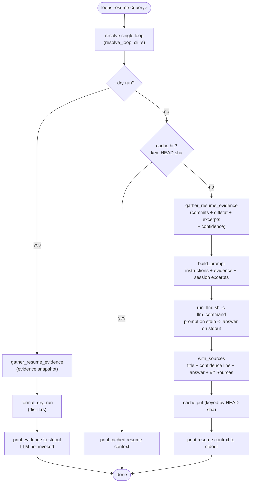

# 05 — Resume & distill

> Architecture layer index: [`README.md`](README.md). Anchor doc with the shared
> vocabulary and end-to-end flow: [`00-overview.md`](00-overview.md). Read the
> overview first; this doc owns the fifth runtime domain in that flow and is the
> detailed home of the canonical term *resume context*.

## Purpose

This domain answers the last two of the three questions `open-loops` exists for —
*where did I leave off, and what is the next step?* — for one chosen open loop.
It consumes the **evidence snapshot** assembled by
[04-inventory-evidence](04-inventory-evidence.md) (`ResumeEvidence`: commits,
diffstat, matched session excerpts, and a confidence score) and turns it into the
**resume context**: a short, human-facing markdown document with `## Why`,
`## Done`, `## Remaining`, and `## Next step` sections, an audit-trail
`## Sources` section, and a confidence line at the top.

The distillation itself is delegated to a Large Language Model, but the domain
owns nothing about *which* LLM: it builds a prompt, pipes it on stdin to a
configurable shell command (`llm_command`, default `claude -p`), and reads the
answer back on stdout. That single contract is the whole integration surface — it
is what lets the test suite stand in `cat` for a real model and lets a user swap
providers without touching code (see *Decisions*, ex-ADR-0002).

The expensive part of this domain is the LLM call (~30–60s on a cold resume). It
is paid only when there is no cached answer; the distillation cache keyed by the
loop's HEAD sha (see [06-cache-index](06-cache-index.md)) makes a repeat resume
instant, and `--dry-run` skips the LLM entirely.

## Domain map

| File | Responsibility |
|---|---|
| [`src/distill.rs`](../../src/distill.rs:1) | The whole domain: prompt construction (`build_prompt`), the LLM invocation via the configured command (`run_llm`), the confidence model (`Confidence`, `compute_confidence`), the `## Sources` append (`with_sources`), and the `--dry-run` formatter (`format_dry_run`). |
| [`src/cli.rs`](../../src/cli.rs:292) (orchestration) | `run_resume` is the caller: it resolves the loop, checks the cache, gathers the evidence snapshot, and threads it through `build_prompt` → `run_llm` → `with_sources`, or short-circuits to `format_dry_run`. |

The evidence that feeds this domain — the `ResumeEvidence` struct and its
assembly in `gather_resume_evidence` — is owned by
[04-inventory-evidence](04-inventory-evidence.md); the session excerpts embedded
in the prompt are `SessionExcerpt` values owned by
[02-sessions-attribution](02-sessions-attribution.md); the `llm_command` config
field is owned by [07-config-state](07-config-state.md). This doc documents only
how the prompt is built, how the command is invoked, and how the answer is
finished into a resume context.

Entry points:

- `build_prompt` ([`src/distill.rs:64`](../../src/distill.rs:64)) — assembles the
  prompt from the evidence snapshot.
- `run_llm` ([`src/distill.rs:106`](../../src/distill.rs:106)) — runs the
  configured command with the prompt on stdin and returns its stdout.
- `with_sources` ([`src/distill.rs:149`](../../src/distill.rs:149)) — appends the
  confidence line and `## Sources` section to the model's answer.
- `compute_confidence` ([`src/distill.rs:23`](../../src/distill.rs:23)) — derives
  the `Low`/`Medium`/`High` score from the excerpts.
- `format_dry_run` ([`src/distill.rs:198`](../../src/distill.rs:198)) — renders the
  evidence snapshot for `--dry-run`, without invoking the LLM.

## Concepts & vocabulary

These build on the canonical terms in [00-overview](00-overview.md#concepts--vocabulary).
This domain owns the precise definition of *resume context* and of *confidence*.

- **resume context** — the distilled, human-facing document this domain produces
  from the evidence snapshot. In its final form it is: a `# <repo/branch>` title,
  the **confidence line**, the four LLM-generated sections (`## Why`, `## Done`,
  `## Remaining`, `## Next step`), and a trailing `## Sources` section. The
  central four sections come straight from the model; the title, confidence line,
  and `## Sources` are added deterministically by `with_sources`
  ([`src/distill.rs:149`](../../src/distill.rs:149)), so the audit trail does not
  depend on the LLM obeying the prompt.
- **prompt** — the text fed to the LLM on stdin, built by `build_prompt`
  ([`src/distill.rs:64`](../../src/distill.rs:64)). It is a fixed instruction
  header (answer in English markdown with exactly those four sections; rely *only*
  on the evidence; write `"insufficient evidence"` where the evidence is thin)
  followed by the evidence itself: the branch key and base, the commit list, the
  diffstat, and one block per matched session excerpt — or an explicit
  `none found` line when there are no sessions.
- **`llm_command`** — the configurable shell command the prompt is piped to,
  default `claude -p` ([`src/config.rs:46`](../../src/config.rs:46)). It is
  interpreted by `sh -c`, so pipes and redirections are allowed; its only contract
  is stdin → stdout. Owned by [07-config-state](07-config-state.md); how to change
  it is in [docs/configuration.md](../configuration.md).
- **confidence** — a `Low`/`Medium`/`High` score derived purely from the matched
  session excerpts (`Confidence`, [`src/distill.rs:13`](../../src/distill.rs:13);
  `compute_confidence`, [`src/distill.rs:23`](../../src/distill.rs:23)). It is
  `High` when at least one excerpt both overlaps the commit window *and* mentions
  the branch name, `Medium` when excerpts matched but neither condition holds, and
  `Low` when no excerpts matched (context is git-only). The score is surfaced as
  the confidence line at the top of both the resume context and the `--dry-run`
  output, so a resume is never silently trusted.
- **`## Sources`** — the audit-trail section `with_sources` appends: the git
  branch and short HEAD sha, then one line per session excerpt used. It exists so
  the reader can verify the distillation against its inputs, especially when
  confidence is not `High`. It is part of the contract, not debugging metadata.

## Main flow

`run_resume` ([`src/cli.rs:292`](../../src/cli.rs:292)) drives the domain. After
resolving the loop it branches three ways: `--dry-run` prints the evidence and
stops; a cache hit prints the stored resume context and stops; otherwise it builds
the prompt, pipes it to the configured command, finishes the answer with the
confidence line and `## Sources`, caches it, and prints it.

In code: the `--dry-run` short-circuit gathers the snapshot and hands it to
`format_dry_run` ([`src/cli.rs:296`](../../src/cli.rs:296),
[`src/distill.rs:198`](../../src/distill.rs:198)). The cache check uses
`Cache::get` keyed by the loop's HEAD sha
([`src/cli.rs:311`](../../src/cli.rs:311); cache owned by
[06-cache-index](06-cache-index.md)). On a miss, `gather_resume_evidence`
([`src/cli.rs:316`](../../src/cli.rs:316)) returns the evidence snapshot, which
`build_prompt` ([`src/distill.rs:64`](../../src/distill.rs:64)) turns into the
prompt; `run_llm` ([`src/distill.rs:106`](../../src/distill.rs:106)) reads
`cfg.llm_command` ([`src/cli.rs:327`](../../src/cli.rs:327)) and pipes the prompt
to it; `with_sources` ([`src/distill.rs:149`](../../src/distill.rs:149)) finishes
the document; `Cache::put` stores it ([`src/cli.rs:329`](../../src/cli.rs:329))
and it is printed to stdout.

## Interfaces & contracts

**The prompt — `build_prompt(lp, default_branch, commits, diffstat, excerpts)`**
([`src/distill.rs:64`](../../src/distill.rs:64)). A pure function of the evidence
snapshot. The instruction header pins the output contract (English markdown;
exactly `## Why` / `## Done` / `## Remaining` / `## Next step`; `"insufficient
evidence"` where the evidence is thin; rely *only* on the evidence below). Then it
embeds the branch key and base, the commit list, the diffstat, and either one
`# Session …` block per excerpt or an explicit `# AI sessions\nnone found` line.
It performs no I/O and never calls the LLM.

**The LLM contract — `run_llm(llm_command, prompt) -> Result<String>`**
([`src/distill.rs:106`](../../src/distill.rs:106)). The entire integration is one
process call:

| Aspect | Behaviour |
|---|---|
| Spawn | `sh -c "<llm_command>"`, so the command may contain pipes/redirections (e.g. `claude -p \| tee /tmp/out.md`). |
| Input | The full prompt is written to the child's **stdin**. |
| Output | The child's **stdout** is captured and returned verbatim (lossy UTF-8). |
| stderr | Captured; on failure it is included in the error message. |
| Broken pipe on write | Treated as success — the LLM exited before reading all of stdin, which is fine ([`src/distill.rs:127`](../../src/distill.rs:127)). |
| Spawn failure | `Err` with a message pointing at installation and `llm_command` in config ([`src/distill.rs:114`](../../src/distill.rs:114)). |
| Non-zero exit | `Err` `LLM command failed (…)` carrying the trimmed stderr ([`src/distill.rs:136`](../../src/distill.rs:136)). |

**Finishing the answer — `with_sources(answer, lp, excerpts, confidence)`**
([`src/distill.rs:149`](../../src/distill.rs:149)). Wraps the model's `answer`
into the final resume context: a `# <repo/branch>` title, the confidence line
(`**Confidence:** <label> — <explanation>`), the trimmed answer, and a
`## Sources` section listing `git: branch <name> (HEAD <short-sha>)` followed by
one `AI session: …` line per excerpt. The short sha is the first 7 chars, or the
whole sha when it is shorter ([`src/distill.rs:155`](../../src/distill.rs:155)).

**The confidence model — `Confidence` / `compute_confidence`**
([`src/distill.rs:13`](../../src/distill.rs:13),
[`src/distill.rs:23`](../../src/distill.rs:23)). Three levels, derived only from
the excerpts:

| Level | Condition | Label / explanation in output |
|---|---|---|
| `High` | some excerpt is `in_window` **and** `mentions_branch` | `high — AI sessions align with branch commits` |
| `Medium` | excerpts exist but none satisfy both | `medium — AI sessions found but alignment uncertain — audit Sources before trusting` |
| `Low` | no excerpts | `low — no AI sessions matched — context from git only` |

**The dry-run formatter — `format_dry_run(lp, default_branch, commits, diffstat,
excerpts, confidence)`** ([`src/distill.rs:198`](../../src/distill.rs:198)).
Renders the evidence snapshot itself: the confidence line, a `## Git` block
(branch, short HEAD sha, base, ahead/behind), the commit list, the diffstat, and a
`## AI sessions` block listing each excerpt with its match tags (`in commit
window`, `mentions branch`, or `matched by heuristic`), closing with
`--- Dry run — LLM not invoked.`. It contains none of the LLM-generated `##`
sections — by design, it is the auditable *input*, not the distilled output.

The user-facing surface — the `loops resume <query> [--dry-run] [--fresh]`
command, the output sections, and the confidence table — is documented in
[docs/features.md](../features.md) and not duplicated here.

## Invariants & edge cases

- **Default `llm_command = "claude -p"`.** When the config has no `llm_command`,
  it defaults to `claude -p` (`default_llm_command`,
  [`src/config.rs:46`](../../src/config.rs:46)), so a fresh install resumes against
  Claude Code with no configuration. The command must be on `PATH`; if it is not,
  `run_llm` fails with a message pointing at installation and the config field
  ([`src/distill.rs:114`](../../src/distill.rs:114)).
- **The LLM command is injectable for testing — point it at any stdin→stdout
  program.** Because `run_llm` only relies on the stdin→stdout contract, the test
  suite sets `llm_command` to `cat`, which echoes the prompt straight back, and
  asserts on the round-trip (`run_llm_passes_prompt_via_stdin`,
  [`src/distill.rs:307`](../../src/distill.rs:307)). The same technique works for
  manual experiments: set `llm_command` to `cat` or `sed 's/^/LLM> /'` in the
  config to exercise the whole resume pipeline — prompt build, pipe, `with_sources`,
  caching, output — without a real model. (Note: `cat` does not emit the four
  `##` sections, so the *content* is not a real distillation; this exercises the
  *plumbing*, which is the point.)
- **`--dry-run` prints the evidence and never calls the LLM.** It gathers the
  evidence snapshot, formats it with `format_dry_run`, prints it, and returns
  before any cache lookup or LLM call ([`src/cli.rs:296`](../../src/cli.rs:296)).
  This is the audit path: it shows exactly the commits, diffstat, and session
  excerpts that *would* feed the model, so the heuristic match can be inspected
  before trusting a distillation.
- **A cache hit skips the LLM entirely.** Before building the prompt, `run_resume`
  checks the distillation cache keyed by HEAD sha and prints the stored resume
  context on a hit ([`src/cli.rs:311`](../../src/cli.rs:311)). A new commit changes
  the HEAD sha and is therefore an automatic miss (see
  [06-cache-index](06-cache-index.md)); `--fresh` affects the inventory memo, not
  this cache.
- **A non-zero LLM exit aborts the resume; a broken pipe does not.** If the command
  exits non-zero, `run_llm` returns an error carrying its stderr and the resume
  fails (nothing is cached) ([`src/distill.rs:136`](../../src/distill.rs:136)). But
  a broken pipe while writing stdin is tolerated — a model that reads a prefix and
  exits early is a normal success, not an error
  ([`src/distill.rs:127`](../../src/distill.rs:127)).
- **No sessions is a valid resume, not a failure.** When no excerpts matched, the
  prompt states `none found`, confidence is `Low`, and `## Sources` lists git only.
  The distillation still runs from git evidence alone — context is reduced, not
  absent.
- **The audit trail is deterministic, independent of the model.** The title,
  confidence line, and `## Sources` section are appended by `with_sources` after
  the model returns, so they are correct even if the LLM ignores the prompt's
  section instructions — the resume is never silently trusted
  ([00-overview](00-overview.md#invariants--edge-cases)).

## Decisions

**The LLM via shell-out to a configurable command** *(ex-ADR-0002, the LLM half;
the git half lives in [01-discovery](01-discovery.md))*. The distillation is
delegated to whatever command `llm_command` names, fed the prompt on stdin and
read back on stdout, rather than embedding an LLM SDK in the binary. The rationale
recorded in the ADR is **simplicity and debuggability**: the performance
bottleneck is the LLM call itself (tens of seconds), not the process boundary, so
a native SDK binding buys nothing the subprocess does not — while the subprocess
contract is trivial to reason about, log, and reproduce by hand (pipe the prompt
into the same command in a shell). Making the command **injectable** has two
direct payoffs that an embedded SDK would forfeit: the test suite substitutes a
plain stdin→stdout program such as `cat`, so the pipeline is testable with no
network, credentials, or model; and a user switches providers (a different CLI, a
local model via `ollama run …`, a wrapper script) purely through config, with no
code change or rebuild. The accepted trade-off is that an LLM CLI must be present
on `PATH` and configured — the binary ships no model and cannot phone home on its
own — so the error messages deliberately point at installation and at the
`llm_command` config field when the command is missing or fails. A second,
smaller trade-off is that the integration goes through `sh -c`, which is what
enables pipes and redirections in `llm_command` but also means the command is
shell-interpreted; this is intended (it is a user-controlled local config value),
not untrusted input.

> **Note — ADR-0002 is written in Portuguese.** The source ADR
> ([`docs/decisions/0002-git-e-llm-via-shell-out.md`](../decisions/0002-git-e-llm-via-shell-out.md))
> records this decision in Portuguese; the decision and its trade-offs are
> re-stated here in English with no change of substance. The current code matches
> the ADR exactly: `llm_command` defaults to `claude -p`
> ([`src/config.rs:46`](../../src/config.rs:46)) and the prompt is delivered on
> stdin ([`src/distill.rs:124`](../../src/distill.rs:124)).

## Extension & limitations

- **Provider-agnostic by construction.** Any stdin→stdout command is a valid
  backend, so new providers are a config change, never a code change. The flip
  side is that `open-loops` neither manages credentials nor knows token limits for
  the backend — that is the configured command's concern.
- **The prompt is fixed, not templated.** `build_prompt` hardcodes the instruction
  header and section list; there is no user-facing prompt template or
  per-provider tuning. Refining the prompt (or the section set) is a code change
  and a known candidate for experimentation.
- **Confidence is a coarse heuristic.** The `Low`/`Medium`/`High` score is derived
  only from whether excerpts overlap the commit window and mention the branch; it
  does not inspect the LLM's answer. It is intentionally a *flag to audit*, paired
  with `## Sources`, rather than a guarantee — which is why every non-`High`
  resume nudges the reader to verify the sources. Sharper attribution is tracked
  in [02-sessions-attribution](02-sessions-attribution.md).
- **No streaming or timeout.** `run_llm` waits for the command to finish and
  returns its full stdout; there is no token streaming to the terminal and no
  built-in timeout (a hung command hangs the resume). Cold resumes are bounded in
  practice by the model, not by this code, and are mitigated by the per-HEAD-sha
  cache rather than by interruption.

## References

Code (verified against the current tree):

- [`src/distill.rs:13`](../../src/distill.rs:13) — `Confidence` (the three-level
  enum); [`src/distill.rs:23`](../../src/distill.rs:23) — `compute_confidence`
  (derived from excerpts).
- [`src/distill.rs:64`](../../src/distill.rs:64) — `build_prompt` (prompt from the
  evidence snapshot; `none found` branch at
  [`:82`](../../src/distill.rs:82)).
- [`src/distill.rs:106`](../../src/distill.rs:106) — `run_llm` (`sh -c`, stdin →
  stdout; spawn-failure context at [`:114`](../../src/distill.rs:114), broken-pipe
  tolerance at [`:127`](../../src/distill.rs:127), non-zero-exit error at
  [`:136`](../../src/distill.rs:136)).
- [`src/distill.rs:149`](../../src/distill.rs:149) — `with_sources` (title +
  confidence line + `## Sources`; short-sha clamp at
  [`:155`](../../src/distill.rs:155)).
- [`src/distill.rs:198`](../../src/distill.rs:198) — `format_dry_run` (evidence
  without the LLM; match tags via `session_match_tags`,
  [`src/distill.rs:174`](../../src/distill.rs:174)).
- [`src/cli.rs:292`](../../src/cli.rs:292) — `run_resume` (the orchestration:
  `--dry-run` short-circuit at [`:296`](../../src/cli.rs:296), cache check at
  [`:311`](../../src/cli.rs:311), evidence at [`:316`](../../src/cli.rs:316),
  prompt at [`:317`](../../src/cli.rs:317), `run_llm` call at
  [`:327`](../../src/cli.rs:327), `Cache::put` at [`:329`](../../src/cli.rs:329));
  [`src/cli.rs:189`](../../src/cli.rs:189) — `gather_resume_evidence` (the evidence
  snapshot, owned by [04-inventory-evidence](04-inventory-evidence.md));
  [`src/cli.rs:18`](../../src/cli.rs:18) — `ResumeEvidence`.
- [`src/config.rs:24`](../../src/config.rs:24) — the `llm_command` field;
  [`src/config.rs:46`](../../src/config.rs:46) — `default_llm_command`
  (`"claude -p"`).

Tests worth reading (all in [`src/distill.rs`](../../src/distill.rs:241)):
`compute_confidence_levels`, `build_prompt_includes_evidence_and_sections`,
`build_prompt_without_sessions_declares_absence`,
`run_llm_passes_prompt_via_stdin` (the `cat` substitution),
`run_llm_contextual_error_when_command_fails`,
`with_sources_appends_git_and_sessions`,
`format_dry_run_lists_evidence_without_llm_sections`, and
`with_sources_short_sha_when_head_sha_under_7_chars`.

Sibling architecture docs: [00-overview](00-overview.md) ·
[02-sessions-attribution](02-sessions-attribution.md) (the `SessionExcerpt`s
embedded in the prompt) · [04-inventory-evidence](04-inventory-evidence.md)
(produces the evidence snapshot this domain consumes) ·
[06-cache-index](06-cache-index.md) (the distillation cache keyed by HEAD sha) ·
[07-config-state](07-config-state.md) (the `llm_command` config field) ·
[08-cli-output](08-cli-output.md) (stdout/stderr split for the resume context).

User-facing docs (linked, not duplicated): [features](../features.md)
(`loops resume`, `--dry-run`, the confidence table) ·
[configuration](../configuration.md) (changing the LLM via `llm_command`).
