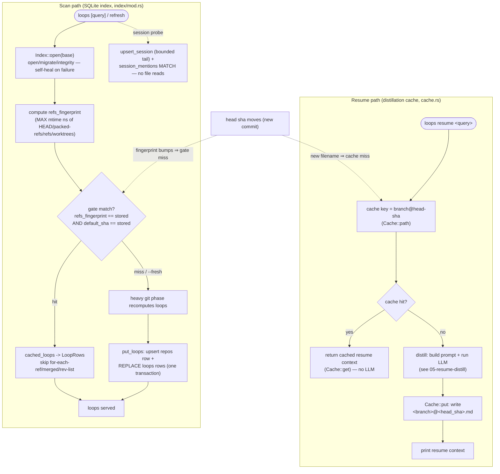

# 06 — Cache & index

> Architecture layer index: [`README.md`](README.md). Anchor doc with the shared
> vocabulary and end-to-end flow: [`00-overview.md`](00-overview.md). Read the
> overview first; this doc owns the sixth runtime domain in that flow — the two
> on-demand side stores that keep `open-loops` fast without ever becoming a
> source of record.

## Purpose

This domain owns the two **disposable caches** the rest of the system reads and
writes along the way: a small *distillation cache* that stores finished resume
contexts, and a *SQLite index* that accelerates scanning and session matching.
Neither is a store of record. Git (and, for the cache, the LLM output derived
from git) is the source of truth; every value in both stores is derivable from
git, and either store can be deleted at any moment and rebuilt as a byproduct of
the next command.

The two stores answer different questions and are easy to confuse, so this doc
names them precisely and keeps them apart:

- **distillation cache** ([`src/cache.rs`](../../src/cache.rs:8)) — caches the
  *output* of a resume: the finished **resume context** for one loop, as a
  markdown file keyed by the loop's `branch@head-sha`. It is read once at the top
  of `loops resume` and written once after the LLM answers, so a repeat resume on
  an unchanged branch is instant and pays no LLM call.
- **SQLite index** ([`src/index/mod.rs`](../../src/index/mod.rs:36)) — caches the
  *inputs* the scan recomputes on every run: per-repo scan results (so a warm
  scan can skip the heavy git phase), the `--git-common-dir` of each scanned
  path (so dedup skips a `git rev-parse`), and a full-text index over a bounded
  tail of each AI session (so the resume mention probe never reads whole files).

A third store, the JSON **inventory memo**, sits beside these but belongs to a
different domain: it memoises only the *ahead/behind* counts and is owned by
[04-inventory-evidence](04-inventory-evidence.md). On the live path the SQLite
index's refs-fingerprint gate supersedes the inventory memo for warm hits; the
memo is retained as the documented behaviour when no index is threaded in. This
doc references the inventory only to disambiguate it from the two stores it owns.

## Domain map

| File | Responsibility |
|---|---|
| [`src/cache.rs`](../../src/cache.rs:8) | The distillation cache: one markdown file per `branch@head-sha` under `<base>/cache/`. `Cache::new` (root), `Cache::get` (read a cached resume context), `Cache::put` (persist one). The HEAD-sha in the filename makes the cache self-invalidate when the branch advances. |
| [`src/index/mod.rs`](../../src/index/mod.rs:36) | The SQLite index at `<base>/index.db` (WAL): tolerant open + self-heal (`Index::open`), the four-table schema and its migrations, and the read/write accessors for the three caches it holds — common-dir, loops (refs-fingerprint gate), and session FTS. `LoopRow` ([`src/index/mod.rs:21`](../../src/index/mod.rs:21)) is the cached scan row. |

Both stores are *driven* from other domains; this doc owns the stores, not the
callers:

- `loops resume` reads and writes the distillation cache directly in `run_resume`
  ([`src/cli.rs:310`](../../src/cli.rs:310), [`src/cli.rs:311`](../../src/cli.rs:311),
  [`src/cli.rs:329`](../../src/cli.rs:329)); the surrounding resume flow is owned by
  [05-resume-distill](05-resume-distill.md).
- The scan threads the index as `Option<&Index>` into
  `scanner::scan_indexed` ([`src/scanner.rs:733`](../../src/scanner.rs:733)) and
  `open_loops_indexed` ([`src/scanner.rs:451`](../../src/scanner.rs:451)); the scan
  itself is owned by [01-discovery](01-discovery.md).
- The session adapter threads the index into `excerpts_indexed`
  ([`src/sessions/claude_code.rs:75`](../../src/sessions/claude_code.rs:75)) for
  the FTS mention probe; the session domain is owned by
  [02-sessions-attribution](02-sessions-attribution.md).

The on-disk locations of every store are listed under *Invariants & edge cases*
and documented for users in
[docs/configuration.md](../configuration.md) (the "SQLite index" and "Inventory
cache" sections); this doc does not duplicate that surface.

## Concepts & vocabulary

These build on the canonical terms in [00-overview](00-overview.md#concepts--vocabulary).
This domain owns the precise definitions of the two stores and the gate.

- **distillation cache** — the on-disk cache of finished **resume contexts**. One
  markdown file per loop lives at
  `<base>/cache/<root_label>/<repo_name>/<branch>@<head_sha>.md`, where `<base>`
  is `OPEN_LOOPS_HOME` or `~/.open-loops`. The branch's `/` characters are
  rewritten to `__` so the branch fits in one path segment, and the filename ends
  in the literal `@<head_sha>` — this *is* the `branch@head-sha` key. It is purely
  the resume *output* store; it holds no scan data.
- **SQLite index** — the single SQLite database at `<base>/index.db`, opened in
  **WAL** mode, wrapped by the `Index` struct. It is a disposable cache of three
  kinds of scan/session input, never a store of record.
- **`branch@head-sha`** — the canonical cache key. In the *distillation cache* it
  is the literal filename. In the *SQLite loops cache* it is expressed
  structurally: a `loops` row carries `branch` and `head_sha`, and a moved HEAD
  bumps the refs-fingerprint gate (below) so the stale rows are recomputed. Both
  stores therefore invalidate themselves when the branch advances — no manual
  invalidation anywhere.
- **refs-fingerprint gate** — the staleness signal that lets a warm scan skip
  `for-each-ref`, `branch --merged`, and per-branch `rev-list` entirely. The
  fingerprint (`refs_fingerprint`, [`src/scanner.rs:195`](../../src/scanner.rs:195))
  is the MAX mtime in **unix nanoseconds** of a repo's `HEAD`, `packed-refs`, the
  newest entry under `refs/`, and the newest entry under `worktrees/`. Cached
  loops are served only when **both** the stored `refs_fingerprint` matches **and**
  the stored `default_sha` matches (the base has not moved). Any mismatch is a
  clean miss → recompute → write-through.
- **common-dir cache** — the `repos` table's mapping from a scanned `path` to its
  absolute `--git-common-dir` (and a FNV-1a hash of that common-dir,
  `common_dir_hash`). On a hit, repo dedup skips the per-candidate
  `git rev-parse --git-common-dir` shell-out.
- **session FTS** — the `sessions` + `sessions_fts` tables: a full-text index over
  a **bounded tail** (`max_session_kb`) of each AI session, so the
  `loops resume` mention probe is a `sessions_fts MATCH` scoped by `repo_path`,
  with no whole-file reads.

## Main flow

Two independent paths touch this domain. The **resume path** reads and writes the
distillation cache around the LLM call. The **scan path** reads and writes the
SQLite index — the refs-fingerprint gate for loops, the common-dir cache during
dedup, and the session FTS during the resume mention probe.

In code, the **resume path** runs through `run_resume`
([`src/cli.rs:292`](../../src/cli.rs:292)): it constructs `Cache::new(base)`
([`src/cli.rs:310`](../../src/cli.rs:310)), calls `Cache::get` keyed by the loop's
HEAD sha and prints the stored context on a hit
([`src/cli.rs:311`](../../src/cli.rs:311)), and on a miss distills and then calls
`Cache::put` ([`src/cli.rs:329`](../../src/cli.rs:329)). `Cache::path`
([`src/cache.rs:20`](../../src/cache.rs:20)) builds the
`<root_label>/<repo_name>/<branch>@<head_sha>.md` filename.

The **scan path** opens the index once per command with `Index::open`
([`src/cli.rs:155`](../../src/cli.rs:155), [`src/cli.rs:232`](../../src/cli.rs:232))
and threads `Some(&index)` into `scan_indexed`. Inside `open_loops_indexed`
([`src/scanner.rs:451`](../../src/scanner.rs:451)) the gate consults `cached_loops`
([`src/scanner.rs:471`](../../src/scanner.rs:471)); on a hit it returns the cached
`LoopRow`s and skips the heavy git phase, and on a miss it recomputes and writes
through with `put_loops` ([`src/scanner.rs:660`](../../src/scanner.rs:660)). The
session mention probe upserts a bounded tail and runs the FTS `MATCH` via
`upsert_session`/`session_mentions`
([`src/sessions/claude_code.rs:113`](../../src/sessions/claude_code.rs:113),
[`src/sessions/claude_code.rs:117`](../../src/sessions/claude_code.rs:117)).

## Interfaces & contracts

**The distillation cache — `Cache`** ([`src/cache.rs:8`](../../src/cache.rs:8)).
A thin filesystem wrapper; no SQLite, no locking.

| Method | Contract |
|---|---|
| `Cache::new(base)` ([`src/cache.rs:14`](../../src/cache.rs:14)) | Roots the cache at `<base>/cache/`. |
| `Cache::path(lp)` ([`src/cache.rs:20`](../../src/cache.rs:20)) | Builds `<root_label>/<repo_name>/<branch>@<head_sha>.md`; `/` in the branch becomes `__`. Private; defines the key. |
| `Cache::get(lp) -> Option<String>` ([`src/cache.rs:30`](../../src/cache.rs:30)) | Reads the cached resume context; any read error (including a missing file) is a clean `None` miss. |
| `Cache::put(lp, content) -> Result<()>` ([`src/cache.rs:39`](../../src/cache.rs:39)) | Creates parent directories and writes the file. The only fallible method: it returns `Err` if the directory cannot be created or the file cannot be written. |

The cache stores the *final* resume context (title, confidence line, the four
LLM sections, and `## Sources`), so a hit is byte-for-byte what a fresh resume
would print; the content contract is owned by
[05-resume-distill](05-resume-distill.md).

**The SQLite index — `Index`** ([`src/index/mod.rs:36`](../../src/index/mod.rs:36)).
Wraps one `rusqlite::Connection`. **Every public accessor is tolerant**: any
SQLite error degrades to a clean miss or a no-op write, prints a one-line
`warning:` to stderr where appropriate, and never aborts the command. `LoopRow`
([`src/index/mod.rs:21`](../../src/index/mod.rs:21)) is the cached scan row
(`branch`, `head_sha`, `base_sha`, `ahead`/`behind` as `Option`, `last_commit`,
`worktree_path`); `ahead`/`behind` are `None` for a light-phase-only scan.

| Method | Contract |
|---|---|
| `Index::open(base)` ([`src/index/mod.rs:50`](../../src/index/mod.rs:50)) | Open/migrate/integrity-check `<base>/index.db`. On any failure: warn, delete `index.db`/`-wal`/`-shm`, recreate; if disk truly fails, fall back to an in-memory db. Never panics, never aborts. |
| `Index::open_in_memory()` ([`src/index/mod.rs:73`](../../src/index/mod.rs:73)) | Same migration in `:memory:` for tests and as the disk-failure fallback. |
| `cached_common_dir(path)` ([`src/index/mod.rs:92`](../../src/index/mod.rs:92)) | `(common_dir_hash, common_dir)` for a known scanned `path`, or `None` on miss/error. |
| `put_repo_common_dir(path, hash, common_dir)` ([`src/index/mod.rs:115`](../../src/index/mod.rs:115)) | Upserts the `repos` row's common-dir columns, leaving the gate columns NULL (filled later by `put_loops`). |
| `cached_loops(hash, refs_fp, default_sha)` ([`src/index/mod.rs:144`](../../src/index/mod.rs:144)) | Returns the cached `LoopRow`s **only** when the stored `refs_fingerprint == refs_fp` **and** `default_sha == default_sha`. A NULL-gate (un-populated) repo row is a clean, warning-free miss. |
| `put_loops(hash, path, common_dir, default_branch, default_sha, refs_fp, rows)` ([`src/index/mod.rs:229`](../../src/index/mod.rs:229)) | Write-through for one repo: upsert the `repos` gate columns and **REPLACE** the repo's `loops` rows (delete + re-insert) in a single transaction. |
| `upsert_session(path, repo_path, mtime, size, text)` ([`src/index/mod.rs:347`](../../src/index/mod.rs:347)) | Indexes a session's bounded tail. Reindexes only when the stored `(mtime, size)` differs — comparing `size` alongside `mtime` closes the same-second append window. |
| `session_mentions(repo_path, branch)` ([`src/index/mod.rs:431`](../../src/index/mod.rs:431)) | The set of session paths (scoped to `repo_path`) whose indexed tail matches `branch` via FTS5. No file reads; empty set on any error. |
| `prune_missing_repos()` ([`src/index/mod.rs:488`](../../src/index/mod.rs:488)) | Deletes `repos` rows (and their `loops`) only when **both** the scanned `path` and the `common_dir` are gone from disk. |

**Schema (`user_version = 2`).** Four tables, created atomically by
`create_schema_v1` ([`src/index/mod.rs:613`](../../src/index/mod.rs:613)) and
healed to v2 by `migrate_v1_to_v2` ([`src/index/mod.rs:593`](../../src/index/mod.rs:593)):

| Table | Holds | Key |
|---|---|---|
| `repos` | One row per repo: `common_dir_hash`, scanned `path`, `common_dir`, `default_branch`, `default_sha`, `refs_fingerprint`, `last_indexed`. | `common_dir_hash` PRIMARY KEY; `path` UNIQUE. |
| `loops` | Cached scan rows mirroring `OpenLoop` for one unmerged branch. | `(common_dir_hash, branch)` PRIMARY KEY. |
| `sessions` | Per-session metadata for the FTS gate: `path`, `repo_path`, `mtime`, `size`. | `path` PRIMARY KEY. |
| `sessions_fts` | A **contentful** FTS5 virtual table over the session `text` tail (`path UNINDEXED`). | `rowid` correlated to `sessions.rowid`. |

The FTS table is **contentful** (not `content=''`) so the reindex path can issue
`DELETE … WHERE rowid = ?` when a session file changes; the per-row text is a
bounded tail, so the storage cost is negligible
([`src/index/mod.rs:648`](../../src/index/mod.rs:648), the inline rationale).
`rusqlite` is pinned with the `bundled` feature, so there is no system
`libsqlite3` dependency, and WAL mode lets two `loops` processes read/write
without corrupting each other.

The user-facing surface — `index.db` and `cache/` as safe-to-delete state,
`loops refresh`, and `--fresh` — is documented in
[docs/configuration.md](../configuration.md) and not duplicated here.

## Invariants & edge cases

- **Both stores live under `<base>` and nothing is written inside your
  repositories.** `<base>` is `OPEN_LOOPS_HOME` or `~/.open-loops`
  (`base_dir`, [`src/main.rs:28`](../../src/main.rs:28)). The distillation cache is
  `<base>/cache/<root_label>/<repo_name>/<branch>@<head_sha>.md`; the SQLite index
  is `<base>/index.db` (plus its `-wal`/`-shm` siblings). The inventory memo lives
  beside them at `<base>/inventory/` and is a *separate* store owned by
  [04-inventory-evidence](04-inventory-evidence.md).
- **Both stores invalidate themselves when the branch advances.** A new commit
  changes the loop's `head_sha`: the distillation cache then resolves to a new
  filename and misses (`new_head_self_invalidates`,
  [`src/cache.rs:81`](../../src/cache.rs:81)), and the SQLite gate's
  refs-fingerprint bumps so `cached_loops` returns `None` and the loops are
  recomputed. There is no manual invalidation step anywhere.
- **The distillation cache distinguishes loops by full identity.** The path
  includes the `root_label` segment, so the same `repo/branch@sha` under two
  different roots cannot collide (`path_includes_root_label_segment`,
  [`src/cache.rs:89`](../../src/cache.rs:89)).
- **A corrupt or unopenable index self-heals.** `Index::open` deletes and
  recreates the db on any open/migrate/integrity failure, and falls back to an
  in-memory db if disk truly fails — with a one-line `warning:`, never an abort
  ([`src/index/mod.rs:50`](../../src/index/mod.rs:50);
  `corrupt_db_is_rebuilt`, [`src/index/mod.rs:770`](../../src/index/mod.rs:770)).
- **Every index read/write is tolerant.** A failed query is a clean miss; a failed
  write is a warned no-op. Git is the source of truth, so a degraded index only
  costs a recompute, never correctness — this is why the in-memory fallback is
  acceptable for a single run.
- **The refs-fingerprint gate is paired and nanosecond-precise.** A hit requires
  both the fingerprint and `default_sha` to match. The fingerprint is in unix
  **nanoseconds** so a branch advanced in the same wall-clock second as the last
  index write still changes it; folding `worktrees/` in means
  `git worktree add`/`remove` invalidates the gate too. `git gc`/repacking
  rewrites `packed-refs` and bumps the fingerprint without a semantic change —
  acceptable, since it forces exactly one harmless recompute, never stale data.
- **`--fresh` and `loops refresh` bypass the gate but still write through.** A
  fresh scan recomputes and re-`put_loops`es, so the next unchanged scan hits
  again; `loops refresh` always forces `fresh = true`
  ([`src/cli.rs:347`](../../src/cli.rs:347)). `--fresh` does **not** clear the
  distillation cache — that cache is keyed by HEAD sha and only a new commit
  invalidates it (see [05-resume-distill](05-resume-distill.md#invariants--edge-cases)).
- **Index prune is stricter than inventory prune.** `prune_missing_repos`
  ([`src/index/mod.rs:488`](../../src/index/mod.rs:488)) removes a repo row only
  when **both** the scanned `path` and the `common_dir` are gone, so a removed
  worktree whose shared bare store survives keeps its row (its branches are still
  real). `inventory::prune_orphans` prunes on a single `repo_path` check; the two
  prunes run together on `loops refresh` ([`src/cli.rs:391`](../../src/cli.rs:391),
  [`src/cli.rs:394`](../../src/cli.rs:394)).
- **The session FTS reindexes on a same-second size change.** `upsert_session`
  compares `(mtime, size)`, not `mtime` alone, so an append that grows a file
  within the same whole second still forces a reindex — closing the staleness
  window a second-grained mtime would leave open
  (`upsert_session_reindexes_on_same_second_size_change`,
  [`src/index/mod.rs:1268`](../../src/index/mod.rs:1268)).
- **The FTS index only sees the bounded tail.** A branch mentioned only in the
  *head* of a session beyond `max_session_kb` is not matched — the same bound as
  the pre-index whole-file probe, by design (see
  [02-sessions-attribution](02-sessions-attribution.md)).

## Decisions

**SQLite index — a disposable cache for scan + session data** *(ex-ADR-0008)*.
Before this decision, `loops` re-ran the full light git phase
(`for-each-ref`, `branch --merged`, default-branch resolution, `git worktree
list`) and the heavy phase (per-branch `rev-list`) on **every** invocation,
read **whole** session files just to probe for a branch mention, and ran a serial
`git rev-parse --git-common-dir` per candidate during dedup. The JSON inventory
(ex-ADR-0003 phase 3) memoised only *ahead/behind*; everything else recomputed.
The decision adds a single SQLite database at `<base>/index.db`, wrapped by one
`Index` struct, that caches the scan/session **inputs**:

- a **refs-fingerprint gate** lets a warm scan with unchanged refs serve cached
  `loops` rows and skip the entire heavy git phase;
- a **common-dir cache** lets dedup skip the `git rev-parse` shell-out per known
  candidate;
- a **session FTS** over a bounded tail replaces whole-file mention probes, and a
  stable ranking that filters empty sessions before truncation stops a real
  session being dropped.

What it *replaced*: it supersedes — but deliberately does **not** delete — the
JSON inventory memo on the live path. The inventory module and its tests are kept
(it remains the documented behaviour when no index is threaded in, the
`Option<&Index> == None` path), so every pre-existing test passes unchanged; the
SQLite gate is a strict superset of the inventory's ahead/behind memo for warm
hits.

The governing principle is **git = truth, SQLite = disposable index**: every
value is derivable from git, the db can be deleted between runs, and any open,
migrate, or read/write failure degrades to a recompute with a one-line warning
rather than aborting — on open/migrate/integrity failure the db file (and its
WAL siblings) is deleted and recreated, and if disk truly fails an in-memory db
serves that one run. Index access is threaded as `Option<&Index>` so `None`
reproduces the pre-index behaviour byte-for-byte.

The accepted trade-offs: a second on-disk cache alongside the JSON inventory; an
mtime-based fingerprint that forces one harmless recompute after `git gc`
repacking; an FTS index bounded to the session tail (a head-only mention beyond
`max_session_kb` is not matched, identical to the prior behaviour); and a new
`rusqlite` dependency, pinned with the `bundled` feature (no system `libsqlite3`)
and opened in WAL mode so concurrent `loops` processes do not corrupt each other.
The pull-only model (ex-ADR-0001) and git/LLM-via-shell-out (ex-ADR-0002) are
unchanged — the index only memoises what git already produces.

> **Code vs. plan — discrepancy noted.** The migration plan
> ([`docs/superpowers/plans/2026-06-29-sqlite-index-migration.md`](../superpowers/plans/2026-06-29-sqlite-index-migration.md))
> specified a single `user_version = 1` migration with a **contentless**
> `sessions_fts` (`content=''`). The shipped code instead uses a **contentful**
> FTS5 table and a two-step migration ending at `user_version = 2`: the contentless
> table silently rejected the row-level `DELETE … WHERE rowid = ?` the reindex path
> needs, so `migrate_v1_to_v2` ([`src/index/mod.rs:593`](../../src/index/mod.rs:593))
> drops and recreates it contentful, leaving `repos`/`loops`/`sessions` untouched.
> A fresh database goes straight to version 2. ADR-0008 records the final, shipped
> design (`user_version = 2`, contentful FTS); this doc follows the code.

**Distillation cache — file-per-`branch@head-sha`, self-invalidating**
*(the cache portion of the phase-3 inventory-cache plan,
[`docs/superpowers/plans/2026-06-26-inventory-cache-phase3.md`](../superpowers/plans/2026-06-26-inventory-cache-phase3.md);
the pull-only mitigation in ex-ADR-0001)*. A cold resume pays for an LLM call
(~30–60s); the chosen mitigation is to cache the finished resume context on disk,
keyed by the loop's `branch@head-sha`. Encoding the HEAD sha directly in the
filename means a new commit produces a different path and therefore an automatic
miss — the cache cannot serve a resume that predates the work it describes, with
no invalidation logic to get wrong. The cache stores plain markdown (no database,
no locking) because it is a write-once-read-many output blob; the trade-off is
that it is never proactively pruned, but it is trivially safe to delete
(`rm -rf ~/.open-loops/cache/`) and regenerates on the next resume.

## Extension & limitations

- **The distillation cache is never pruned automatically.** Stale
  `branch@head-sha` files for branches that have since advanced or been deleted
  accumulate until manually removed; there is no TTL and no GC pass. This is an
  accepted cost of keeping the cache a dumb file store. (`loops refresh` prunes the
  *index* and the *inventory*, not the distillation cache.)
- **The SQLite gate reduces work, not fan-out.** A gate miss still recomputes the
  repo's heavy phase, and the scan still spawns one thread per gate-miss repo; the
  parallelism strategy of the scan itself is out of scope for this domain (it is
  owned by [01-discovery](01-discovery.md)).
- **The FTS index is tail-bounded.** It indexes only `max_session_kb` of each
  session, so it cannot match a mention that appears solely in a session's head —
  the same limitation as the whole-file probe it replaced, surfaced here only
  because the bound is now an index-time decision.
- **WAL concurrency is best-effort, not transactional across stores.** Two
  concurrent `loops` processes can read/write the index safely under WAL, but the
  distillation cache and the index are independent stores with no cross-store
  transaction; a crash between writing one and the other simply leaves a recompute
  for the next run, which is the disposable-cache contract.

## References

Code (verified against the current tree):

- [`src/cache.rs:8`](../../src/cache.rs:8) — `Cache` (the distillation cache struct);
  [`src/cache.rs:14`](../../src/cache.rs:14) — `Cache::new`;
  [`src/cache.rs:20`](../../src/cache.rs:20) — `Cache::path` (defines the
  `<root_label>/<repo_name>/<branch>@<head_sha>.md` key);
  [`src/cache.rs:30`](../../src/cache.rs:30) — `Cache::get`;
  [`src/cache.rs:39`](../../src/cache.rs:39) — `Cache::put`.
- [`src/index/mod.rs:21`](../../src/index/mod.rs:21) — `LoopRow` (the cached scan row);
  [`src/index/mod.rs:36`](../../src/index/mod.rs:36) — `Index`;
  [`src/index/mod.rs:50`](../../src/index/mod.rs:50) — `Index::open` (self-healing open);
  [`src/index/mod.rs:73`](../../src/index/mod.rs:73) — `Index::open_in_memory`.
- [`src/index/mod.rs:92`](../../src/index/mod.rs:92) — `cached_common_dir`;
  [`src/index/mod.rs:115`](../../src/index/mod.rs:115) — `put_repo_common_dir`;
  [`src/index/mod.rs:144`](../../src/index/mod.rs:144) — `cached_loops` (the
  refs-fingerprint + `default_sha` gate);
  [`src/index/mod.rs:229`](../../src/index/mod.rs:229) — `put_loops` (write-through,
  one transaction).
- [`src/index/mod.rs:347`](../../src/index/mod.rs:347) — `upsert_session`
  (`(mtime, size)` reindex check);
  [`src/index/mod.rs:431`](../../src/index/mod.rs:431) — `session_mentions` (FTS `MATCH`);
  [`src/index/mod.rs:488`](../../src/index/mod.rs:488) — `prune_missing_repos`
  (stricter than the inventory prune).
- [`src/index/mod.rs:570`](../../src/index/mod.rs:570) — `run_migrations`;
  [`src/index/mod.rs:593`](../../src/index/mod.rs:593) — `migrate_v1_to_v2` (FTS heal,
  `user_version` 1 → 2);
  [`src/index/mod.rs:613`](../../src/index/mod.rs:613) — `create_schema_v1` (four
  tables);
  [`src/index/mod.rs:668`](../../src/index/mod.rs:668) — `check_integrity`;
  [`src/index/mod.rs:683`](../../src/index/mod.rs:683) — `delete_db_files`.
- [`src/scanner.rs:195`](../../src/scanner.rs:195) — `refs_fingerprint` (MAX mtime ns);
  [`src/scanner.rs:451`](../../src/scanner.rs:451) — `open_loops_indexed`
  (gate read at [`:471`](../../src/scanner.rs:471), write-through at
  [`:660`](../../src/scanner.rs:660));
  [`src/scanner.rs:733`](../../src/scanner.rs:733) — `scan_indexed`.
- [`src/sessions/claude_code.rs:75`](../../src/sessions/claude_code.rs:75) —
  `excerpts_indexed` (`upsert_session` at
  [`:113`](../../src/sessions/claude_code.rs:113), `session_mentions` probe at
  [`:117`](../../src/sessions/claude_code.rs:117)).
- [`src/cli.rs:292`](../../src/cli.rs:292) — `run_resume` (`Cache::new` at
  [`:310`](../../src/cli.rs:310), `Cache::get` at [`:311`](../../src/cli.rs:311),
  `Cache::put` at [`:329`](../../src/cli.rs:329));
  [`src/cli.rs:155`](../../src/cli.rs:155), [`src/cli.rs:232`](../../src/cli.rs:232) —
  `Index::open` per command; [`src/cli.rs:336`](../../src/cli.rs:336) — `run_refresh`
  (`prune_orphans` + `prune_missing_repos` at
  [`:391`](../../src/cli.rs:391)–[`:394`](../../src/cli.rs:394)).
- [`src/main.rs:28`](../../src/main.rs:28) — `base_dir` (`OPEN_LOOPS_HOME` /
  `~/.open-loops` resolution).

Tests worth reading: in [`src/cache.rs`](../../src/cache.rs:50) —
`miss_then_put_then_hit` ([`src/cache.rs:71`](../../src/cache.rs:71)),
`new_head_self_invalidates`, `path_includes_root_label_segment`;
in [`src/index/mod.rs`](../../src/index/mod.rs:697) —
`open_fresh_dir_creates_all_four_tables`, `corrupt_db_is_rebuilt`,
`migrate_v1_contentless_fts_to_v2_contentful`,
`put_loops_then_cached_loops_round_trip_on_matching_gate`,
`cached_loops_misses_on_fingerprint_mismatch`,
`cached_loops_misses_on_default_sha_mismatch`,
`upsert_session_reindexes_on_same_second_size_change`, and
`prune_missing_repos_keeps_repo_when_common_dir_survives`.

Absorbed decision + plans: [`docs/decisions/0008-sqlite-index.md`](../decisions/0008-sqlite-index.md)
*(ex-ADR-0008)* ·
[`docs/superpowers/plans/2026-06-29-sqlite-index-migration.md`](../superpowers/plans/2026-06-29-sqlite-index-migration.md) ·
[`docs/superpowers/plans/2026-06-26-inventory-cache-phase3.md`](../superpowers/plans/2026-06-26-inventory-cache-phase3.md)
(cache portion).

Sibling architecture docs: [00-overview](00-overview.md) ·
[01-discovery](01-discovery.md) (owns the scan and its parallelism) ·
[02-sessions-attribution](02-sessions-attribution.md) (the FTS-accelerated session
mention probe) · [04-inventory-evidence](04-inventory-evidence.md) (the JSON
ahead/behind memo — a *separate* store from the two here) ·
[05-resume-distill](05-resume-distill.md) (reads/writes the distillation cache
around the LLM call) · [07-config-state](07-config-state.md) (`<base>` resolution
and config).

User-facing docs (linked, not duplicated): [configuration](../configuration.md)
(the "SQLite index" and "Inventory cache" sections, `loops refresh`, `--fresh`) ·
[features](../features.md).
