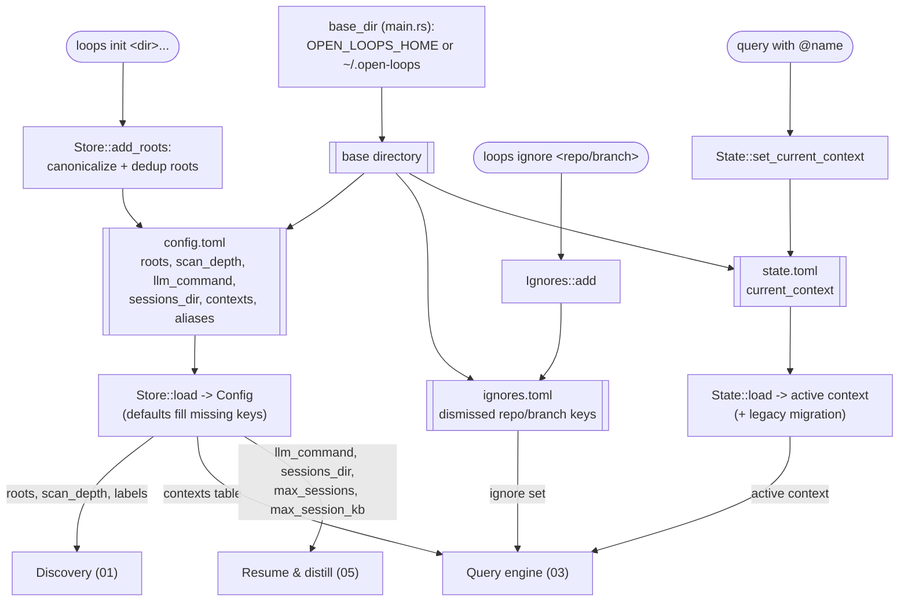

# 07 — Config & state

> Architecture layer index: [`README.md`](README.md). Anchor doc with the shared
> vocabulary and end-to-end flow: [`00-overview.md`](00-overview.md). Read the
> overview first; this doc owns the seventh runtime domain — the small set of
> files under `~/.open-loops/` that every other domain reads from.

## Purpose

Config & state answers a sideways question to the main pipeline: *where does the
tool look, how does it behave, and what did you last ask it to do?* It is not a
stage in the scan-to-resume flow; it is the **out-of-band store** the other
domains consult. Three concerns live here:

- **Configuration** (`config.toml`) — the declarative, user-edited settings:
  which `roots` to scan, how deep (`scan_depth`), which `llm_command` to distil
  through, where Claude Code sessions live, and the named `[contexts.X]` scopes.
- **Runtime state** (`state.toml`) — the one mutable fact the CLI itself writes:
  the **active context**, set when you type `@name` and read back on the next
  invocation. It is kept separate from `config.toml` precisely so a CLI-driven
  context switch never rewrites the file you hand-edit.
- **Ignores** (`ignores.toml`) — the loops you dismissed with `loops ignore`,
  filtered out of the inventory unless `+ignored` asks for them back.

The unifying invariant is the *pull-only* model
([00-overview](00-overview.md#concepts--vocabulary)): nothing is written inside
your repositories. Every byte this tool persists lands under `~/.open-loops/`
(or `OPEN_LOOPS_HOME`), and all of it except `config.toml`/`state.toml`/
`ignores.toml` is a throwaway cache. This doc owns the three TOML files; the
disposable caches (`cache/`, `inventory/`, `index.db`) belong to
[06-cache-index](06-cache-index.md).

## Domain map

| File | Responsibility |
|---|---|
| [`src/config.rs`](../../src/config.rs:1) | The `Config` struct (every key + default), `Store` (load/save `config.toml`, `add_roots`), context lookup, root-label resolution, and `root:` → roots-subset resolution. Reads no environment variables — the base path is injected. |
| [`src/state.rs`](../../src/state.rs:1) | The `State` type backing `state.toml`: the persisted active context, plus first-run migration of the legacy `default_context`/`current_context` keys out of `config.toml`. |
| [`src/ignores.rs`](../../src/ignores.rs:1) | The `Ignores` set backing `ignores.toml`: dismissed `repo/branch` keys, applied by the query evaluator. Documented here; consumed by discovery/query. |

The base directory itself is resolved *outside* these files, in
[`src/main.rs:28`](../../src/main.rs:28) (`base_dir`): `OPEN_LOOPS_HOME` if set,
else `~/.open-loops`. That path is threaded into every `run_*` function, so the
test suite injects a tempdir and nothing under `config.rs`/`state.rs`/`ignores.rs`
ever touches `std::env` directly.

This domain feeds three neighbours. Discovery ([01-discovery](01-discovery.md))
consumes `roots`, `scan_depth`, the resolved root **labels**, and the `ignores`
set. The query engine ([03-query-engine](03-query-engine.md)) consumes the
`[contexts.X]` table and the persisted **active context**. Resume & distill
([05-resume-distill](05-resume-distill.md)) consumes `llm_command`, `sessions_dir`,
`max_sessions`, and `max_session_kb`.

## Concepts & vocabulary

These build on the canonical terms in [00-overview](00-overview.md#concepts--vocabulary).

- **base directory** — the single directory that holds all persisted state,
  resolved by `base_dir` ([`src/main.rs:28`](../../src/main.rs:28)) as
  `OPEN_LOOPS_HOME` or `~/.open-loops`. Everything below is relative to it.
- **config** — the declarative `Config` ([`src/config.rs:15`](../../src/config.rs:15))
  serialised to `config.toml`. Every key is `#[serde(default)]`, so a missing key
  (or a missing file entirely) yields the documented default rather than an error
  (`Store::load`, [`src/config.rs:258`](../../src/config.rs:258)).
- **root** — a directory under which git repositories are searched
  (`Config.roots`, [`src/config.rs:18`](../../src/config.rs:18)). Stored as a
  canonicalised absolute path by `add_roots`
  ([`src/config.rs:275`](../../src/config.rs:275)).
- **root label** — the stable short name of a root: its directory basename, or an
  explicit `aliases` override. Labels form the first segment of the canonical
  `root-label/repo/branch` key. Resolved by `resolve_labels`
  ([`src/config.rs:99`](../../src/config.rs:99)); the per-repo lookup is
  `label_for_repo` ([`src/config.rs:231`](../../src/config.rs:231)).
- **context** — a named, persistent query scope, defined as `[contexts.<name>]`
  with a `filter` query string (`ContextDef`,
  [`src/config.rs:10`](../../src/config.rs:10); `Config.contexts`,
  [`src/config.rs:43`](../../src/config.rs:43)). Defined here, *parsed and
  evaluated* by the query engine.
- **active context** — the context applied implicitly when a query carries no `@`
  token, persisted as `current_context` in `state.toml`
  (`State::current_context`, [`src/state.rs:47`](../../src/state.rs:47)). This is
  the only field the CLI mutates at runtime.
- **ignore key** — a dismissed loop, stored in the `repo/branch`-shaped key set in
  `ignores.toml` (`Ignores`, [`src/ignores.rs:14`](../../src/ignores.rs:14)). A
  loop whose key is in the set is hidden unless the query passes `+ignored`.

## Main flow

Config & state has no single linear flow; it is a store read at the edges of the
runtime. The diagram traces the two write paths (`loops init` writing
`config.toml`; a `@context` switch writing `state.toml`) and the read fan-out
into discovery, query, and resume — all rooted at the `OPEN_LOOPS_HOME`-resolved
base directory.

In code: `run_init` ([`src/cli.rs:264`](../../src/cli.rs:264)) calls
`Store::add_roots` ([`src/config.rs:275`](../../src/config.rs:275)), which
canonicalises and de-duplicates each path then saves. Every scanning command
opens config through the shared preamble `load_cfg_with_roots`
([`src/cli.rs:38`](../../src/cli.rs:38)), which loads the config and enforces the
"at least one root" invariant. The active context is read and any `@` switch
persisted by `resolve_plan_persisting`
([`src/cli.rs:63`](../../src/cli.rs:63)), which loads `State` and calls
`set_current_context` for a `Set`/`Clear` outcome. The ignore set is loaded per
list/refresh and consulted while filtering (`Ignores::load` +
`ignores.contains`, [`src/cli.rs:245`](../../src/cli.rs:245),
[`src/cli.rs:251`](../../src/cli.rs:251)); `run_ignore`
([`src/cli.rs:278`](../../src/cli.rs:278)) writes a new key.

## Interfaces & contracts

### Config keys

The authoritative, user-facing key reference (with descriptions and examples) is
[docs/configuration.md](../configuration.md) — **not duplicated here**. The table
below is the implementation contract: each key's Rust type, default, and the
defining declaration line.

| Key | Type | Default | Declared / default fn |
|---|---|---|---|
| `roots` | `Vec<PathBuf>` | `[]` | [`src/config.rs:18`](../../src/config.rs:18) |
| `aliases` | `BTreeMap<String,String>` | `{}` | [`src/config.rs:21`](../../src/config.rs:21) |
| `llm_command` | `String` | `"claude -p"` | field [`:24`](../../src/config.rs:24); `default_llm_command` [`:46`](../../src/config.rs:46) |
| `sessions_dir` | `PathBuf` | `~/.claude/projects` | field [`:27`](../../src/config.rs:27); `default_sessions_dir` [`:50`](../../src/config.rs:50) |
| `max_sessions` | `usize` | `3` | field [`:30`](../../src/config.rs:30); `default_max_sessions` [`:56`](../../src/config.rs:56) |
| `max_session_kb` | `u64` | `50` | field [`:33`](../../src/config.rs:33); `default_max_session_kb` [`:60`](../../src/config.rs:60) |
| `scan_depth` | `usize` | `4` | field [`:36`](../../src/config.rs:36); `default_scan_depth` [`:64`](../../src/config.rs:64) |
| `inventory_ttl_secs` | `u64` | `0` (SHA-only) | [`src/config.rs:40`](../../src/config.rs:40) |
| `[contexts.X]` | `BTreeMap<String,ContextDef>` | `{}` | [`src/config.rs:43`](../../src/config.rs:43); `ContextDef.filter` [`:10`](../../src/config.rs:10) |

`Config` derives its full defaults via `impl Default`
([`src/config.rs:68`](../../src/config.rs:68)); `Store::load`
([`src/config.rs:258`](../../src/config.rs:258)) returns `Config::default()` when
the file is absent, so the tool runs (with no roots) before `loops init` is ever
called.

### Store, State, and Ignores contracts

- **`Store`** ([`src/config.rs:245`](../../src/config.rs:245)) wraps the base path:
  `config_path` ([`:254`](../../src/config.rs:254)) is `<base>/config.toml`;
  `load`/`save` ([`:258`](../../src/config.rs:258), [`:268`](../../src/config.rs:268))
  round-trip TOML; `add_roots` ([`:275`](../../src/config.rs:275)) canonicalises
  each path (erroring on a nonexistent directory), appends only new entries, and
  saves.
- **`Config::resolve_labels`** ([`src/config.rs:99`](../../src/config.rs:99))
  returns one `(root, label)` per root — alias if present, else basename — and
  **errors** when two roots resolve to the same label with no alias to
  disambiguate. `label_for_repo` ([`src/config.rs:231`](../../src/config.rs:231))
  picks the owning root by longest path prefix.
- **`Config::resolve_scan_roots`** ([`src/config.rs:127`](../../src/config.rs:127))
  turns a `ScanPlan`'s `root_filters` into the subset of roots to scan: tilde-expand
  + canonicalise as a path prefix, exact alias match, or path-tail/basename match;
  multiple `root:` filters **intersect (AND)**, and an empty intersection is an
  empty result, not an error. This is the one config function the query engine
  *defines a token for* but delegates resolution to (see
  [03-query-engine](03-query-engine.md)).
- **`Config::context_filter`** ([`src/config.rs:86`](../../src/config.rs:86))
  returns a named context's filter string, or an actionable error naming the
  missing `[contexts.<name>]` table.
- **`State`** ([`src/state.rs:13`](../../src/state.rs:13)): `load`
  ([`:23`](../../src/state.rs:23)) reads `state.toml` (missing file ⇒ empty
  state); `current_context` ([`:47`](../../src/state.rs:47)) reads the active
  context; `set_current_context` ([`:51`](../../src/state.rs:51)) is a no-op when
  unchanged and otherwise persists. The on-disk shape is `StateFile`
  ([`src/state.rs:8`](../../src/state.rs:8)) with a single `current_context`
  field.
- **`Ignores`** ([`src/ignores.rs:14`](../../src/ignores.rs:14)): `load`
  ([`:28`](../../src/ignores.rs:28)) reads the `repo/branch` set (missing file ⇒
  empty); `add` ([`:48`](../../src/ignores.rs:48)) inserts and immediately
  persists; `contains` ([`:61`](../../src/ignores.rs:61)) is the predicate the
  query evaluator calls. Keys are an ordered `BTreeSet` (`IgnoreFile`,
  [`src/ignores.rs:9`](../../src/ignores.rs:9)).

## Invariants & edge cases

- **Nothing is written inside your repositories.** All three TOML files (and all
  caches) live under the base directory resolved by `base_dir`
  ([`src/main.rs:28`](../../src/main.rs:28)). This is the system-wide pull-only
  guarantee restated for the store this domain owns.
- **Config defaults fill every missing key.** Each field is
  `#[serde(default)]`, and `Store::load` returns `Config::default()` for an absent
  file ([`src/config.rs:258`](../../src/config.rs:258)), so a partial or empty
  `config.toml` never aborts a command.
- **`add_roots` canonicalises and de-duplicates; a nonexistent root is rejected at
  registration.** `loops init /no/such/dir` fails with `nonexistent root: …`
  rather than recording an unusable path
  ([`src/config.rs:278`](../../src/config.rs:278)). Re-adding an existing root is a
  no-op.
- **Two roots may not share a label without an alias.** `resolve_labels` bails with
  an actionable `roots … share label …; set an alias` error
  ([`src/config.rs:111`](../../src/config.rs:111)), because the label is the first
  segment of the canonical loop key and must be unambiguous.
- **State is separate from config, and the CLI never rewrites your config.** The
  active context lives in `state.toml`, not `config.toml`
  ([`src/state.rs:1`](../../src/state.rs:1)), so `loops @work` persists a switch
  without touching the file you hand-edit. `set_current_context` short-circuits
  when the value is unchanged ([`src/state.rs:52`](../../src/state.rs:52)), so a
  no-op query performs no write.
- **Legacy `default_context` is migrated once, on first run.** If `state.toml` is
  absent, `State::load` reads `current_context` (or the older `default_context`)
  out of `config.toml`, writes `state.toml`, and never reads the legacy key again
  (`legacy_context_from_config`, [`src/state.rs:72`](../../src/state.rs:72)). An
  empty `state.toml` is *not* written when there is nothing to migrate
  ([`src/state.rs:36`](../../src/state.rs:36)).
- **A missing TOML file is empty, not an error; a malformed one is a clear error.**
  All three stores treat `NotFound` as "empty", but a present file that fails to
  parse surfaces an `invalid <file> at <path>` context message
  (`Store::load` [`:265`](../../src/config.rs:265), `State::load`
  [`src/state.rs:29`](../../src/state.rs:29), `Ignores::load`
  [`src/ignores.rs:33`](../../src/ignores.rs:33)). This is stricter than the
  tolerant session-parsing rule because these files are the tool's own, not an
  external format.
- **Ignore keys are `repo/branch`-shaped.** `run_ignore` requires a `/` in the key
  and otherwise prints the expected format
  ([`src/cli.rs:279`](../../src/cli.rs:279)). After the 0.2 key change the stored
  key is the full `root-label/repo/branch`; the upgrade note lives in
  [docs/configuration.md](../configuration.md).

## Decisions

This domain has **no dedicated ADR**; the rules below are documented as currently
implemented. Where a cross-cutting decision applies, it is cited.

**Inject the base path; read no environment in the store modules.** `config.rs`,
`state.rs`, and `ignores.rs` all take a `base: &Path` and never call `std::env`.
Only `base_dir` ([`src/main.rs:28`](../../src/main.rs:28)) reads
`OPEN_LOOPS_HOME`. The consequence is that the entire persistence layer is
testable against a tempdir with no global-environment mutation — which is exactly
what the unit tests in each module do.

**Declarative config vs. runtime state are separate files** *(relates to
ex-ADR-0003, contexts)*. Contexts are *defined* declaratively in `config.toml`,
but the *active* context is mutable runtime state the CLI writes on every `@`
switch. Keeping it in `state.toml` means a CLI-driven switch never rewrites the
file a user hand-edits, and `config.toml` stays a clean, version-controllable
artifact. The legacy `default_context`/`current_context` keys once lived in
`config.toml`; the one-time migration in `State::load` preserves them without
leaving the runtime value in the declarative file. The contexts-as-persistent-
scopes design itself is owned by [03-query-engine](03-query-engine.md).

**Roots are canonical, labels are stable, `root:` resolves before the scan**
*(relates to ex-ADR-0003, the `root:` push-down)*. Roots are stored canonicalised
so the same directory is never registered twice and so prefix matching is
reliable; labels are derived deterministically (alias → basename) and must be
unique because they prefix the loop key. `resolve_scan_roots` narrows the scanned
roots *before* discovery spawns any git subprocess — the real performance lever,
not in-memory filtering. The token grammar lives in
[03-query-engine](03-query-engine.md); the resolution rule lives here.

**Ignore is an advisory soft-hide, not a delete.** `loops ignore` only adds a key
to `ignores.toml`; it never touches the branch or the repository. The query
evaluator hides ignored loops by default and surfaces them again with `+ignored`,
so a dismissal is always reversible and auditable.

## Extension & limitations

- **No config-file validation beyond TOML shape.** A syntactically valid
  `config.toml` with a nonexistent `sessions_dir`, an unreachable `llm_command`,
  or a root that has since been deleted is accepted at load time; the failure
  surfaces later as a runtime warning or an actionable error from the consuming
  domain (a missing root is skipped during the scan; a broken `llm_command` fails
  in `run_llm`). There is no `loops config check` command.
- **`inventory_ttl_secs` is config-owned but cache-consumed.** The key is declared
  here, but its only effect is on the inventory memo in
  [06-cache-index](06-cache-index.md); it is documented in full there and in
  [docs/configuration.md](../configuration.md).
- **Single active context.** `state.toml` holds exactly one `current_context`;
  there is no stack or per-directory context. Reports (`:name`) and `+stale`,
  designed alongside contexts, are deferred and would extend the query grammar,
  not this store (see [03-query-engine](03-query-engine.md)).
- **Typed errors (planned).** Every failure here is an `anyhow` string error with
  an actionable message; the typed-error work is part of the not-yet-built
  library-maturity / OSS-health stream tracked in
  [00-overview](00-overview.md#extension--limitations).

## References

Code (verified against the current tree):

- [`src/main.rs:28`](../../src/main.rs:28) — `base_dir` (`OPEN_LOOPS_HOME` or
  `~/.open-loops`).
- [`src/config.rs:10`](../../src/config.rs:10) — `ContextDef`;
  [`src/config.rs:15`](../../src/config.rs:15) — `Config`;
  [`src/config.rs:68`](../../src/config.rs:68) — `impl Default for Config`.
- [`src/config.rs:18`](../../src/config.rs:18) — `roots`;
  [`src/config.rs:21`](../../src/config.rs:21) — `aliases`;
  [`src/config.rs:24`](../../src/config.rs:24) — `llm_command`
  (default [`:46`](../../src/config.rs:46));
  [`src/config.rs:27`](../../src/config.rs:27) — `sessions_dir`
  (default [`:50`](../../src/config.rs:50));
  [`src/config.rs:30`](../../src/config.rs:30) — `max_sessions`
  (default [`:56`](../../src/config.rs:56));
  [`src/config.rs:33`](../../src/config.rs:33) — `max_session_kb`
  (default [`:60`](../../src/config.rs:60));
  [`src/config.rs:36`](../../src/config.rs:36) — `scan_depth`
  (default [`:64`](../../src/config.rs:64));
  [`src/config.rs:40`](../../src/config.rs:40) — `inventory_ttl_secs`;
  [`src/config.rs:43`](../../src/config.rs:43) — `contexts`.
- [`src/config.rs:86`](../../src/config.rs:86) — `Config::context_filter`;
  [`src/config.rs:99`](../../src/config.rs:99) — `Config::resolve_labels`
  (label collision at [`:111`](../../src/config.rs:111));
  [`src/config.rs:127`](../../src/config.rs:127) — `Config::resolve_scan_roots`
  (`root:` push-down, AND-intersection);
  [`src/config.rs:231`](../../src/config.rs:231) — `label_for_repo`.
- [`src/config.rs:245`](../../src/config.rs:245) — `Store`;
  [`src/config.rs:254`](../../src/config.rs:254) — `Store::config_path`;
  [`src/config.rs:258`](../../src/config.rs:258) — `Store::load`
  (default on missing, `invalid config.toml` on parse failure at
  [`:265`](../../src/config.rs:265));
  [`src/config.rs:268`](../../src/config.rs:268) — `Store::save`;
  [`src/config.rs:275`](../../src/config.rs:275) — `Store::add_roots`
  (canonicalise + reject nonexistent at [`:278`](../../src/config.rs:278)).
- [`src/state.rs:8`](../../src/state.rs:8) — `StateFile` (`current_context`);
  [`src/state.rs:13`](../../src/state.rs:13) — `State`;
  [`src/state.rs:23`](../../src/state.rs:23) — `State::load` (legacy migration);
  [`src/state.rs:47`](../../src/state.rs:47) — `State::current_context`;
  [`src/state.rs:51`](../../src/state.rs:51) — `State::set_current_context`;
  [`src/state.rs:72`](../../src/state.rs:72) — `legacy_context_from_config`.
- [`src/ignores.rs:9`](../../src/ignores.rs:9) — `IgnoreFile`;
  [`src/ignores.rs:14`](../../src/ignores.rs:14) — `Ignores`;
  [`src/ignores.rs:28`](../../src/ignores.rs:28) — `Ignores::load`;
  [`src/ignores.rs:48`](../../src/ignores.rs:48) — `Ignores::add`;
  [`src/ignores.rs:61`](../../src/ignores.rs:61) — `Ignores::contains`.
- [`src/cli.rs:38`](../../src/cli.rs:38) — `load_cfg_with_roots` (shared preamble);
  [`src/cli.rs:63`](../../src/cli.rs:63) — `resolve_plan_persisting`
  (reads + persists the active context);
  [`src/cli.rs:245`](../../src/cli.rs:245) — `Ignores::load` /
  [`src/cli.rs:251`](../../src/cli.rs:251) — `ignores.contains` in the list filter;
  [`src/cli.rs:264`](../../src/cli.rs:264) — `run_init`;
  [`src/cli.rs:278`](../../src/cli.rs:278) — `run_ignore`
  (key-shape check at [`:279`](../../src/cli.rs:279)).

Tests worth reading: `load_without_file_returns_default`,
`add_roots_canonicalizes_and_deduplicates`,
`add_roots_fails_for_nonexistent_dir`, `resolve_labels_uses_basename_then_alias`,
`resolve_labels_errors_on_collision_without_alias`,
`resolve_scan_roots_filters_by_label_and_path`, and
`config_contexts_roundtrip_from_toml` (all in
[`src/config.rs`](../../src/config.rs:289)); `set_persists_current_context`,
`clear_removes_current_context`, and `migrates_legacy_default_context_from_config`
(in [`src/state.rs`](../../src/state.rs:88)); `add_persists_and_contains_finds`
(in [`src/ignores.rs`](../../src/ignores.rs:66)).

Sibling architecture docs: [00-overview](00-overview.md) ·
[01-discovery](01-discovery.md) (consumes `roots`, `scan_depth`, labels, and the
ignore set) · [03-query-engine](03-query-engine.md) (the `[contexts.X]` table,
the active context, and `root:` resolution) ·
[05-resume-distill](05-resume-distill.md) (`llm_command`, `sessions_dir`,
`max_sessions`, `max_session_kb`) · [06-cache-index](06-cache-index.md)
(the disposable caches and `inventory_ttl_secs`).

User-facing docs (linked, not duplicated): [configuration](../configuration.md)
(the authoritative key reference, contexts, root labels, state-file layout) ·
[features](../features.md) (`loops init`, `loops ignore`, `@context` usage).
