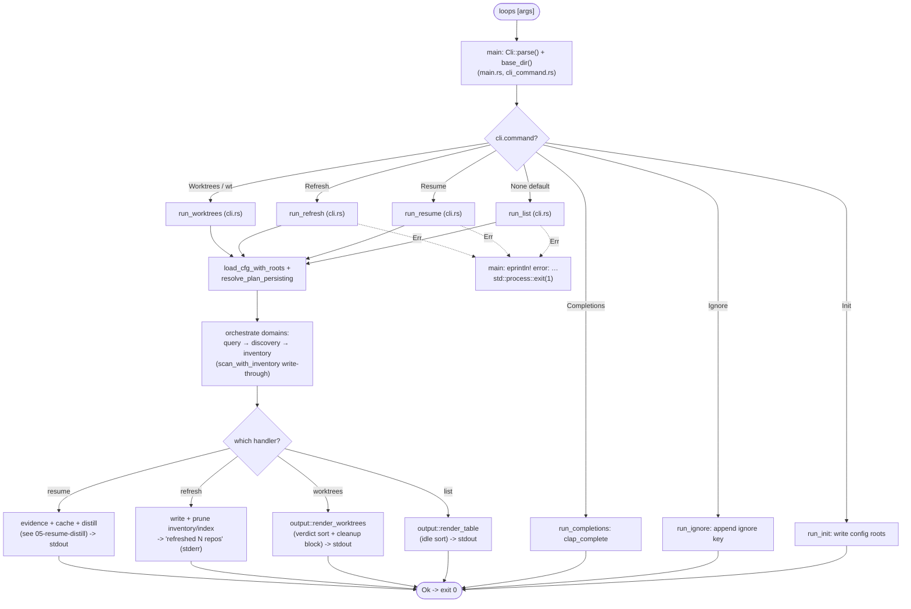

# 08 — CLI & output

> Architecture layer index: [`README.md`](README.md). Anchor doc with the shared
> vocabulary and end-to-end flow: [`00-overview.md`](00-overview.md). Read the
> overview first; this doc owns the eighth runtime domain — the CLI orchestration
> seam and the shared terminal render layer — and is the detailed home of how a
> `loops` invocation is dispatched and how its results are painted.

## Purpose

This domain is the outermost ring of the runtime: it turns a process invocation
into a result. It does two jobs. First, **orchestration** — parse the command
line, dispatch to exactly one handler per subcommand, and thread that handler
through the other seven domains in the right order (config → query → discovery →
inventory/evidence → cache/distill). Second, **rendering** — convert the typed
results those domains produce (`OpenLoop` inventory rows, `Worktree` cleanup
verdicts) into the plain-text tables a terminal prints.

The orchestration layer is deliberately *thin*. Every domain decision lives
below it — the query grammar in [03-query-engine](03-query-engine.md), the
ahead/behind memo in [04-inventory-evidence](04-inventory-evidence.md), the LLM
contract in [05-resume-distill](05-resume-distill.md). The CLI's only
responsibility is sequencing: load config, resolve the plan, scan, filter, then
either render or distill. Because it holds no business logic of its own, it is
covered end-to-end by [`tests/cli.rs`](../../tests/cli.rs:1) — a black-box suite
that drives the real `loops` binary against real git repositories in tempdirs,
with the LLM replaced by `cat`. This doc also owns [`src/output.rs`](../../src/output.rs:1),
the shared render layer that [04-inventory-evidence](04-inventory-evidence.md)
defers to for *how* a row is painted.

User-facing command syntax and flags are documented in
[docs/features.md](../features.md); this doc describes the *boundaries and
sequencing*, not the user manual.

## Domain map

| File | Responsibility |
|---|---|
| [`src/main.rs`](../../src/main.rs:5) | The binary entrypoint: `Cli::parse()`, base-dir resolution (`OPEN_LOOPS_HOME`), the `match` that dispatches each `Command` variant to its `run_*`, and the single error sink (`error: …`, exit 1). The only `pub fn` is `main`; everything else is library. |
| [`src/cli_command.rs`](../../src/cli_command.rs:5) | The clap command surface: the `Cli` parser and the `Command` subcommand enum. Declared once and shared by the runtime and `build.rs` (via `include!`) so the binary and the completion/man generation never drift. |
| [`src/cli.rs`](../../src/cli.rs:1) | The orchestration layer: one `run_*` function per subcommand plus the shared preamble (`load_cfg_with_roots`), the plan-resolution wrapper (`resolve_plan_persisting`), and the scan/write-through helper (`scan_with_inventory`). Holds no domain logic; it only sequences the other domains. |
| [`src/output.rs`](../../src/output.rs:1) | The shared render layer: the inventory table (`render_table`), the worktree cleanup table (`render_worktrees`), and the human-age/`fmt_count` formatters. Pure string-building — no I/O, no git, no config. |

The library crate (`open_loops`) exposes the `cli` module, which re-exports
`Cli`/`Command` ([`src/cli.rs:4`](../../src/cli.rs:4)) and every `run_*`. The
`main.rs` binary is a thin shell over that library, so the same orchestration is
reachable from integration tests without spawning a process where that is enough
(though [`tests/cli.rs`](../../tests/cli.rs:1) spawns the real binary on purpose).

Output streaming follows one rule, set here at the seam: progress lines and
warnings go to **stderr** (`progress`, [`src/cli.rs:31`](../../src/cli.rs:31));
the inventory table, the worktree table, the resume context, and completion
scripts go to **stdout**. This lets stdout be piped or captured without losing
data behind progress chatter.

## Concepts & vocabulary

These build on the canonical terms in [00-overview](00-overview.md#concepts--vocabulary).
This domain owns the dispatch and render vocabulary.

- **subcommand** — one variant of the `Command` enum
  ([`src/cli_command.rs:20`](../../src/cli_command.rs:20)). Each variant maps to
  exactly one `run_*` handler in the `main` dispatch
  ([`src/main.rs:8`](../../src/main.rs:8)). The full set is `Init`, `Resume`,
  `Ignore`, `Worktrees` (visible alias `wt`), `Completions`, and `Refresh`.
- **default path** — the no-subcommand invocation `loops [query]`. When
  `cli.command` is `None`, `main` calls `run_list`
  ([`src/main.rs:9`](../../src/main.rs:9)); the trailing arguments are joined into
  the query string. This is the most common invocation: the inventory listing.
- **`run_*` handler** — the per-subcommand orchestration function in `cli.rs`
  (`run_list`, `run_resume`, `run_init`, `run_ignore`, `run_refresh`,
  `run_worktrees`, `run_completions`). Each returns `anyhow::Result<()>`; `main`
  turns any `Err` into `error: …` on stderr and exit status 1.
- **shared preamble** — `load_cfg_with_roots` ([`src/cli.rs:38`](../../src/cli.rs:38)),
  the common prologue every scanning command runs first: load config and enforce
  the invariant that at least one root is registered, otherwise emit the guided
  "run `loops init`" error. Centralizing it keeps that guidance identical across
  entry points.
- **render layer** — the pure string-building functions in `output.rs`. They take
  already-computed domain values plus `now` and return a `String`; the caller
  prints it. No render function touches the filesystem, git, or config — which is
  why they are unit-tested in isolation inside `output.rs`.
- **idle sort** — the inventory's ordering rule: most idle first. `render_table`
  sorts ascending by `last_commit` ([`src/output.rs:36`](../../src/output.rs:36)),
  so the loop untouched longest floats to the top, because staleness is the
  attention criterion.
- **cleanup verdict** — the per-worktree disposition (`home`/`prunable`/`active`/
  `deletable`/`cold`) that `render_worktrees` both tabulates and uses to emit a
  copy-pasteable cleanup command block. The `Verdict` type itself
  ([`src/worktrees.rs:10`](../../src/worktrees.rs:10)) is owned by
  [01-discovery](01-discovery.md); this doc owns only its rendering.

## Main flow

A `loops` invocation flows through three stages owned here — parse, dispatch,
render — wrapping the domain work in between. `main` parses the arguments and
resolves the base directory, the `match` routes the `Command` variant (or the
`None` default) to its `run_*`, the handler orchestrates the domains, and the
result is either rendered by `output.rs` to stdout or, for resume, distilled.
Any `Err` bubbling back to `main` becomes `error: …` and exit 1.

In code, dispatch is a single `match cli.command` in `main`
([`src/main.rs:8`](../../src/main.rs:8)): `None → run_list`, and each `Some(Command::…)`
to its handler. The scanning handlers (`run_list`, `run_resume`, `run_refresh`,
`run_worktrees`) all open with `load_cfg_with_roots`
([`src/cli.rs:38`](../../src/cli.rs:38)) and, except `run_worktrees`, resolve the
query into a `ScanPlan` via `resolve_plan_persisting`
([`src/cli.rs:63`](../../src/cli.rs:63)) — the runtime wrapper that persists any
`@context` switch and delegates to `query::resolve_plan` (see
[03-query-engine](03-query-engine.md)). They then scan with inventory
write-through via `scan_with_inventory` ([`src/cli.rs:110`](../../src/cli.rs:110)),
filter loops with `ScanPlan::matches`, and finally either render
(`output::render_table`, [`src/output.rs:31`](../../src/output.rs:31)) or, for
resume, gather evidence and distill (`run_resume`,
[`src/cli.rs:292`](../../src/cli.rs:292), threading
`build_prompt`/`run_llm`/`with_sources`, [`src/distill.rs:64`](../../src/distill.rs:64),
[`src/distill.rs:106`](../../src/distill.rs:106),
[`src/distill.rs:149`](../../src/distill.rs:149)). The non-scanning handlers are
self-contained: `run_init` writes config roots, `run_ignore` appends an ignore
key, and `run_completions` streams a clap-generated completion script with no
config load at all.

## Interfaces & contracts

**The command surface — `Cli` / `Command`** ([`src/cli_command.rs:8`](../../src/cli_command.rs:8),
[`src/cli_command.rs:20`](../../src/cli_command.rs:20)). The `Cli` parser carries
the optional subcommand, a `trailing_var_arg` query vector, and the global
`--fresh` flag; `args_conflicts_with_subcommands` means the bare query and a
subcommand are mutually exclusive. Each subcommand maps to one handler:

| Subcommand | Handler | What it does | Side stores touched |
|---|---|---|---|
| `loops [query]` (default, `None`) | `run_list` ([`src/cli.rs:224`](../../src/cli.rs:224)) | Scan + filter + render the inventory table. Forces `need_ahead_behind = true` so the table always has AHEAD/BEHIND. | reads config/state, reads+writes index & inventory memo |
| `loops init <dir>...` | `run_init` ([`src/cli.rs:264`](../../src/cli.rs:264)) | Register repository roots in config; prints the resolved roots and config path. | writes config roots |
| `loops resume <query> [--dry-run] [--fresh]` | `run_resume` ([`src/cli.rs:292`](../../src/cli.rs:292)) | Resolve the single matching loop, then either print the evidence snapshot (`--dry-run`) or serve/produce the distilled resume context. | also reads+writes the distillation cache |
| `loops ignore <repo/branch>` | `run_ignore` ([`src/cli.rs:278`](../../src/cli.rs:278)) | Append a `repo/branch` key to the ignore list (rejects keys without a `/`). | writes the ignore list |
| `loops worktrees` (alias `wt`) | `run_worktrees` ([`src/cli.rs:418`](../../src/cli.rs:418)) | Scan worktrees and render the cleanup table + command block. | reads config |
| `loops completions <shell>` | `run_completions` ([`src/cli.rs:411`](../../src/cli.rs:411)) | Stream a shell-completion script to stdout. | none |
| `loops refresh [query]` | `run_refresh` ([`src/cli.rs:336`](../../src/cli.rs:336)) | Force-recompute ahead/behind for matching repos, write through, and prune orphan inventory files + index rows. | recomputes & prunes index + inventory |

`Resume`'s `query` is a single `String`, not a `trailing_var_arg Vec` like the
list/refresh path: `Resume` takes option flags (`--dry-run`/`--fresh`) after the
positional, and a trailing var-arg would swallow those flags into the query
([`src/cli_command.rs:25`](../../src/cli_command.rs:25)). `Worktrees` carries a
`visible_alias = "wt"` ([`src/cli_command.rs:39`](../../src/cli_command.rs:39)).

**The render layer — `output.rs`.** Three pure functions, each taking domain
values plus `now` and returning a `String`:

| Function | Input | Output contract |
|---|---|---|
| `render_table` ([`src/output.rs:31`](../../src/output.rs:31)) | `&[OpenLoop]`, `now` | The `LOOP / IDLE / AHEAD / BEHIND` table, sorted most-idle-first; column width auto-sized to the longest key. Empty input → a celebratory `"No open loops…"` line, never a blank table. |
| `render_worktrees` ([`src/output.rs:75`](../../src/output.rs:75)) | `&[Worktree]`, `now` | The `WORKTREE / BRANCH / IDLE / MERGED / STATE / VERDICT` table, sorted deletable/prunable first then oldest-idle, followed by an ASCII cleanup-command block (or "nothing to clean up"). |
| `human_age` ([`src/output.rs:13`](../../src/output.rs:13)) | `now`, `then` | Compact age string: `<60min → "{N}min"`, `<48h → "{N}h"`, else `"{N}d"`. |
| `fmt_count` ([`src/output.rs:24`](../../src/output.rs:24)) | `Option<u32>` | The count, or `-` for `None` (the heavy phase was skipped). |

The full base-directory contract lives in `main`: `OPEN_LOOPS_HOME` overrides the
default `~/.open-loops` for tests and non-standard installs (`base_dir`,
[`src/main.rs:28`](../../src/main.rs:28)); the resolved base is passed into every
`run_*` so that nothing is ever written inside a user's repositories. On any
handler `Err`, `main` prints `error: {e:#}` to stderr and exits 1
([`src/main.rs:21`](../../src/main.rs:21)).

## Invariants & edge cases

- **The CLI layer holds no domain logic; it only sequences.** Every rule it
  enforces (the query grammar, the ahead/behind memo, the LLM contract) is owned
  by a domain below it. This is why `cli.rs` is verified end-to-end by
  [`tests/cli.rs`](../../tests/cli.rs:1) rather than by unit tests of its own — the
  test that matters is "does the whole pipeline produce the right text?".
- **Exactly one handler per invocation.** `main` dispatches a single `Command`
  variant (or the `None` default); `args_conflicts_with_subcommands`
  ([`src/cli_command.rs:7`](../../src/cli_command.rs:7)) forbids mixing a bare
  query with a subcommand, so there is never ambiguity about which `run_*` runs.
- **Progress on stderr, results on stdout.** Progress and warnings use `eprintln!`
  (via `progress`, [`src/cli.rs:31`](../../src/cli.rs:31)); the rendered table /
  resume context / completion script use `print!`/`println!`. `loops` output can
  be piped without progress chatter contaminating it.
- **Errors are actionable strings, surfaced uniformly.** Every `run_*` returns
  `anyhow::Result<()>`; `main` is the single sink that formats the error and sets
  exit status 1 ([`src/main.rs:21`](../../src/main.rs:21)). Messages are in
  English and tell the user what to do (e.g. "no roots configured. Run: loops init
  <dir-with-your-repos>", [`src/cli.rs:43`](../../src/cli.rs:43)).
- **No-roots is a guided error on every scanning command.** `load_cfg_with_roots`
  ([`src/cli.rs:38`](../../src/cli.rs:38)) is the shared preamble that fails closed
  with the `loops init` guidance when no root is registered, so all scanning
  entry points behave identically.
- **An empty list renders a celebration, not a void.** `render_table` returns
  `"No open loops. All finished or ignored.\n"` for an empty slice
  ([`src/output.rs:32`](../../src/output.rs:32)); a query that matches nothing also
  prints a stderr hint to run bare `loops` ([`src/cli.rs:254`](../../src/cli.rs:254)).
- **Render output is ASCII and width-stable.** Both tables auto-size columns to
  the longest entry and the worktree command block is ASCII-only (asserted by
  `render_worktrees_*` tests), so the output stays terminal-safe and diffable.
- **`run_completions` needs no config.** It is the one scanning-adjacent command
  that skips `load_cfg_with_roots` entirely — it builds the clap command and
  streams the script, so completions work before `loops init`
  ([`src/cli.rs:411`](../../src/cli.rs:411)).
- **`run_refresh` reports on stderr and prunes globally.** It prints
  `refreshed N repos` to stderr (not stdout) and runs orphan pruning of both the
  inventory and the index regardless of the query scope, because a repo gone from
  disk is an orphan no matter what triggered the refresh
  ([`src/cli.rs:391`](../../src/cli.rs:391); see
  [04-inventory-evidence](04-inventory-evidence.md) and
  [06-cache-index](06-cache-index.md)).

## Decisions

This domain has **no dedicated ADR**. The orchestration-plus-render structure
documented above is the implemented shape, and it rests on two cross-cutting
decisions from the architecture, applied here at the outermost seam.

**Thin orchestration over a library core.** The binary (`main.rs`) is a shell:
parse, dispatch, sink errors. All sequencing logic lives in the `cli` module of
the `open_loops` *library*, so the orchestration is reachable from tests and the
command surface (`Cli`/`Command`) can be shared with `build.rs` for completion
and man-page generation. The deliberate consequence is that `cli.rs` carries no
business rules of its own — each `run_*` is a script that calls into the domains
— which is exactly why the project verifies it with the black-box
[`tests/cli.rs`](../../tests/cli.rs:1) suite (real binary, real git repos, LLM
stubbed by `cat`) rather than unit tests. The render layer is split out into a
separate, pure `output.rs` for the same testability reason: it can be unit-tested
on hand-built `OpenLoop`/`Worktree` values with no I/O.

**Git and the LLM via shell-out; everything keyed off a single base dir**
*(cross-cutting, ex-ADR-0002)*. The CLI is where the two shell-out integrations
surface: `run_worktrees`/`run_list` drive git through the scanner, and
`run_resume` drives the LLM through the configurable `llm_command` (default
`claude -p`), which is what lets [`tests/cli.rs`](../../tests/cli.rs:1) substitute
`cat`. The base directory resolved in `main` (`OPEN_LOOPS_HOME` or
`~/.open-loops`, [`src/main.rs:28`](../../src/main.rs:28)) is threaded into every
handler, which is the mechanism that enforces the system-wide invariant that
nothing is written inside the user's repositories (see
[00-overview](00-overview.md#decisions) and [07-config-state](07-config-state.md)).
The full user-facing command and flag reference is in
[docs/features.md](../features.md); it is intentionally not duplicated here.

## Extension & limitations

- **New subcommands are local changes.** Adding a command is: one `Command`
  variant in [`src/cli_command.rs`](../../src/cli_command.rs:20), one `match` arm
  in [`src/main.rs`](../../src/main.rs:8), and one `run_*` in `cli.rs` that reuses
  the shared preamble and render layer. Because the command surface is a single
  declaration shared with `build.rs`, completions and man pages pick up the new
  command automatically.
- **The render layer is plain text by design.** `output.rs` emits fixed-width
  ASCII tables — no color, no TTY detection, no machine-readable format. A
  `--json`/`:report` output mode is reserved query/feature surface (see
  [03-query-engine](03-query-engine.md), where `:report` is rejected today) and
  would slot in as an alternative renderer alongside `render_table`, not as a
  change to the orchestration.
- **`run_worktrees` does not resolve a `ScanPlan`.** Unlike the other scanning
  commands it scans all configured roots directly
  ([`src/cli.rs:421`](../../src/cli.rs:421)); the worktree domain shares only the
  filter *layer* conceptually, and wiring query filters into `loops worktrees` is
  future work (see [03-query-engine](03-query-engine.md#extension--limitations)).
- **Library-maturity work stream (planned, not built).** Typed errors (replacing
  the uniform `anyhow` string sink in `main`) and a stable public library API are
  part of the drafted, not-yet-implemented work stream tracked in
  [00-overview](00-overview.md#extension--limitations); today the CLI is the only
  supported public surface.

## References

Code (verified against the current tree):

- [`src/main.rs:5`](../../src/main.rs:5) — `main` (parse + dispatch);
  [`src/main.rs:8`](../../src/main.rs:8) — the `match cli.command` dispatch table;
  [`src/main.rs:21`](../../src/main.rs:21) — the `error: …` sink + exit 1;
  [`src/main.rs:28`](../../src/main.rs:28) — `base_dir` (`OPEN_LOOPS_HOME`).
- [`src/cli_command.rs:8`](../../src/cli_command.rs:8) — `Cli` (parser, global
  `--fresh`, trailing query);
  [`src/cli_command.rs:20`](../../src/cli_command.rs:20) — the `Command` enum
  (`Init`/`Resume`/`Ignore`/`Worktrees`/`Completions`/`Refresh`);
  [`src/cli_command.rs:39`](../../src/cli_command.rs:39) — `Worktrees` visible
  alias `wt`.
- [`src/cli.rs:38`](../../src/cli.rs:38) — `load_cfg_with_roots` (shared preamble);
  [`src/cli.rs:63`](../../src/cli.rs:63) — `resolve_plan_persisting` (plan + context
  persistence);
  [`src/cli.rs:110`](../../src/cli.rs:110) — `scan_with_inventory` (scan with
  write-through);
  [`src/cli.rs:224`](../../src/cli.rs:224) — `run_list` (default path);
  [`src/cli.rs:264`](../../src/cli.rs:264) — `run_init`;
  [`src/cli.rs:278`](../../src/cli.rs:278) — `run_ignore`;
  [`src/cli.rs:292`](../../src/cli.rs:292) — `run_resume`;
  [`src/cli.rs:336`](../../src/cli.rs:336) — `run_refresh`;
  [`src/cli.rs:411`](../../src/cli.rs:411) — `run_completions`;
  [`src/cli.rs:418`](../../src/cli.rs:418) — `run_worktrees`;
  [`src/cli.rs:31`](../../src/cli.rs:31) — `progress` (stderr).
- [`src/output.rs:13`](../../src/output.rs:13) — `human_age`;
  [`src/output.rs:24`](../../src/output.rs:24) — `fmt_count` (`-` for `None`);
  [`src/output.rs:31`](../../src/output.rs:31) — `render_table` (inventory table);
  [`src/output.rs:36`](../../src/output.rs:36) — the idle sort key
  (`sort_by_key(last_commit)`);
  [`src/output.rs:75`](../../src/output.rs:75) — `render_worktrees` (cleanup table
  + command block).
- [`src/worktrees.rs:10`](../../src/worktrees.rs:10) — `Verdict` (rendered here,
  owned by [01-discovery](01-discovery.md));
  [`src/worktrees.rs:24`](../../src/worktrees.rs:24) — `Verdict::label`;
  [`src/worktrees.rs:150`](../../src/worktrees.rs:150) — `scan_worktrees`.
- [`src/distill.rs:64`](../../src/distill.rs:64) — `build_prompt`;
  [`src/distill.rs:106`](../../src/distill.rs:106) — `run_llm`;
  [`src/distill.rs:149`](../../src/distill.rs:149) — `with_sources`;
  [`src/distill.rs:198`](../../src/distill.rs:198) — `format_dry_run` (threaded by
  `run_resume`; owned by [05-resume-distill](05-resume-distill.md)).

Tests worth reading (in [`tests/cli.rs`](../../tests/cli.rs:1), the black-box
suite for this layer): `full_flow_init_list_resume_cache_ignore` (the end-to-end
happy path), `list_and_resume_without_roots_guides_user` (the no-roots preamble),
`ignore_key_without_slash_rejects_with_helpful_message`,
`resume_ambiguous_query_lists_candidates`, `list_prints_warnings_for_broken_repos`
(stderr vs stdout), `completions_generates_script_for_shell`, and
`worktrees_lists_and_suggests_cleanup`. The render functions also have unit tests
inside [`src/output.rs`](../../src/output.rs:150) (`render_table_sorts_most_idle_first`,
`render_table_empty_celebrates`, `render_worktrees_sorts_deletable_first_and_shows_command`).

Sibling architecture docs: [00-overview](00-overview.md) (the end-to-end flow this
layer wraps) · [03-query-engine](03-query-engine.md) (`resolve_plan_persisting`
delegates here) · [04-inventory-evidence](04-inventory-evidence.md) (produces the
`OpenLoop` rows; defers to `output.rs` for rendering) ·
[05-resume-distill](05-resume-distill.md) (`run_resume` threads its prompt/LLM
contract) · [06-cache-index](06-cache-index.md) (the index/cache `run_refresh`
prunes) · [07-config-state](07-config-state.md) (the config/state the preamble
loads).

User-facing docs (linked, not duplicated): [features](../features.md) (every
subcommand and flag) · [configuration](../configuration.md) (`llm_command`, the
state directory, `OPEN_LOOPS_HOME`).
