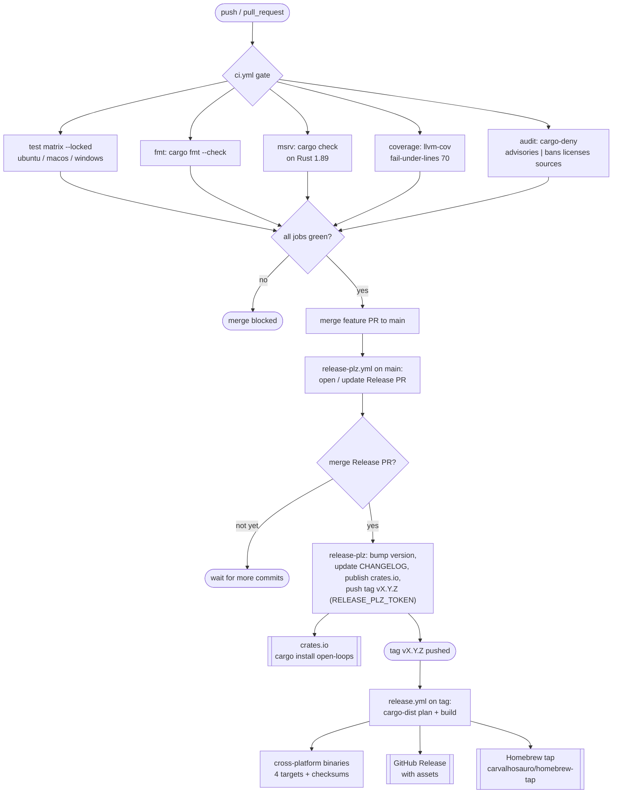

# 09 — Build / CI / Release

> Architecture layer index: [`README.md`](README.md). Anchor doc:
> [00-overview.md](00-overview.md). This is the only non-runtime domain doc: it
> covers how the `loops` binary is verified, built, and shipped, not how it runs.

## Purpose

Every runtime domain (docs 01–08) answers "what does the code do?". This domain
answers a different question: **how do we know the code is correct on every
supported platform, and how does a green `main` become an installable release?**

It owns two pipelines. The **CI pipeline** ([`.github/workflows/ci.yml`](../../.github/workflows/ci.yml:1))
gates every push and pull request: format, cross-OS test, a dedicated minimum
supported Rust version (MSRV) check, coverage, and supply-chain audit. The
**release pipeline** turns merged work into published artifacts in two stages —
[`release-plz`](../../.github/workflows/release-plz.yml:1) owns version, changelog,
the crates.io publish and the git tag; [`cargo-dist`](../../.github/workflows/release.yml:1)
owns binaries, the Homebrew formula, and the GitHub Release. The two are linked
by a single tag push.

This doc is the source of truth for *how the pipelines are wired*. It does not
duplicate the user-facing setup steps: for the one-time secret checklist and the
operator's release flow, see [`docs/distribution.md`](../distribution.md) and the
`## Release` section of [`CLAUDE.md`](../../CLAUDE.md). It documents what the
workflows **actually do** today (read from the YAML), flagging where an absorbed
spec or ADR diverges from the live files.

## Domain map

The build/CI/release domain is configuration, not Rust source. Its files live at
the repository root and under `.github/`:

| Concern | File | Role |
|---|---|---|
| CI gate | [`.github/workflows/ci.yml`](../../.github/workflows/ci.yml:1) | `fmt`, `test` (matrix), `msrv`, `coverage`, `audit` |
| Release stage 1 | [`.github/workflows/release-plz.yml`](../../.github/workflows/release-plz.yml:1) | version bump, changelog, crates.io publish, tag |
| Release stage 2 | [`.github/workflows/release.yml`](../../.github/workflows/release.yml:1) | cargo-dist: binaries, Homebrew, GitHub Release |
| MSRV pin | [`rust-toolchain.toml`](../../rust-toolchain.toml:2) | `channel = "1.89"` (local + CI selection) |
| Crate manifest | [`Cargo.toml`](../../Cargo.toml:1) | `rust-version`, license, dist/release profiles |
| Release config | [`release-plz.toml`](../../release-plz.toml:1) | publish flags, tag name, inline changelog template |
| Dist config | [`dist-workspace.toml`](../../dist-workspace.toml:1) | targets, installers, tap, bundled artifacts |
| Supply-chain policy | [`deny.toml`](../../deny.toml:1) | advisories, licenses, bans, sources |
| Dependency updates | [`.github/dependabot.yml`](../../.github/dependabot.yml:1) | weekly cargo + github-actions PRs |
| Artifact generation | [`build.rs`](../../build.rs:1) | completions + man page into the archive |
| Dev shortcuts | [`justfile`](../../justfile:1) | local mirror of the CI gate |

The two ADRs that justify these files are absorbed in *Decisions* below:
ex-ADR-0006 (cross-OS + MSRV matrix) and ex-ADR-0007 (release-plz / cargo-dist
split).

## Concepts & vocabulary

These terms are canonical for this domain.

- **CI gate** — the set of jobs in `ci.yml` that must pass before merge. A push
  to `main` or any pull request triggers it
  ([`.github/workflows/ci.yml:2`](../../.github/workflows/ci.yml:2)).
- **test matrix** — the `test` job fanned out across
  `[ubuntu-latest, macos-latest, windows-latest]` with `fail-fast: false`, so one
  failing OS does not cancel the others
  ([`.github/workflows/ci.yml:30`](../../.github/workflows/ci.yml:30)). `loops`
  shells out to git and walks the filesystem, so path separators, CRLF, and git
  behavior diverge per OS — the matrix is what makes those divergences visible.
- **MSRV (minimum supported Rust version)** — `1.89`, pinned in three places that
  must agree: [`rust-toolchain.toml:2`](../../rust-toolchain.toml:2) (local +
  CI toolchain selection), [`Cargo.toml:5`](../../Cargo.toml:5)
  (`rust-version`), and the dedicated `msrv` job that *verifies* it
  ([`.github/workflows/ci.yml:45`](../../.github/workflows/ci.yml:45)). A pin
  without a verifying job is a false promise.
- **two-stage release** — release-plz (stage 1) and cargo-dist (stage 2) are
  separate workflows linked by a tag. Stage 1 publishes the crate and pushes the
  tag; the tag triggers stage 2.
- **tag handoff** — the act of release-plz pushing `vX.Y.Z` with a fine-grained
  PAT (`RELEASE_PLZ_TOKEN`) rather than the default `GITHUB_TOKEN`. This is the
  single most fragile link in the pipeline (see *Invariants & edge cases*).
- **delivery channels** — the two ways a user installs `loops`: **crates.io**
  (`cargo install open-loops`, fed by stage 1) and the **Homebrew tap**
  `carvalhosauro/homebrew-tap` (`brew install carvalhosauro/tap/open-loops`, fed
  by stage 2).
- **`--locked`** — every compiling CI job runs against the committed `Cargo.lock`,
  so CI tests exactly what publish and users receive
  ([`.github/workflows/ci.yml:42`](../../.github/workflows/ci.yml:42)).

## Main flow

A change moves through two phases. **Verification** happens on every push/PR.
**Release** happens only when the release-plz Release PR is merged to `main`.

In the YAML: `ci.yml` declares the five jobs (`fmt`, `test`, `msrv`, `coverage`,
`audit`) at [`.github/workflows/ci.yml:18`](../../.github/workflows/ci.yml:18).
Stage 1 is a single `release-plz` job
([`.github/workflows/release-plz.yml:12`](../../.github/workflows/release-plz.yml:12));
the tag it pushes matches the trigger of stage 2
([`.github/workflows/release.yml:43`](../../.github/workflows/release.yml:43)).
Stage 2 is the cargo-dist-generated pipeline: `plan` →
`build-local-artifacts` → `build-global-artifacts` → `host` (creates the GitHub
Release at [`.github/workflows/release.yml:269`](../../.github/workflows/release.yml:269))
→ `publish-homebrew-formula`
([`.github/workflows/release.yml:281`](../../.github/workflows/release.yml:281))
→ `announce`.

## Interfaces & contracts

The "interfaces" of this domain are workflow triggers, jobs, secrets, and the
delivery channels — the contract between a commit and a shipped binary.

### CI jobs (`ci.yml`)

Triggered by `push: [main]` and `pull_request`
([`.github/workflows/ci.yml:2`](../../.github/workflows/ci.yml:2)); a workflow-level
`concurrency` group with `cancel-in-progress: true` kills stale PR runs
([`.github/workflows/ci.yml:7`](../../.github/workflows/ci.yml:7)); a global
`env` block sets `RUSTFLAGS: "-D warnings"` and retry/backtrace knobs
([`.github/workflows/ci.yml:11`](../../.github/workflows/ci.yml:11)).

| Job | Runner(s) | Command | Blocking? |
|---|---|---|---|
| `fmt` | ubuntu | `cargo fmt --check` ([`ci.yml:27`](../../.github/workflows/ci.yml:27)) | yes |
| `test` | ubuntu, macos, windows | `cargo clippy --all-targets --locked` + `cargo test --locked` ([`ci.yml:42`](../../.github/workflows/ci.yml:42)) | yes |
| `msrv` | ubuntu (Rust 1.89) | `cargo check --locked --all-targets` ([`ci.yml:53`](../../.github/workflows/ci.yml:53)) | yes |
| `coverage` | ubuntu | `cargo llvm-cov --locked --fail-under-lines 70` ([`ci.yml:64`](../../.github/workflows/ci.yml:64)) | yes |
| `audit` | ubuntu (matrix) | `cargo-deny check {advisories \| bans licenses sources}` ([`ci.yml:78`](../../.github/workflows/ci.yml:78)) | advisories non-blocking; the rest blocking |

The `audit` job runs as a split matrix; only `advisories` carries
`continue-on-error` so a newly published RUSTSEC advisory reports without
blocking an unrelated PR, while license/ban/source policy stays mandatory
([`.github/workflows/ci.yml:72`](../../.github/workflows/ci.yml:72)). The policy
itself lives in [`deny.toml`](../../deny.toml:1).

### Release workflows and secrets

| Workflow | Trigger | Owns | Secrets used |
|---|---|---|---|
| `release-plz.yml` | `push: [main]` ([`release-plz.yml:2`](../../.github/workflows/release-plz.yml:2)) | version bump, `CHANGELOG.md`, crates.io publish, tag `vX.Y.Z` | `RELEASE_PLZ_TOKEN`, `CARGO_REGISTRY_TOKEN` ([`release-plz.yml:25`](../../.github/workflows/release-plz.yml:25)) |
| `release.yml` | `push: tags '**[0-9]+.[0-9]+.[0-9]+*'` ([`release.yml:43`](../../.github/workflows/release.yml:43)) | binaries (4 targets), GitHub Release, Homebrew formula | `GITHUB_TOKEN`, `HOMEBREW_TAP_TOKEN` ([`release.yml:296`](../../.github/workflows/release.yml:296)) |

Required repository secrets (one-time setup is in
[`docs/distribution.md`](../distribution.md)):

- **`RELEASE_PLZ_TOKEN`** — fine-grained PAT (Contents + Pull requests: write).
  Used as `GITHUB_TOKEN` for the release-plz action so the pushed tag *does*
  trigger `release.yml`. See *Invariants & edge cases*.
- **`CARGO_REGISTRY_TOKEN`** — crates.io publish token.
- **`HOMEBREW_TAP_TOKEN`** — write access to `carvalhosauro/homebrew-tap`.

### Delivery channels

- **crates.io** — `cargo install open-loops`, published by stage 1. The crate is
  dual-licensed `MIT OR Apache-2.0` ([`Cargo.toml:7`](../../Cargo.toml:7)) and
  ships an optimized profile (`lto = "thin"`, `strip = true`,
  [`Cargo.toml:45`](../../Cargo.toml:45)) so a source install matches the dist
  build.
- **Homebrew** — `brew install carvalhosauro/tap/open-loops`, populated by stage
  2 into the tap `carvalhosauro/homebrew-tap`
  ([`dist-workspace.toml:15`](../../dist-workspace.toml:15)).

### Shipped targets

cargo-dist builds four targets ([`dist-workspace.toml:20`](../../dist-workspace.toml:20)):
`aarch64-apple-darwin`, `x86_64-apple-darwin`, `x86_64-unknown-linux-gnu`,
`x86_64-pc-windows-msvc`. The same four are the `deny.toml` graph targets
([`deny.toml:2`](../../deny.toml:2)) — the license/advisory check evaluates the
dependency tree exactly for what ships.

## Invariants & edge cases

- **The tag handoff requires the PAT, not `GITHUB_TOKEN`.** A tag pushed with the
  workflow's default `GITHUB_TOKEN` does **not** trigger other workflows (GitHub's
  anti-recursion rule), so `release.yml` would never run and no binary would ship
  — silently. release-plz is therefore configured to push the tag with
  `RELEASE_PLZ_TOKEN`
  ([`.github/workflows/release-plz.yml:25`](../../.github/workflows/release-plz.yml:25)).
  This is the single point of failure; the first end-to-end patch release is what
  validates it.
- **MSRV is pinned in three places and they must agree.** `rust-toolchain.toml`
  (`1.89`), `Cargo.toml` `rust-version` (`1.89`), and the `msrv` job's toolchain
  (`1.89`) are independent declarations; the `msrv` job is what fails CI if the
  crate stops compiling on 1.89. The job runs `cargo check`, not `cargo test`:
  dev-dependencies may require newer Rust, but the contract is that *the crate*
  builds on 1.89 ([`.github/workflows/ci.yml:53`](../../.github/workflows/ci.yml:53)).
- **mac-intel is shipped but not tested.** The matrix tests macOS on arm64
  (`macos-latest`), covering `aarch64-apple-darwin`; `x86_64-apple-darwin` is
  built and shipped by cargo-dist but has no CI coverage — an accepted trade-off
  (same codebase as mac-arm, arch rarely diverges for git/path shell-out). See
  *Decisions* (ex-ADR-0006).
- **`release.yml` is generated, never hand-edited.** It is produced by
  `dist generate` ([`.github/workflows/release.yml:1`](../../.github/workflows/release.yml:1)
  banner). All packaging changes go through `dist-workspace.toml` / `Cargo.toml`
  / `build.rs`. The one deliberate exception is the tap-bootstrap step in
  `publish-homebrew-formula`, which initializes an empty tap on the first release;
  `allow-dirty = ["ci"]` in [`dist-workspace.toml:19`](../../dist-workspace.toml:19)
  keeps `dist plan` accepting that checked-in customization.
- **`release.yml` also runs on `pull_request`** in a dry, non-publishing mode
  ([`.github/workflows/release.yml:42`](../../.github/workflows/release.yml:42)):
  it plans/builds but `publishing` is false, so nothing is uploaded. Only a tag
  push publishes.
- **Advisories never block; license/ban/source always do.** A fresh RUSTSEC
  advisory must not red-light an unrelated PR, but a forbidden license or an
  unknown source must ([`.github/workflows/ci.yml:72`](../../.github/workflows/ci.yml:72)).
- **`build.rs` only writes `dist-artifacts/` inside a git checkout.** It guards on
  `.git` being present ([`build.rs:24`](../../build.rs:24)), so generating the
  completions/man page never pollutes a `cargo install` from crates.io — it only
  populates the directory cargo-dist bundles during a release build.

## Decisions

Two cross-cutting decisions define this domain, absorbed from the original ADRs.

**Cross-OS test matrix + verified MSRV** *(ex-ADR-0006)*. `loops` shells out to
git and walks the filesystem, behavior that diverges across operating systems, so
CI tests on `ubuntu-latest`, `macos-latest` (arm64), and `windows-latest` with
`fail-fast: false`. MSRV `1.89` is treated as a real contract enforced by a
dedicated `msrv` job running `cargo check --locked` on 1.89, not merely a pin in
`rust-toolchain.toml`. Every compiling job uses `--locked` so CI matches what
publish and users receive. Supply-chain is covered by `cargo-deny` (advisories
non-blocking, licenses/bans/sources blocking), GitHub Actions are SHA-pinned, and
`concurrency` cancels stale PR runs. The accepted trade-off is that
`x86_64-apple-darwin` (mac-intel) is shipped without CI coverage — the arch
rarely diverges from mac-arm for this kind of shell-out CLI, and adding a fourth
matrix leg was judged not worth the runner cost.

**release-plz / cargo-dist split** *(ex-ADR-0007)*. A fully manual release (edit
version, run `just changelog`, push a tag, run a separate publish workflow) is
error-prone. The pipeline is split by ownership instead: **release-plz** owns the
version bump, `CHANGELOG.md`, the crates.io publish, and the `v{{ version }}` git
tag ([`release-plz.toml:4`](../../release-plz.toml:4)), with
`git_release_enable = false` ([`release-plz.toml:3`](../../release-plz.toml:3)) so
it does *not* create a duplicate GitHub Release. **cargo-dist** remains the sole
owner of cross-platform binaries, the GitHub Release, and the Homebrew formula.
The two compose rather than compete: cargo-dist does not publish to crates.io, and
release-plz does not build binaries. The former `publish-crate.yml` workflow was
removed (subsumed by release-plz), and `just changelog` (git-cliff) is now a
**local preview only** — the release changelog is produced by release-plz on
Release-PR merge ([`justfile:23`](../../justfile:23)).

**Live divergence from the absorbed ADR/spec (changelog source).** Ex-ADR-0007
and its spec state that release-plz "reuses the existing `cliff.toml`
automatically". The live configuration does **not** rely on that: this version of
release-plz no longer reads `cliff.toml` (its `changelog_config` path is
deprecated), so the changelog template is duplicated inline under a `[changelog]`
table in [`release-plz.toml:10`](../../release-plz.toml:10), with a comment
requiring the two files be kept in sync ([`cliff.toml:2`](../../cliff.toml:2)).
`cliff.toml` survives only for the local `just changelog` preview. The documented
intent (one changelog template, Conventional Commits grouping) is unchanged; the
mechanism differs from the ADR text, and the live files are authoritative.

## Extension & limitations

- **Archive vs. installer gap.** `build.rs` puts shell completions (bash, zsh,
  fish, PowerShell) and the `loops.1` man page into `dist-artifacts/`
  ([`build.rs:11`](../../build.rs:11)), bundled into the release tarball via
  `include` ([`dist-workspace.toml:7`](../../dist-workspace.toml:7)). cargo-dist
  `0.32.0` ([`dist-workspace.toml:11`](../../dist-workspace.toml:11)) does not yet
  wire those files into the Homebrew formula or the shell-installer paths
  (upstream limitation): archive users copy them manually, and `loops completions`
  remains the local generation path. See ex-ADR-0007 consequences.
- **Prereleases are out of the default flow.** Versions with a suffix after the
  patch (e.g. `1.1.0-rc.1`) are outside the default release-plz flow and are
  handled manually if needed (see [`docs/distribution.md`](../distribution.md)).
- **No publish via OIDC (yet).** crates.io publish uses a token
  (`CARGO_REGISTRY_TOKEN`); migrating to OIDC trusted publishing to drop the
  long-lived token was explicitly deferred in the CI-hardening spec.
- **Dependency hygiene is automated, merges are not.** Dependabot opens weekly
  grouped PRs for `cargo` and `github-actions`
  ([`.github/dependabot.yml:3`](../../.github/dependabot.yml:3)), which keep the
  SHA pins and crate versions current; a human still reviews and merges them.

## References

Workflows and config (verified against the current tree):

- [`.github/workflows/ci.yml:2`](../../.github/workflows/ci.yml:2) — triggers;
  [`ci.yml:7`](../../.github/workflows/ci.yml:7) — concurrency;
  [`ci.yml:11`](../../.github/workflows/ci.yml:11) — global `env`;
  [`ci.yml:19`](../../.github/workflows/ci.yml:19) — `fmt`;
  [`ci.yml:29`](../../.github/workflows/ci.yml:29) — `test` matrix
  ([`ci.yml:33`](../../.github/workflows/ci.yml:33) — OS list);
  [`ci.yml:45`](../../.github/workflows/ci.yml:45) — `msrv` job
  ([`ci.yml:53`](../../.github/workflows/ci.yml:53) — `cargo check`);
  [`ci.yml:55`](../../.github/workflows/ci.yml:55) — `coverage`;
  [`ci.yml:66`](../../.github/workflows/ci.yml:66) — `audit` matrix
  ([`ci.yml:72`](../../.github/workflows/ci.yml:72) — `continue-on-error`).
- [`.github/workflows/release-plz.yml:2`](../../.github/workflows/release-plz.yml:2)
  — trigger; [`release-plz.yml:8`](../../.github/workflows/release-plz.yml:8) —
  concurrency (`cancel-in-progress: false`);
  [`release-plz.yml:23`](../../.github/workflows/release-plz.yml:23) — action;
  [`release-plz.yml:25`](../../.github/workflows/release-plz.yml:25) — tokens.
- [`.github/workflows/release.yml:43`](../../.github/workflows/release.yml:43) —
  tag trigger; [`release.yml:49`](../../.github/workflows/release.yml:49) —
  `plan`; [`release.yml:269`](../../.github/workflows/release.yml:269) — GitHub
  Release; [`release.yml:281`](../../.github/workflows/release.yml:281) —
  `publish-homebrew-formula` ([`release.yml:296`](../../.github/workflows/release.yml:296)
  — `HOMEBREW_TAP_TOKEN`).
- [`rust-toolchain.toml:2`](../../rust-toolchain.toml:2) — MSRV channel `1.89`.
- [`Cargo.toml:5`](../../Cargo.toml:5) — `rust-version`;
  [`Cargo.toml:7`](../../Cargo.toml:7) — dual license;
  [`Cargo.toml:45`](../../Cargo.toml:45) — `[profile.release]`;
  [`Cargo.toml:50`](../../Cargo.toml:50) — `[profile.dist]`.
- [`release-plz.toml:2`](../../release-plz.toml:2) — publish flags;
  [`release-plz.toml:10`](../../release-plz.toml:10) — inline `[changelog]`.
- [`dist-workspace.toml:7`](../../dist-workspace.toml:7) — bundled artifacts;
  [`dist-workspace.toml:13`](../../dist-workspace.toml:13) — installers/tap;
  [`dist-workspace.toml:20`](../../dist-workspace.toml:20) — targets.
- [`deny.toml:2`](../../deny.toml:2) — graph targets;
  [`deny.toml:15`](../../deny.toml:15) — license allow-list.
- [`.github/dependabot.yml:1`](../../.github/dependabot.yml:1) — update config.
- [`build.rs:11`](../../build.rs:11) — completions/man generation;
  [`build.rs:24`](../../build.rs:24) — git-checkout guard.
- [`justfile:19`](../../justfile:19) — `cov`;
  [`justfile:24`](../../justfile:24) — `changelog` (local preview).
- [`cliff.toml:2`](../../cliff.toml:2) — local-preview changelog, kept in sync.

Decisions absorbed (ex-ADRs): cross-OS + MSRV matrix *(ex-ADR-0006)*,
release-plz / cargo-dist split *(ex-ADR-0007)*.

User-facing docs (linked, not duplicated):
[distribution](../distribution.md) · the `## Release` checklist in
[`CLAUDE.md`](../../CLAUDE.md).

Sibling architecture docs: [00-overview](00-overview.md) ·
[01-discovery](01-discovery.md) · [02-sessions-attribution](02-sessions-attribution.md) ·
[03-query-engine](03-query-engine.md) · [04-inventory-evidence](04-inventory-evidence.md) ·
[05-resume-distill](05-resume-distill.md) · [06-cache-index](06-cache-index.md) ·
[07-config-state](07-config-state.md) · [08-cli-output](08-cli-output.md).
